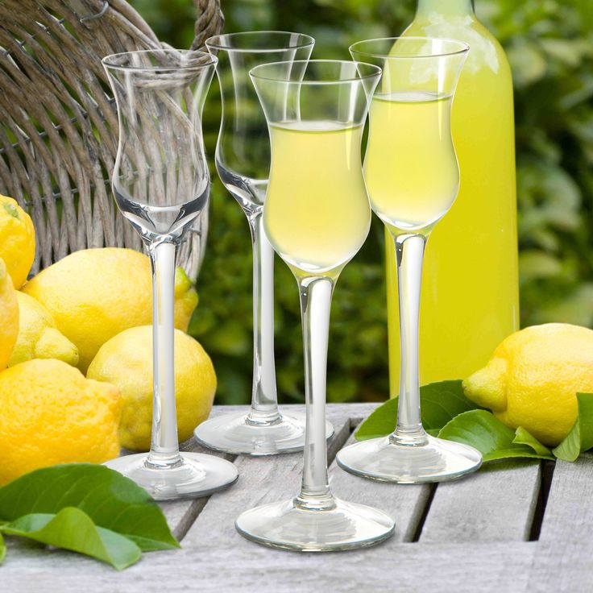

# Limoncello

*Amalfi lemon peels macerated in grain alcohol for a week, sweetened with simple syrup, bottled and chilled to icy: the southern Italian after-dinner pour, served in tiny frosted glasses straight from the freezer.*

**Serves:** makes about 1.5 litres

**Prep Time:** 30 minutes (plus 7 to 10 days macerating)

**Cook Time:** 10 minutes

## Overview
Limoncello is the after-dinner liqueur of southern Italy — Sorrento, Amalfi, Capri — made from the zest of specific large-fruited Amalfi or Sfusato lemons macerated in high-proof neutral alcohol for a week to ten days, then strained and combined with a sugar syrup. Bottled, refrigerated and served in tiny frosted glasses pulled straight from the freezer (the alcohol prevents it from solidifying), sipped as a digestivo at the end of a meal. The flavour is bright, intensely lemon-oily, sweet but not cloying, alcoholic in the 25-30% range. Tourist limoncellos in Sorrento gift shops range from excellent to terrible; homemade is reliably good if you start with the right lemons.

## Ingredients

### Steep
- 8 to 10 unwaxed lemons (preferably Amalfi or Sorrento lemons; thick-skinned, intensely aromatic — see notes)
- 1 litre 95% neutral grain alcohol (Everclear-style; OR 1 litre 50% vodka as a substitute, will give a milder limoncello)

### Sugar syrup
- 800 g caster sugar
- 1 litre water

## Method

### Stage 1 - Peel the lemons
1. Wash and dry the lemons thoroughly.
1. Using a vegetable peeler or a microplane, remove the yellow zest in wide strips, taking ONLY the yellow outer layer. Avoid the white pith below — pith makes limoncello bitter.
1. You should have 100 to 150 g of zest by weight.

### Stage 2 - Steep
1. Place the zest in a large clean glass jar (1.5 to 2 litre capacity).
1. Pour over the alcohol; the zest should be fully submerged.
1. Seal and leave at room temperature in a dark cupboard for 7 to 10 days, swirling once a day.
1. The alcohol turns deep yellow as it extracts the lemon oils.

### Stage 3 - Make the syrup
1. Combine the sugar and water in a saucepan over medium heat; stir until the sugar dissolves and the mixture is clear.
1. Simmer 3 minutes; cool to room temperature.

### Stage 4 - Combine
1. Strain the alcohol through a fine sieve into the cooled syrup; discard the spent zest.
1. Stir gently to combine.
1. Decant into clean glass bottles.

### Stage 5 - Rest
1. Seal the bottles; let stand in the fridge for at least 1 week before drinking (longer is better — the harshness of the alcohol mellows over 2 to 4 weeks).
1. Store in the freezer.

### To serve
1. Pour 30 to 50 ml into tiny chilled glasses (limoncello glasses are about half the size of a shot glass).
1. Serve straight from the freezer.

## Notes
- **Lemon variety is everything.** Amalfi (Sfusato Amalfitano), Sorrento, or other thick-skinned Mediterranean lemons. UK supermarket lemons work but give a thinner limoncello; specialty grocers occasionally have Italian imports.
- **Only the yellow zest.** White pith = bitter. Use a peeler in long strips and any visible pith should be on the peel side facing away.
- **High-proof alcohol extracts better.** 95% grain alcohol is traditional and extracts lemon oils efficiently in days; 50% vodka works but takes longer and gives a less intense result.
- **Freezer storage is non-negotiable.** Limoncello served warm is just sweet lemon syrup; the icy temperature is the entire point.

## Storage
- Sealed in the freezer indefinitely. Once opened, drink within 6 months for peak flavour (still safe much longer; just less aromatic).
