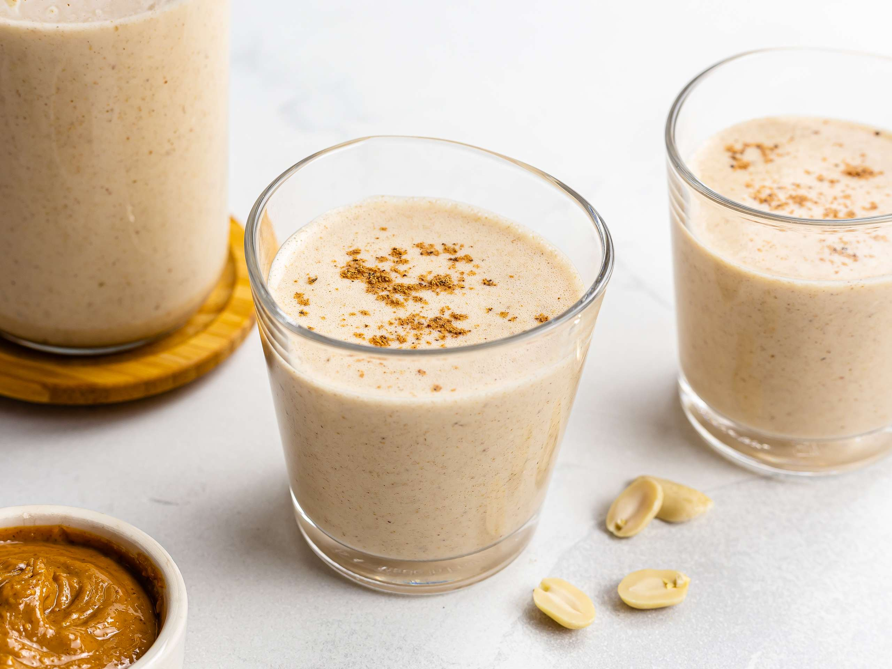

# Peanut Punch

*Roasted peanuts blitzed into condensed milk, evaporated milk, oats and vanilla with a pinch of nutmeg: the Jamaican "strong man" drink that doubles as breakfast for builders, dancehall DJs and gym lads.*

**Serves:** 4

**Prep Time:** 10 minutes

**Cook Time:** 0 minutes

## Overview
Peanut punch is the Jamaican high-calorie protein drink - sold from coolers at every food stall, breakfast shop and gym across the island, marketed (jokingly and seriously) as a strength-building, virility-enhancing pour. The build is roasted peanuts blitzed with sweetened condensed milk, evaporated milk, rolled oats (which thicken the drink), vanilla, a pinch of nutmeg and sometimes a splash of stout. Thick, creamy, intensely sweet, properly filling - half a glass leaves you not hungry. Caribbean variants exist in Trinidad and Guyana; the Jamaican version is the most heavily marketed. Often served cold from a chilled glass with crushed ice.

## Ingredients

- 200 g roasted unsalted peanuts (Spanish-style or skinless red-skinned; OR substitute 200 g smooth natural peanut butter to skip the roasting)
- 400 ml evaporated milk (Carnation full-fat)
- 250 ml sweetened condensed milk
- 50 g rolled oats
- 400 ml cold water
- 1 tablespoon vanilla extract
- ½ teaspoon ground nutmeg (plus extra for garnish)
- Pinch of fine salt
- Optional: 100 ml Guinness or other stout (the "strong" variant)

### To serve
- Plenty of ice cubes
- Grated fresh nutmeg

## Method

1. If using whole peanuts: combine the peanuts and 200 ml of the cold water in a blender; blitz 60 seconds into a smooth paste.
1. Add the evaporated milk, condensed milk, oats, remaining water, vanilla, nutmeg and salt to the blender.
1. Blitz for another 90 seconds until completely smooth and thick.
1. Taste; adjust sweetness with more condensed milk if wanted.
1. If using stout, stir in by hand.
1. Refrigerate at least 1 hour.
1. Pour over ice in tall glasses; grate fresh nutmeg on top.

## Notes
- **Peanut butter shortcut works.** Smooth natural peanut butter (just peanuts + salt) replaces whole peanuts cleanly. Skip the first blend step; just add to the blender with everything else.
- **Oats thicken without flour.** Rolled oats give the drink its characteristic body; without them it's a thin peanut milk. Blend them for the full 90 seconds so they break down completely.
- **Properly sweet, properly thick.** Adjust to taste, but the Jamaican original is closer to a milkshake than to a smoothie.

## Storage
- Refrigerate up to 3 days in a sealed bottle; shake hard before serving (the oats and peanut settle).
