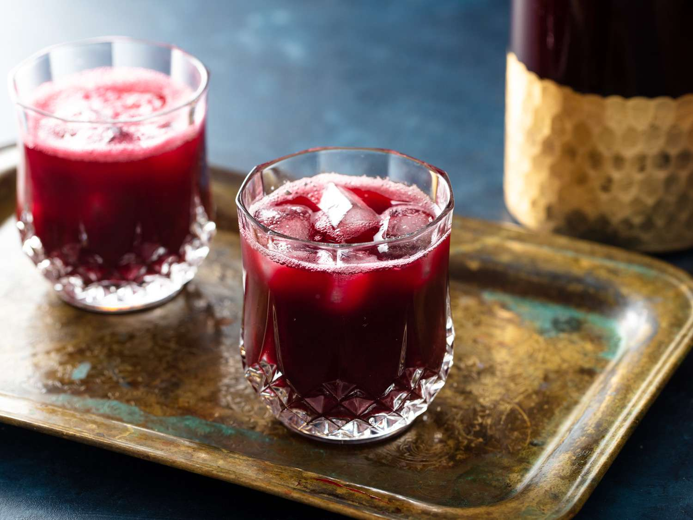

# Sorrel Drink

*Dried hibiscus calyces simmered with ginger, cloves, cinnamon and orange peel, sweetened heavily, served ice-cold over the Jamaican Christmas season: deep red, sharp, spicy, holiday in a glass.*

**Serves:** 8

**Prep Time:** 10 minutes

**Cook Time:** 30 minutes (plus 24 hours steeping)

## Overview
Sorrel drink is the Jamaican Christmas beverage, sold in big glass jugs at every Yard celebration from mid-December through to Old Year's Night. "Sorrel" here means dried hibiscus calyces (Hibiscus sabdariffa), unrelated to the English garden herb. They're simmered with fresh ginger, whole cloves, cinnamon sticks and orange peel, sweetened heavily with caster sugar, left to steep 24 hours, then strained and served ice-cold (sometimes with a splash of dark rum or sorrel wine added for the adult version). The result is deep crimson-red, sharply tart, spiced and warming despite being cold. Each Jamaican family has slight variations; this is a baseline. The same ingredient appears across the Caribbean: Trinidad sorrel is similar, Bissap in Senegal is the West African parent.

## Ingredients

- 100 g dried hibiscus calyces (sorrel)
- 100 g fresh ginger (sliced thin, no need to peel)
- 1 cinnamon stick
- 8 whole cloves
- Wide strip of orange peel (no pith)
- 4 allspice berries (pimento; the Jamaican touch)
- 2 litres just-boiled water
- 300 g caster sugar (or to taste; Jamaican palates take it sweet)
- 60 ml dark rum (optional, for the adult version; Wray & Nephew, Appleton Estate)

### To serve
- Plenty of ice cubes
- Sliced orange or lime
- Mint sprigs (optional)

## Method

1. Combine the hibiscus, ginger, cinnamon, cloves, orange peel and allspice in a large heatproof jug or stockpot.
1. Pour over the just-boiled water; stir.
1. Cover and let steep at room temperature for 24 hours (minimum 8 hours if pressed for time, but 24 gives the deepest flavour).
1. Strain through a fine sieve into a clean jug; press the solids gently to extract everything.
1. Stir in the sugar until completely dissolved.
1. If using rum, add it now.
1. Refrigerate at least 4 hours before serving.
1. Pour over plenty of ice in tall glasses; garnish with an orange slice and a mint sprig.

## Notes
- **Dried sorrel calyces, not English sorrel leaves.** The Jamaican "sorrel" is dried hibiscus; English sorrel is a totally different plant. Sold by weight at Caribbean / African groceries.
- **24-hour steep is best.** A short steep (an hour or two) gives a thinner drink. The flavour deepens significantly overnight.
- **Allspice berries are the Jamaican signature.** Without them you have the West African / Senegalese bissap; with them it's specifically Jamaican.

## Storage
- Refrigerate up to 1 week in a sealed jug. The flavour deepens for the first 2 to 3 days.
