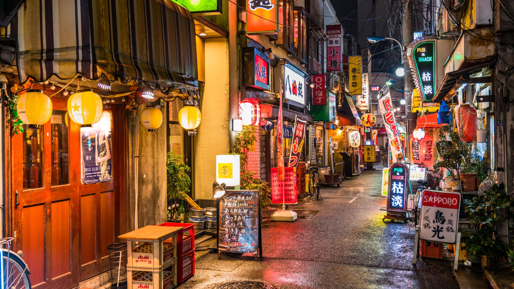

# Drinks of Japan

Matcha whisked hard in a chawan with a bamboo whisk until it foams; mugicha (cold roasted-barley tea) by the jug all summer; ramune in the marble-stoppered bottle; sake at every formal meal; calpis as the family standby.
