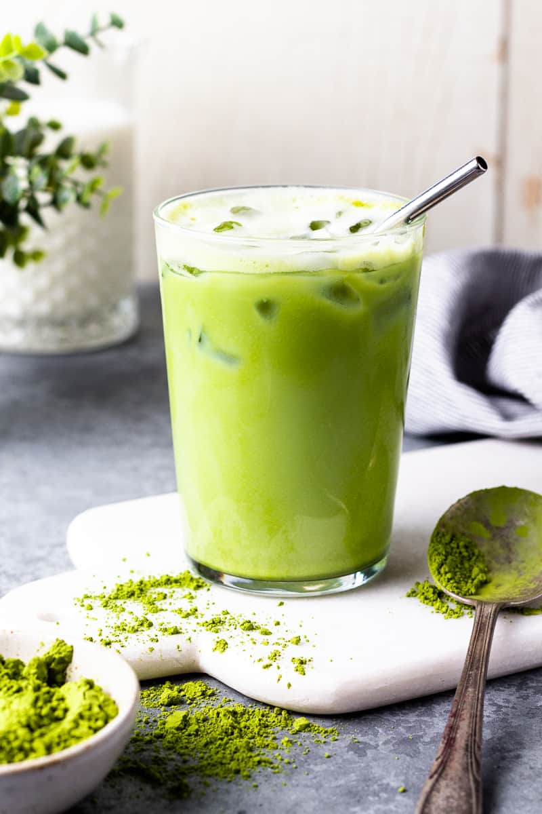

# Matcha

*Powdered green tea (the same that drives the Japanese tea ceremony) whisked hard with hot water in a chawan bowl using a bamboo whisk until a thick frothy emerald layer forms on top: the most concentrated way to drink green tea.*

**Serves:** 1

**Prep Time:** 3 minutes

**Cook Time:** 2 minutes

## Overview
Matcha is finely ground green tea powder, specifically tencha leaves, shade-grown, steamed and ground on slow stone wheels. Unlike loose-leaf green tea where you steep and strain, matcha is whisked into hot water so you consume the leaf itself, and the caffeine, L-theanine and antioxidant content are several times that of regular green. Two preparations exist: usucha (thin, modern everyday matcha) and koicha (thick, ceremonial matcha used in the formal tea ceremony, twice the powder, less water, an almost-paste). This recipe is usucha, the everyday drink. Properly prepared matcha has a generous foamy head, a deep emerald-green colour, a flavour that's grassy-sweet with a slight umami edge. Ceremonial-grade matcha (the premium stuff, around £30 per 30 g tin) gives the best result, while culinary-grade matcha (around £10 per 100 g) is what most home cooks use.

## Ingredients

- 2 g matcha powder (about 1 heaped teaspoon; ceremonial-grade for best flavour, culinary works)
- 70 ml hot water at 70 to 80°C (NOT boiling, since boiling water makes matcha bitter)

### Equipment (traditional but optional)
- A chawan (wide tea bowl, about 12 cm across)
- A chasen (bamboo whisk), essential for the foam; a small electric milk frother works as a substitute
- A chashaku (bamboo scoop) for measuring; a teaspoon works

## Method

### Stage 1 - Sift the matcha
1. Sift the matcha through a fine sieve directly into the chawan. Matcha clumps in storage, so sifting prevents lumps in the finished drink.

### Stage 2 - Add water
1. Boil water, then let it cool 90 seconds to drop to about 75°C.
1. Pour the hot water gently over the matcha in the chawan.

### Stage 3 - Whisk hard
1. Hold the bamboo whisk loosely between thumb and forefinger.
1. Whisk in a quick "W" or "M" zigzag pattern, NOT circular, since circular motion doesn't create foam.
1. Continue whisking hard for 15 to 20 seconds. The matcha will go from a flat green liquid to a frothy emerald with a thick layer of small bubbles on top.
1. The proper foam is fine and even; large bubbles mean you didn't whisk hard enough.

### Stage 4 - Drink
1. Drink straight from the chawan, holding it in both hands.
1. Three slurping sips is the traditional pace.
1. Optionally serve a small wagashi (Japanese sweet) on the side; the sweetness balances the matcha's bitter edge.

## Notes
- **Water temperature is critical.** Above 85°C and matcha turns harshly bitter. 75°C is the right zone.
- **Bamboo whisk over electric.** A chasen produces a finer, more stable foam than any electric whisk. They cost about £10, worth getting if you drink matcha regularly.
- **Sift to prevent lumps.** Skipping the sift gives clumps, and matcha clumps don't whisk out.
- **Quality matters at this price point.** Low-grade matcha tastes like grass clippings, and the difference between £10 and £30 powder is real.

## Variations
- **Koicha (thick matcha).** Double the matcha (4 g), halve the water (40 ml). The result is a thick, almost-paste consistency, used in the formal tea ceremony.
- **Matcha latte.** Whisk matcha with a few tablespoons of hot water as above, then top with steamed milk. Not traditional but a modern café staple.

## Storage
- Matcha powder oxidises fast once opened. Store in an airtight tin in the fridge; use within 6 weeks.
- Brewed matcha doesn't store; drink within 5 minutes.
