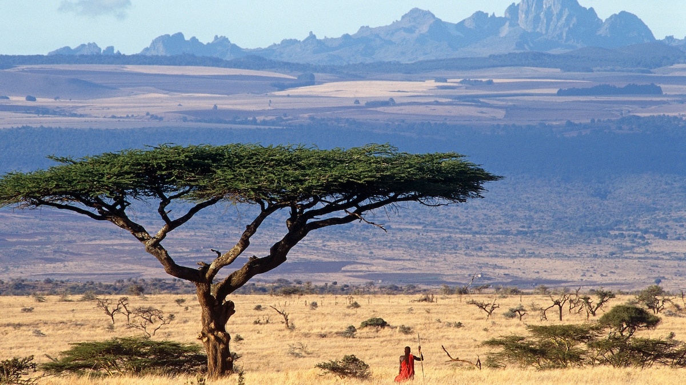

# Drinks of Kenya

Chai with everything. Tea is the most-grown crop in the country, and the home version is brewed strong with milk, cardamom and ginger and drunk all day long. Tusker, the elephant-on-the-label lager named after the founder's brother (killed by one), is the bar-and-nyama-choma standby and the de facto national beer. Uji, the warm sour fermented millet or sorghum porridge, is the rural breakfast drink and the traditional first food given to new mothers after childbirth. Single-origin Kenyan coffee has built a reputation abroad for its bright blackcurrant acidity, but Kenyan homes still drink tea, not coffee. Muratina, a honey-and-sausage-tree-fruit brew, remains the ceremonial drink of Kikuyu elders, poured at weddings and funerals from a gourd.
