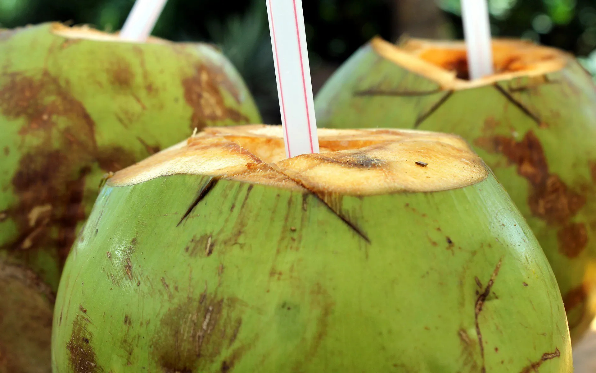

# Madafu (Young Coconut Water)

*Mombasa's morning street drink: a freshly machete-tapped young green coconut served with a straw, the water cold and faintly sweet; the soft white jelly inside scooped out with a spoon at the end.*

**Serves:** 1 coconut per drinker

**Prep Time:** 2 minutes

**Cook Time:** None

## Overview
Madafu is the Swahili word for the young green coconut, picked off the palm before the flesh has hardened. The Kenyan coast (Mombasa, Malindi, Diani, Lamu) sells madafu at every beach kiosk and bus station: the seller picks a coconut off a pile, swings a panga (machete) to lop off the top, drops in a straw, and hands it over for the buyer to drink the cold sweet water straight from the shell. The water inside is the perfect rehydration fluid: lightly mineral, faintly sweet, with the natural electrolytes of potassium and sodium. When the water is finished, the seller will slice the empty shell open and the drinker scoops out the soft custardy young flesh with a piece of the cut shell or a spoon. The drink is the standard answer to a hot Indian Ocean afternoon.

## Ingredients

### Per drinker
- 1 young green coconut (madafu), about 1.5-2 kg
- 1 wide drinking straw (paper or steel)

### Optional adds (modern beach-bar versions)
- A squeeze of fresh lime
- A pinch of fine sea salt
- 1 small piece of fresh ginger (grated)
- 50 ml white rum (for the cocktail version)

### To finish
- A short spoon (for the inner jelly)

## Method

### Stage 1 - Pick a young coconut
1. A madafu is a young coconut: deep green outside, with the husk still firm. (Brown hairy coconuts are mature; the water inside has begun fermenting and the flesh has hardened.)
2. Lift the coconut; it should feel heavy for its size and slosh audibly when shaken (that's the water inside).
3. If buying from a market, ask for a "madafu" (not a "nazi", that's the mature coconut for grating).

### Stage 2 - Open the top
1. Sit the coconut upright on a sturdy chopping board.
2. Holding it firmly at the base, use a heavy cleaver or panga to make three angled chops around the stem end, paring the husk away on each chop till the shell underneath is exposed.
3. Make one final chop to slice off the cap; this exposes a small round opening to the water cavity.
4. (Alternatively, use a "coconut tap" or hammer-and-nail to drive a hole through the soft eye at the top.)

### Stage 3 - Drink the water
1. Drop a wide straw into the opening.
2. Drink straight from the shell.
3. The water inside is naturally cold (a freshly picked coconut is room-temperature; for service, refrigerate the whole coconut 2 hours).
4. Each madafu yields about 350-500 ml.

### Stage 4 - Scoop the flesh
1. When the water is finished, lay the coconut on its side.
2. Use the panga to slice the coconut in half lengthwise.
3. Inside the cavity is the soft young jelly flesh, custardy and translucent.
4. Use a spoon (or a piece of the cut husk shaped into a scoop) to lift the jelly out.
5. Eat it as it is, with a sprinkle of salt, or stir it back into the remaining drops of water.

## Notes
- **Refrigerate the whole coconut** at least 2 hours before serving for the cold sip; out of the fridge it's tepid.
- **Heavy cleaver or panga:** an ordinary kitchen knife will not chop through the husk; a Chinese cleaver, panga, or coconut-tap tool is essential.
- **Drink within a day of opening:** the water sours fast once exposed to air.
- **Eat the jelly:** the soft flesh is the second half of the drink and is the chef's perk.
- **Watch your fingers:** chop with the coconut sat firmly on a board, never on the palm.

## Variations
- **Madafu na ndimu:** add a squeeze of fresh lime and a pinch of salt; the sports-drink version.
- **Madafu wenye tangawizi:** grate a small piece of ginger into the water; the digestive version.
- **Madafu cocktail (beach-bar):** drop 50 ml white rum into the water and stir with the straw.
- **Bottled coconut water alternative:** if no fresh madafu, use the best bottled raw young coconut water (look for "no added sugar" and "young coconut" on the label).
- **Madafu na chumvi:** a pinch of salt added directly to the water; the Mombasa fishermen's electrolyte drink.

## Serving
- At a Mombasa beach kiosk (the natural setting) · after a long hot bus ride on the Nairobi-Mombasa road · on a Diani beach lounger · alongside a plate of mahamri or kebabs · at a Lamu street-corner stall · as a post-workout drink (the electrolyte mineralisation is the original sports drink).

## Storage
- Best drunk fresh from the picked coconut.
- A whole unopened madafu keeps 5 days in the fridge.
- Once opened, drink within 6 hours; refrigerate any remaining water in a sealed bottle.
- Don't freeze the water (the structure breaks).
- The jelly scoops out cleanly only on the first day; after that it firms up and tastes more mature.
