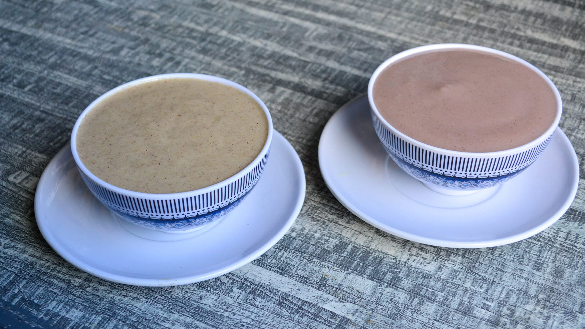

# Uji

*Sour fermented millet-or-sorghum porridge drunk warm from a cup: the rural Kenyan breakfast drink, the morning hot beverage of the highlands and a traditional postpartum food for new mothers.*

**Serves:** 4

**Prep Time:** 5 minutes (plus 24 to 48 hours fermentation)

**Cook Time:** 20 minutes

## Overview
Uji is the warm fermented-grain drink of rural Kenya, drunk from a mug rather than eaten from a bowl. Whole-grain flour (millet, sorghum, or a mix; sometimes with a small amount of maize for body) is mixed with water and left to ferment at room temperature for a day or two until it goes lightly sour and develops a tangy yoghurt note. It is then simmered with more water until smooth, sweetened lightly with sugar (or, in older households, with honey) and drunk warm. The fermentation makes the porridge much more nutrient-dense than a plain cooked-grain drink: more bioavailable minerals, B vitamins from the wild lactobacilli, and a gentle prebiotic effect. It is the traditional first food for new mothers after childbirth, prescribed for elders, and the standard 6 AM breakfast drink in the highlands and the western provinces. Lemon-sour, faintly nutty, warming.

## Ingredients

- 100 g millet flour (or sorghum flour, or 50 g of each)
- 30 g white maize flour (optional; gives smoother body)
- 800 ml water (divided: 200 ml for the ferment, 600 ml for cooking)
- 2 tbsp sugar (or honey to taste)
- A pinch of salt
- 1/2 tsp ground cardamom (optional, modern addition)
- 50 ml whole milk (optional, for a creamier version)

### Optional
- A squeeze of lemon (the Kikuyu finish; an alternative if your ferment is mild)

## Method

### Stage 1 - Mix the ferment
1. In a clean bowl, whisk together the millet flour, maize flour (if using) and 200 ml of room-temperature water.
1. Stir until smooth; the mixture should be like a thin batter.
1. Cover the bowl loosely with a clean cloth (not a tight lid; the ferment needs some air).
1. Leave at warm room temperature (22 to 28 C is ideal) for 24 to 48 hours.
1. After fermentation, the mixture should smell pleasantly sour (like buttermilk or sourdough starter), with small bubbles on the surface. If it smells unpleasant or has visible mould, discard and start again.

### Stage 2 - Whisk and dilute
1. Whisk the fermented mixture; it will have separated, that is normal.
1. Stir in the remaining 600 ml water and the salt.
1. Pour into a heavy saucepan.

### Stage 3 - Cook
1. Bring the mixture to a gentle simmer over medium heat, whisking constantly to prevent lumps.
1. Once it starts to thicken (around 8 minutes), reduce the heat to low.
1. Continue cooking, stirring with a wooden spoon, for another 10 to 12 minutes until the porridge has thickened to the consistency of a thin cream (it should pour, not plop). It will thicken further as it cools.

### Stage 4 - Sweeten and serve
1. Stir in the sugar (or honey), the cardamom and the milk if using.
1. Taste; adjust sweetness; a squeeze of lemon brightens it if the ferment was mild.
1. Pour into mugs and drink warm.

## Method (the quick non-fermented version, for time-pressed mornings)

1. Whisk 100 g millet flour with 800 ml cold water plus 100 ml plain yoghurt (the yoghurt mimics the fermented tang).
1. Simmer 15 minutes as Stage 3.
1. Sweeten and serve. This is not the proper uji but is a workable substitute when you have not started a ferment.

## Notes
- **The ferment is the dish.** Without it, uji is just thin porridge. The 24 to 48 hour rest is what gives the characteristic sour-cream tang and the nutritional benefits.
- **Whole-grain flours.** Fresh-milled whole millet (mawele) and whole sorghum (mtama) are the traditional grains. Refined / white versions ferment less well.
- **Drinking consistency.** Uji is meant to pour from the mug and be sipped, not spooned. If yours is too thick, add hot water; if too thin, simmer a few more minutes.
- **Postpartum tradition.** In rural Kenya uji is given to women for forty days after childbirth, sometimes enriched with peanut butter, butter or extra milk; it is considered restorative.
- **Lactobacilli safety.** A properly fermented batch develops a pleasant sour smell. Pink, fluffy or black mould means contaminated; discard.

## Variations
- **Uji wa mtama:** sorghum only, the darker richer western Kenyan version.
- **Uji wa wimbi:** finger-millet only (wimbi), the most prized; iron-rich, very nutty.
- **Coastal uji:** finished with coconut milk instead of dairy.
- **Uji ya karanga:** with a spoon of peanut butter stirred in, for new mothers and post-illness recovery.
- **Cinnamon-sweet:** finish with a pinch of cinnamon and a drizzle of honey; the modern Nairobi cafe version.

## Serving
Warm in a tin mug at sunrise · the breakfast drink before a long day's work · prescribed for new mothers · drunk by elders for general health · sometimes with a slice of mandazi or chapati on the side.

## Storage
- Refrigerate cooked uji 3 days; reheat with a splash of water as it thickens.
- The fermented base (before cooking) keeps 5 days refrigerated; warmer storage continues the fermentation and turns it sharp.
- Do not freeze (texture suffers); make fresh each time from the fermented base.
