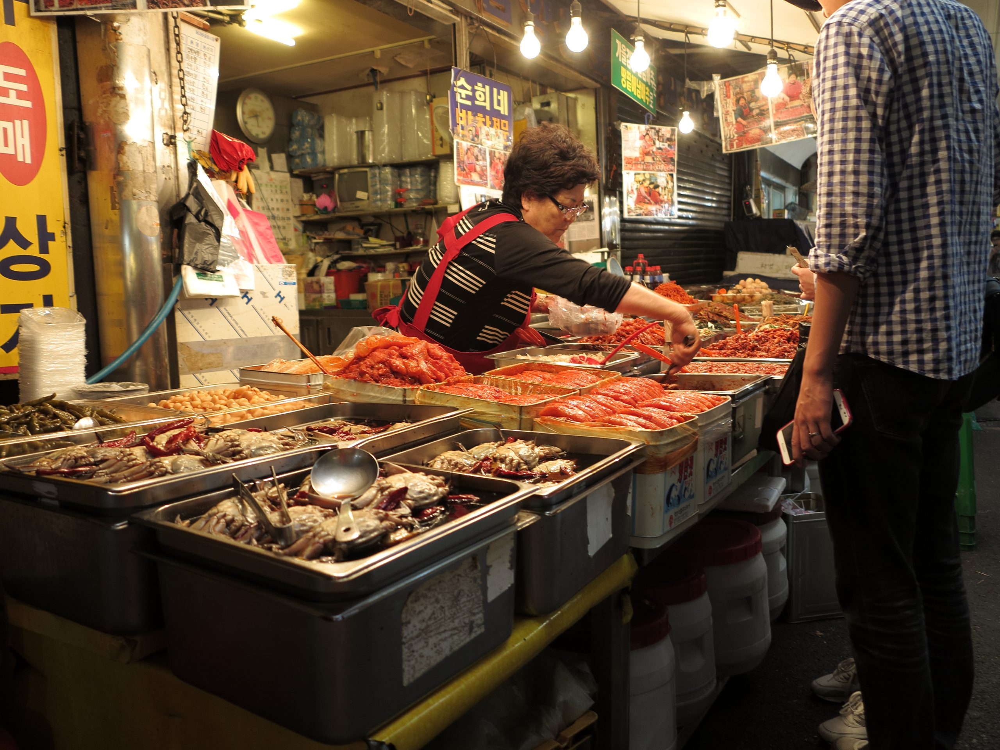

# Drinks of Korea

Sujeonggwa, the dark cinnamon-ginger persimmon punch served chilled at Lunar New Year; sikhye, the pale-sweet fermented rice drink with whole grains floating on top; boricha (barley tea) by the litre at every meal; soju by the green bottle.
