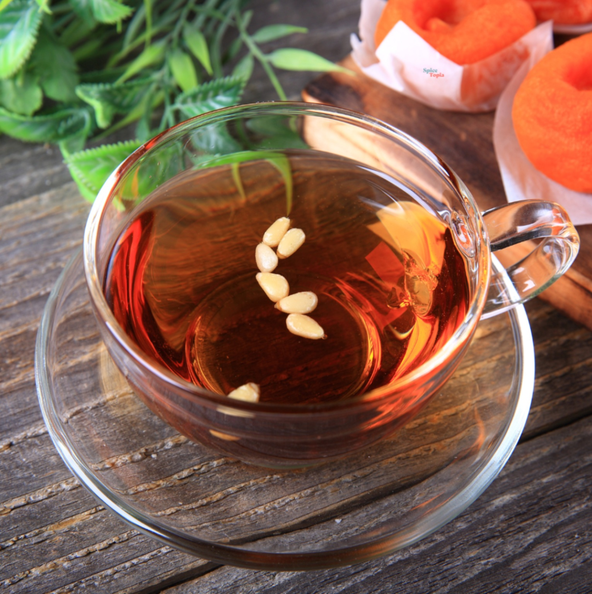

# Sujeonggwa

*Korean cinnamon and ginger punch: a deep amber spiced tea boiled long and slow with cinnamon sticks and ginger, sweetened with brown sugar, chilled, and floated with dried persimmons and pine nuts. The traditional Korean Lunar New Year drink.*

**Serves:** 6 small cups

**Prep Time:** 10 minutes

**Cook Time:** 1 hour

## Overview
Sujeonggwa is one of Korea's two great traditional punches (the other is sikhye, the fermented rice drink). It's a bold, almost-medicinal infusion: cinnamon sticks and fresh ginger boiled hard in water for an hour each, separately, to extract their oils, then combined with brown sugar and chilled. The build matters: ginger and cinnamon are simmered apart because boiling them together makes the cinnamon's tannins bind to the ginger and turn the drink muddy. Served deeply chilled in small cups with a softened dried persimmon and a few pine nuts floating on top, it's the classic dessert drink after a Lunar New Year feast: spicy, sweet, warming-yet-cold. Common in Korean cafés and convenience stores year-round in chilled bottles.

## Ingredients

- 80 g cinnamon sticks (use the proper hard cassia sticks, not soft Ceylon)
- 80 g fresh ginger, sliced into 5 mm coins (skin on is fine)
- 2.5 litres cold water (1.25 litres for each pot)
- 150 g dark muscovado or soft brown sugar
- 2 tablespoons honey (optional, for gloss)

### To serve
- 6 dried persimmons (gotgam, sold at Korean groceries)
- 1 tablespoon pine nuts
- A few pine nuts per cup

## Method

### Stage 1 - Boil cinnamon and ginger separately
1. Put the cinnamon sticks in one saucepan with 1.25 litres cold water.
1. Put the ginger coins in a second saucepan with 1.25 litres cold water.
1. Bring both to the boil, then reduce to a gentle simmer for 1 hour.
1. The cinnamon water becomes deep amber, the ginger water golden-clear and sharply hot.

### Stage 2 - Combine and sweeten
1. Strain both into a large bowl, discarding the solids.
1. Add the muscovado sugar and stir until dissolved.
1. Taste and add honey if you want extra gloss and rounder sweetness.

### Stage 3 - Chill
1. Cool the liquid to room temperature, then refrigerate at least 4 hours (overnight is better). The drink improves with time.

### Stage 4 - Serve
1. Soak the dried persimmons in a small bowl of the chilled sujeonggwa for 30 minutes to soften.
1. Ladle the chilled drink into small glass cups or bowls.
1. Float one softened persimmon in each cup and scatter a few pine nuts on top.

## Notes
- **The separate-pots rule.** Boiling ginger and cinnamon together extracts a muddier, harsher drink. Separating them keeps each clean, then they blend after the heat is off.
- **Cassia, not Ceylon.** True hard cassia sticks (the dark reddish-brown ones) are the right cinnamon. Soft, papery Ceylon cinnamon dissolves and clouds.
- **Skin-on ginger.** Don't peel; the skin holds flavour and won't be eaten.
- **Pine nut prep.** Pine nuts oxidise fast: float them on the drink just before serving, or they'll darken and bitter the surface.

## Variations
- **Hot sujeonggwa.** Serve hot in winter; same brew, no chilling.
- **No persimmon.** Skip if you can't find gotgam; the drink works alone with just pine nuts on top.
- **Spicier.** Add 4 to 6 black peppercorns to the cinnamon pot for a stronger warming note.

## Storage
- Refrigerate the strained, sweetened sujeonggwa up to 1 week in a sealed jug. Add persimmons fresh to each cup; don't soak them in the master jug or they'll go sodden.
