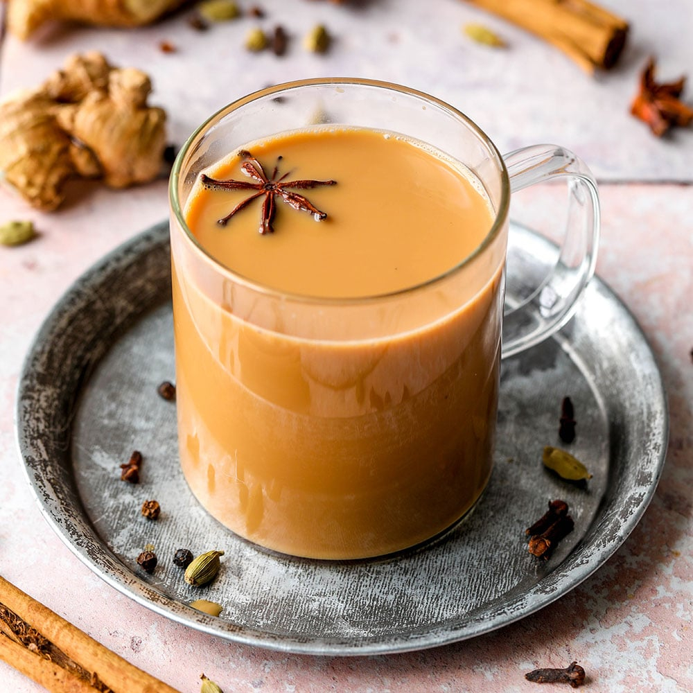

# Karak Chai Kuwaiti

*Kuwait's daytime tea: strong black tea stewed with full-cream evaporated milk, crushed cardamom and saffron, sweetened heavily, poured at every roadside diwaniya stand.*

**Serves:** 4

**Prep Time:** 2 minutes

**Cook Time:** 12 minutes

## Overview
Karak chai is the drink of the Kuwaiti working day: stewed black tea, evaporated or whole milk, cardamom, saffron, plenty of sugar, poured in small paper cups from corner-stand kettles outside every diwaniya and petrol station. The technique is borrowed from Indian and Yemeni traders who brought masala chai to the Gulf in the early twentieth century; the Kuwaiti version dropped the ginger and clove and turned up the cardamom and saffron, kept the heavy sweetness and the long stew. The colour is a deep ochre, the texture slightly viscous from the milk reduction, the sweet matched to the strong tannin. Drunk hot, all day, in any weather.

## Ingredients

### Per 4 small cups
- 500 ml water
- 200 ml evaporated milk (or 200 ml whole milk for a lighter version)
- 4 tsp loose black tea (Ceylon or Assam, strong)
- 8 green cardamom pods, lightly crushed
- 4 strands saffron (optional but traditional)
- 4 to 6 tsp sugar (to taste; karak is meant to be sweet)

## Method

### Stage 1 - Stew the tea
1. Bring water to a boil in a small saucepan.
2. Add the tea, crushed cardamom and saffron.
3. Simmer briskly 5 minutes; the water turns deep mahogany.

### Stage 2 - Add milk and sugar
1. Pour in the evaporated milk and the sugar.
2. Bring back to a simmer; cook 5 to 6 minutes, watching it doesn't boil over (it foams up fast).
3. The tea should reduce slightly and turn a uniform deep tan colour.

### Stage 3 - Strain and pour
1. Off the heat.
2. Strain through a fine sieve into small glasses (75 to 100 ml each).
3. Serve immediately, hot.

## Notes
- **Evaporated milk is traditional.** It gives the body that fresh milk can't match. If using fresh milk, reduce the water slightly to compensate.
- **Sweet is the point.** Karak undersweetened tastes thin and unpleasant. Start with 1 tsp per cup; adjust up.
- **Small cups.** A karak is meant to be 80 to 100 ml, knocked back in a few sips. Big mugs aren't the format.

## Storage
- Best fresh from the pan
- Cold leftovers reheat once but the flavour fades; better to make fresh
