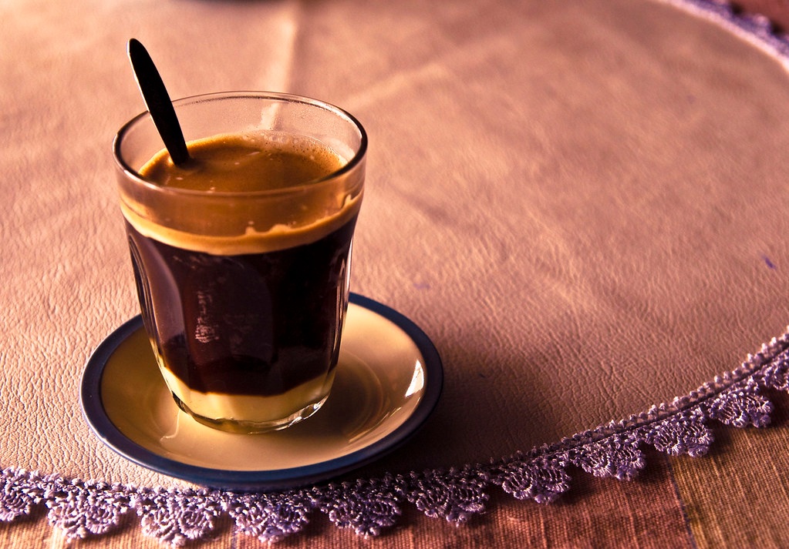

# Café Lao (Lao Iced Coffee)

*Laos's morning iced coffee: dark-roast Bolaven Plateau beans brewed strong through a tin phin filter, poured over a thick layer of sweetened condensed milk, stirred and filled with crushed ice.*

**Serves:** 2

**Prep Time:** 5 minutes

**Cook Time:** 10 minutes (the slow drip)

## Overview
Café Lao is the French-colonial coffee legacy adapted by Lao home cooks. The beans matter: Lao coffee from the Bolaven Plateau in the south is one of the world's underrated specialty origins, typically Robusta or a Robusta-Arabica blend dark-roasted to a deep mahogany. The result is a stronger, more bitter brew than Western light-roast Arabica. Outside Laos, Vietnamese-style dark-roast beans (Trung Nguyen is widely available) or strong French-roast espresso beans substitute. The brewing tool is the phin, a small individual tin filter that sits on top of the glass: ground coffee goes in, hot water pours over, the brew drips slowly through over five to ten minutes. An Aeropress on slow drip works outside Asian markets. The assembly is sequential: two tablespoons of sweetened condensed milk in the bottom of the glass first, the coffee drips on top, stirred vigorously, then ice last. Strong, creamy, deeply sweet, the perfect cold counterpoint to spicy-sour morning Lao meals.

## Ingredients

### Per drink (multiply for more)
- 2 tablespoons sweetened condensed milk (full-fat; the brand Longevity or Eagle Brand is traditional)
- 3 tablespoons coarsely ground dark-roast Lao or Vietnamese coffee (or French-roast espresso grind)
- 200 ml just-off-the-boil water (about 95°C)
- 1 small handful crushed ice or 4-5 ice cubes

### Equipment
- 1 Vietnamese-style tin drip filter (phin) per glass; OR an Aeropress; OR a fine mesh filter cone
- 2 tall iced-coffee glasses (250-300 ml)
- A long bar spoon for stirring

### Optional
- A small piece of cinnamon stick added to the grounds (the modern variant)
- A few drops of vanilla extract added to the condensed milk

## Method

### Stage 1 - Set up
1. Spoon 2 tablespoons of sweetened condensed milk into the bottom of each tall glass.
2. Place the tin drip filter (phin) on top of the glass.

### Stage 2 - Add the coffee
1. Spoon 3 tablespoons of coarsely-ground dark coffee into the drip filter.
2. Press down lightly with the filter's metal disc (most tin phins come with one).

### Stage 3 - Bloom the grounds
1. Pour about 50 ml of hot water (just-off-the-boil) over the grounds.
2. Wait 30 seconds for the grounds to bloom (they swell slightly and release CO2).

### Stage 4 - The slow drip
1. Pour the remaining 150 ml of hot water over the grounds.
2. Cover with the phin's lid (or leave open).
3. Let the coffee drip slowly through 6-10 minutes.
4. The coffee should drip in a slow steady stream; if too fast (under 5 minutes), the grind is too coarse; if too slow (over 12 minutes), too fine.

### Stage 5 - Stir
1. Lift away the phin.
2. Use a long spoon to stir the coffee vigorously into the condensed milk at the bottom.
3. The mixture turns a creamy caramel colour.

### Stage 6 - Add ice
1. Fill the glass with crushed ice (or 4-5 ice cubes).
2. Stir briefly.

### Stage 7 - Serve
1. The drink is ready.
2. Drink with a straw; or stir occasionally as the ice melts.
3. Best drunk within 10 minutes; the ice continues melting and the drink dilutes.

## Notes
- **Strong dark-roast coffee is essential:** the condensed milk is very sweet; the coffee needs to push back. Light-roast or weak coffee gives a one-note milkshake.
- **Slow drip is the traditional technique:** the phin produces concentrated coffee over 6-10 minutes.
- **Condensed milk first:** the traditional layering. Pouring coffee over hot grounds and adding condensed milk later doesn't dissolve the milk as cleanly.
- **Crushed ice or cubes:** crushed melts faster; cubes give a slower dilution.
- **Don't oversweeten:** 2 tablespoons of condensed milk per glass is the traditional amount. More is dessert.

## Variations
**Hot café Lao:** skip the ice; stir the condensed milk into the hot brewed coffee. The winter / morning version.
**Café Lao with coconut milk:** replace condensed milk with 60 ml of full-fat coconut milk + 2 tsp palm sugar. The modern Lao café variant.
**Café Lao with extra strong coffee:** double the coffee grounds; serve with extra ice.
**Café sữa đá (Vietnamese cousin):** same technique with Vietnamese coffee; very similar to Lao.
**Egg coffee (cà phê trứng - Vietnamese variant):** whisk an egg yolk with the condensed milk to a foam; pour coffee over. Borderline overlap with Vietnamese.

## Serving
At a Lao morning market stall (the traditional setting; sold from carts at 6 am alongside khao jee sandwiches) · at a Vientiane or Luang Prabang café · at a Lao breakfast counter · at home as a strong morning pick-me-up · paired with khao jee (Lao baguette sandwich) or sai oua.

## Storage
- Drink fresh; doesn't store.
- The brewed black coffee alone keeps refrigerated 24 hours.
- The condensed milk keeps refrigerated 2 weeks once opened.
- Lao coffee beans (whole) keep months in a sealed jar; grind fresh per brew.
