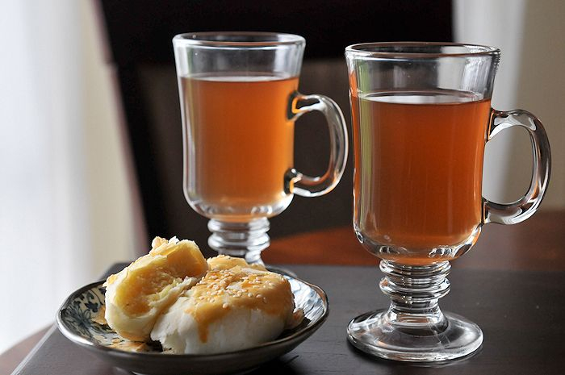

# Nam Khing (Lao Ginger Tea)

*Laos's winter warmer: thick slices of fresh ginger simmered with palm sugar, a pinch of salt and a generous squeeze of lime, served hot in small ceramic cups.*

**Serves:** 4

**Prep Time:** 5 minutes

**Cook Time:** 25 minutes

## Overview
Nam khing is one of Laos's simplest and most beloved drinks: a ginger infusion sweetened with palm sugar and brightened with lime. Three Lao-specific details define the drink. The ginger is thickly sliced (not finely chopped or grated); thick slices give a slow steady infusion over the long simmer that finely-chopped ginger can't match. The Lao kitchen uses ginger generously, around 40 g per litre of water, which gives a strong warming brew rather than a delicate ginger water. Palm sugar is the traditional sweetener and gives the caramel-molasses depth that distinguishes nam khing from white-sugared ginger drinks; granulated sugar produces a thinner, less aromatic result. The lime goes in off the heat at the very end, never during the simmer; lime added to hot tea turns bitter and ruins the brightness it should provide. The pinch of salt is the Lao kitchen secret that sharpens the ginger heat and rounds the sweetness without making the drink taste salty. Served hot in small ceramic cups.

## Ingredients

### Per pot (4 servings)
- 40-50 g fresh ginger, peeled and thickly sliced (5 mm thick rounds)
- 1 litre water
- 60 g palm sugar (or soft brown sugar)
- 1/4 teaspoon fine sea salt
- 1 tablespoon fresh lime juice (added at the end)
- 1 cinnamon stick (optional, the Northern Lao variant)
- 2 cloves (optional)
- 4 black peppercorns (optional, the modern adult variant)

### To serve
- Small ceramic mugs (about 150 ml each)
- A small drizzle of honey (optional, for the modern variant)
- A thin slice of lime on top
- A small star anise pod for decoration (optional)

## Method

### Stage 1 - Prep the ginger
1. Peel a 40-50 g piece of fresh ginger.
2. Slice into thick rounds (about 5 mm thick).
3. Don't bother to chop finer; thick slices give a steady infusion.

### Stage 2 - Simmer
1. In a heavy small saucepan, combine the sliced ginger with the water, palm sugar, salt and (optional) cinnamon stick, cloves and peppercorns.
2. Bring to a gentle boil over medium heat.
3. Reduce to a low simmer.
4. Cook covered 20-25 minutes, the brew develops a deep ginger heat.

### Stage 3 - Strain
1. Strain through a fine sieve into a clean teapot or pitcher.
2. Discard the ginger slices (or save for a second weaker brew).

### Stage 4 - Add lime
1. Stir in the fresh lime juice OFF the heat.
2. (Lime added during the simmer goes bitter.)

### Stage 5 - Serve
1. Pour into small warm ceramic mugs.
2. Garnish with a thin slice of lime, optional star anise.
3. Drink hot.

## Notes
- **Thick ginger slices:** the slow steady infusion is the traditional Lao technique.
- **Palm sugar over white sugar:** the traditional Lao depth.
- **Lime off the heat:** added during the simmer it goes bitter; added off the heat it stays bright.
- **Salt pinch:** the Lao kitchen secret. Sharpens the ginger.
- **Strong proportions:** the traditional Lao brew is more aggressive than Western "ginger tea" - 40-50 g ginger per litre.

## Variations
**With honey instead of palm sugar:** swap palm sugar for honey, more aromatic, modern.
**Cold nam khing:** chill the brewed drink; serve over ice with extra lime, the summer variant.
**With lemongrass:** add 1 stalk lemongrass (lightly crushed) to the simmer, the Northern Lao variant.
**With turmeric:** add a 2 cm slice of fresh turmeric, the medicinal cold-and-flu variant.
**Boozy nam khing:** add 30 ml of Lao-Lao rice spirit or whisky per cup, the adult cold-weather variant.

## Serving
At a Lao morning market stall (the traditional setting; especially in cool months) · at a Lao breakfast counter · at a Lao home as a morning or after-meal digestive · at a Lao temple for visiting monks · at home as a cold-weather warming drink · paired with a Lao biscuit, a small piece of mango sticky rice, or a slice of coconut cake.

## Storage
- The brewed tea (strained) refrigerates 5 days; reheat on the stovetop.
- Freezes 3 months.
- The brewed ginger pieces can be re-used once for a lighter second infusion.
- A "ginger-syrup concentrate" can be made stronger (less water) and refrigerated; dilute with hot water on demand.
- Fresh ginger keeps refrigerated 4 weeks; freezes 6 months whole.
