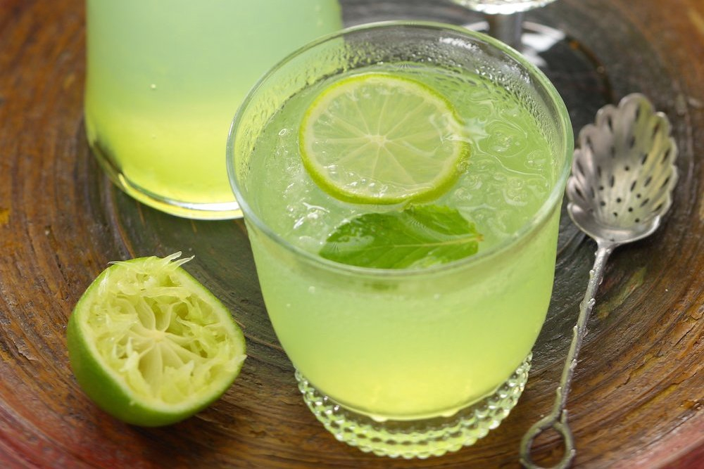

# Nam Mak Nao (Lao Palm-Sugar Limeade)

*Laos's midday cooler: fresh lime juice mixed with palm-sugar syrup, a pinch of salt and cold water, served over crushed ice with a slice of lime on the rim.*

**Serves:** 4

**Prep Time:** 10 minutes

**Cook Time:** 5 minutes (for the syrup)

## Overview
Nam mak nao is one of the simplest and most beloved Lao drinks: a Lao spin on lemonade, sold from carts in every Lao market in the hot months. The lime matters: small Asian limes (the Lao "mak nao") are juicier and more aromatic than the larger Persian limes in Western supermarkets; four or five Lao limes (or two or three Western ones) fill the traditional proportions. Palm sugar (from palmyra or coconut palms) gives the dark caramel-molasses notes that distinguish nam mak nao from a generic limeade made with white sugar; dark muscovado substitutes. The pinch of salt is the Lao secret: salt sharpens sweet-sour drinks, the same principle as a salted-rim margarita, and without it the drink tastes flat.

## Ingredients

### The palm-sugar syrup (makes 250 ml; enough for about 8 drinks)
- 100 g palm sugar (or soft dark muscovado as substitute)
- 200 ml water
- 1 pandan leaf, torn and knotted (optional but traditional)

### Per drink (× 4)
- 30 ml fresh lime juice (from 1-2 limes)
- 30 ml palm-sugar syrup (from above; adjust to taste)
- 1/4 teaspoon fine sea salt
- 250 ml cold water
- Crushed ice
- A slice of lime on the rim
- A small pinch of crushed ice on top

### Optional
- A small mint sprig
- A pinch of chilli flakes (the modern Lao street-stall variant; the salt-sweet-sour-spicy quadruple)

## Method

### Stage 1 - Make the palm-sugar syrup
1. In a small saucepan, combine the palm sugar, water and pandan leaf.
2. Warm over medium heat, stirring, till the palm sugar fully dissolves.
3. Bring to a gentle simmer for 2-3 minutes (concentrates slightly).
4. Take off the heat; remove the pandan leaf.
5. Cool to room temperature.

### Stage 2 - Assemble each drink (in a tall glass)
1. Pour 30 ml of fresh lime juice into the bottom of a tall glass.
2. Add 30 ml of palm-sugar syrup.
3. Add a generous pinch (1/4 tsp) of fine sea salt.
4. Stir briefly to dissolve.

### Stage 3 - Add water and ice
1. Fill the glass with crushed ice.
2. Top up with 250 ml of cold water.
3. Stir again.

### Stage 4 - Garnish and serve
1. Float a slice of lime on top.
2. Add a sprig of mint (optional).
3. Serve immediately with a straw.

## Notes
- **Palm sugar gives the traditional Lao depth:** white sugar is acceptable but flat.
- **Salt is essential:** small pinch per glass. Sharpens the sweet-sour balance.
- **Crushed ice ideal:** melts fast, gives a refreshing slushy texture.
- **Fresh lime juice only:** bottled lime juice tastes wrong.
- **Adjust sweetness:** the traditional Lao balance is moderately sweet; taste and adjust.

## Variations
- **Spicy nam mak nao:** add a pinch of chilli flakes; the traditional Lao street-stall sweet-spicy-sour variant.
- **Nam mak nao with mint:** muddle 4-5 fresh mint leaves in the bottom of the glass before adding lime, the modern variant.
- **Hot nam mak nao:** skip the ice; pour hot palm-sugar syrup + lime + salt + hot water, the cold-weather variant.
- **With sparkling water:** swap still water for sparkling, the modern bubbly variant.

## Serving
- At a Lao street stall (the traditional setting; sold from carts in every market in hot weather) · at a Lao midday meal as the non-alcoholic accompaniment · at a Lao café · at home as the Lao answer to lemonade · paired with sai oua, laap, tam mak hung or any spicy Lao dish.

## Storage
- The palm-sugar syrup refrigerates 4 weeks in a sealed jar.
- Fresh lime juice keeps 5 days refrigerated (loses aroma over time; squeeze fresh).
- Assemble per drink; pre-mixed limeade goes flat and the salt settles out.
