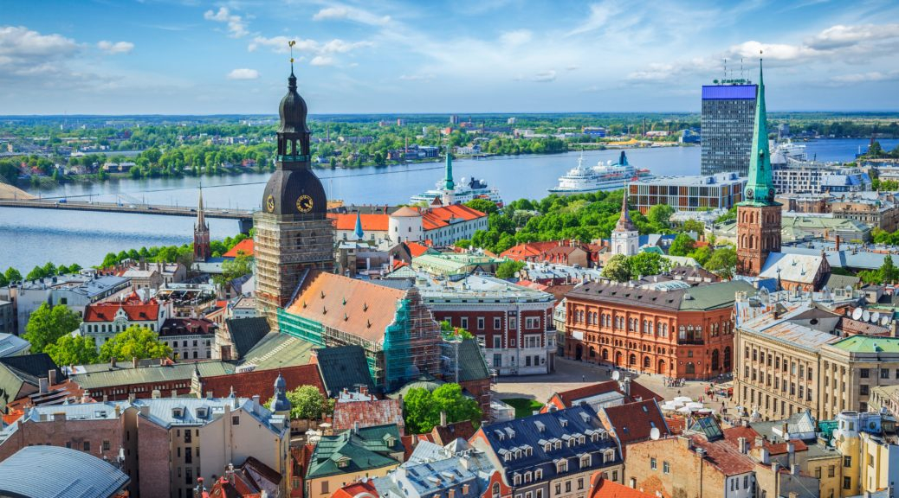

# Drinks of Latvia

Kvass poured from wooden barrels on every Riga street in summer, cold and lightly sour from the fermented rye. Riga Black Balsam in the bar at the end of the night, the country's 45% ABV bitter built on 24 herbs and botanicals (yarrow, valerian, wormwood, gentian, oak bark), drunk neat from a small glass, mixed into hot coffee, or stirred with blackcurrant juice. Birch sap collected in March and April when the trees first wake, drunk fresh or fermented to a faint sparkle. The rural tradition still keeps honey mead alive in the eastern Latgale region.
