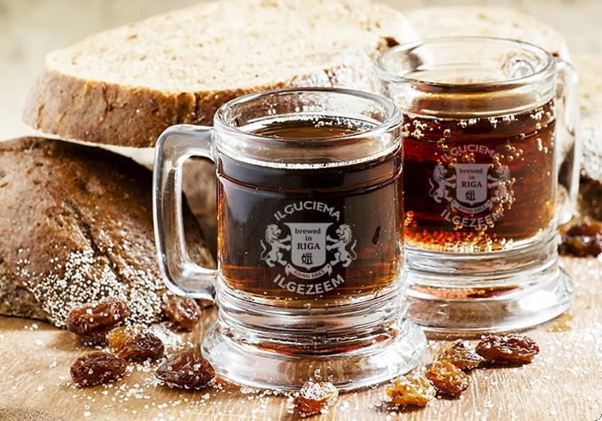

# Kvass (Latvian)

*Latvian rye-bread kvass: dark rupjmaize toasted to deep colour, soaked with sugar and a few raisins, lightly fermented with yeast for two days until faintly fizzy and just under 1% alcohol. Cold, sour, malty, the summer drink poured from wooden barrels on every Riga corner.*

**Serves:** Makes 2 litres

**Prep Time:** 30 minutes

**Cook Time:** 30 minutes (plus 48 hours fermenting)

## Overview
Kvass is the rye-bread drink of the Baltic and Slavic east. In Latvia it is poured from wheeled wooden barrels on summer pavements, sold in glass mugs and refilled with a wooden ladle. The build is simple: stale dark rupjmaize is toasted in a hot oven to a deep dark colour (this is the malt flavour and the brown colour of the finished drink), then soaked in hot water with sugar for several hours. The liquid is strained, cooled to lukewarm, then fermented with a small amount of yeast and a few raisins for 36 to 48 hours until the surface bubbles, the smell turns yeasty-sour and the drink develops a light natural fizz and a barely-there alcohol content (around 0.5 to 1%, so it counts as soft for most purposes). Sometimes a mint sprig or a piece of orange peel goes into the ferment for scent. Bottled cold and drunk straight from the fridge with a meal, or used as the base for the cold summer soup okroshka. The full ferment runs longer for a proper alcoholic version, but the everyday Latvian house kvass is the light two-day kind.

## Ingredients

### Toasted rye
- 500 g stale rupjmaize (dark Latvian rye)

### Steep
- 3 litres boiling water
- 150 g caster sugar
- 8 raisins

### Ferment
- 5 g instant dried yeast (or 1 tablespoon active sourdough starter)
- 2 sprigs fresh mint or 1 strip lemon peel (optional)
- 1 extra tablespoon sugar (for the yeast)

## Method

### Stage 1 - Toast the rye
1. Heat the oven to 180°C (160°C fan).
2. Cut the rupjmaize into 2 cm chunks.
3. Spread on a tray; toast 25 to 30 minutes, turning halfway, until the bread is very dark brown all the way through but not burnt-black (burnt gives a bitter kvass).

### Stage 2 - Steep
1. Tip the toasted bread into a large heatproof bowl or pot.
2. Pour over the boiling water; stir in 150 g of the sugar.
3. Cover; rest 6 to 8 hours at room temperature (overnight is convenient). The water should turn deep brown-black, smelling of malt and toast.

### Stage 3 - Strain
1. Set a fine sieve lined with muslin or a clean tea towel over a wide jug or bowl.
2. Pour the steep through, squeezing the bread gently to extract every drop.
3. Discard the soaked bread (or compost; it has done its job).
4. Cool the liquid to lukewarm (about 30°C).

### Stage 4 - Pitch the yeast
1. In a small jug, dissolve the extra 1 tablespoon sugar in 100 ml of the warm kvass liquid; sprinkle in the yeast; rest 10 minutes until foaming.
2. Stir the foaming yeast back into the main liquid.
3. Add the raisins. Add the mint or lemon peel if using.

### Stage 5 - Ferment
1. Cover the bowl with muslin or a loose lid (the ferment needs air, not a seal).
2. Leave at warm room temperature 24 to 48 hours. The surface should bubble, the smell should turn yeasty-sour, the raisins should rise to the top.

### Stage 6 - Strain and bottle
1. Strain the kvass into clean glass bottles (leave 3 cm headspace at the top).
2. Cap tightly; refrigerate at least 6 hours to develop the fizz.
3. Open with the bottle leaning over the sink the first time; younger kvass can be lively.

### Stage 7 - Serve
1. Pour cold into glass mugs.
2. Optionally garnish with a slice of orange or a mint leaf.
3. Drink with rye bread and salted fish, or as the base for okroshka cold soup.

## Notes
- **Toast deep, not burnt.** The colour of the kvass comes from deeply toasted rye. Burnt-black bread makes the drink bitter; underdone bread makes it pale and weak.
- **Cool to lukewarm before adding yeast.** Hot water kills the yeast and stops the ferment dead.
- **Watch the bottles.** Once capped and refrigerated the kvass is calm, but a bottle left warm overnight builds pressure fast. Cold storage and short pours.

## Variations
- **Mint kvass:** Add a generous handful of fresh mint to the ferment for a clean herbal version, especially good on hot days.
- **Raisin-and-honey kvass:** Replace 50 g of the sugar with honey; richer, more mellow.
- **Okroshka base:** A cold summer soup is built on kvass poured over diced cucumber, radish, hard-boiled egg, ham, dill and spring onion; serve with sour cream.

## Serving
Serve cold, straight from the bottle, in heavy glass mugs. With rye bread and herring, with cold meats and pickled gherkins, alongside the summer table.

## Storage
- Keeps 5 to 7 days refrigerated, bottled. The flavour deepens, the fizz builds.
- Do not freeze.
- Vent the bottle cap every 2 to 3 days if you keep it longer than a week (pressure builds).

