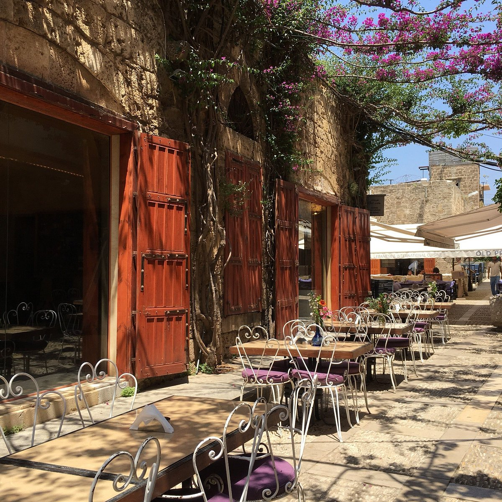

# Drinks of Lebanon

Jallab at iftar (the deep-burgundy date-and-rose syrup with pine nuts floating on top); limonana, the frozen lemon-mint slush that defines summer; arak diluted to milky white with mezze; Lebanese coffee scented with cardamom and served in tiny cups.
