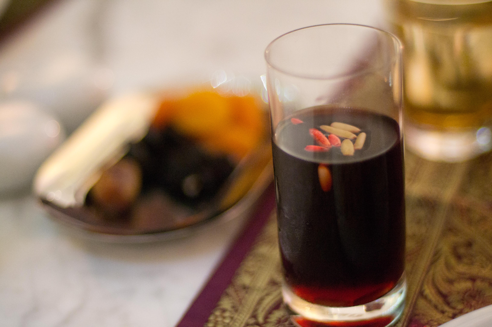

# Jallab

*Lebanese summer punch made from date molasses, rose water and grape syrup, diluted with cold water over crushed ice, topped with pine nuts and golden sultanas. Deep burgundy, intensely fragrant, the Ramadan iftar drink across the Levant.*

**Serves:** 4 tall glasses

**Prep Time:** 5 minutes

**Cook Time:** 0 minutes

## Overview
Jallab is the signature Lebanese summer drink and the most common cold drink served at iftar (the meal that breaks the daily Ramadan fast). The base is dibs (a thick syrup blended from date molasses, carob molasses and grape syrup) plus a generous splash of rose water. Diluted with very cold water over a tall mound of crushed ice, it turns a deep burgundy with a heady floral perfume from the rose water. The traditional topping is a small handful of pine nuts and golden sultanas: the sultanas soften and plump as they sit in the drink, while the pine nuts give a creamy bite. You'll find it sold from street carts in Beirut, Damascus and Amman, ladled out of huge glass urns, and bottled jallab concentrate is widely sold at Middle Eastern groceries to take the prep down to seconds.

## Ingredients

- 60 ml jallab syrup (bottled, sold at Middle Eastern groceries)
- 500 ml very cold water
- 1 teaspoon rose water (extra, on top of what's in the syrup)
- Plenty of crushed ice

### To serve
- 2 tablespoons pine nuts
- 2 tablespoons golden sultanas
- 4 tall glasses, chilled

### If you can't find jallab syrup, mix your own
- 4 tablespoons date molasses (silan)
- 1 tablespoon grape molasses (or pomegranate molasses)
- 1 tablespoon rose water
- 1 teaspoon orange-flower water (optional)

## Method

### Stage 1 - Build the base
1. Soak the sultanas in a small bowl of warm water for 5 minutes, then drain. This plumps them up so they don't soak too much from the drink later.
1. If using bottled jallab syrup, mix the syrup with the extra rose water in a jug.
1. If mixing your own, stir the date molasses, grape molasses, rose water and orange-flower water (if using) together in a jug until smooth.

### Stage 2 - Assemble
1. Fill each chilled glass three-quarters full with crushed ice.
1. Pour 60 ml of the syrup mix over each (or about 2 generous tablespoons).
1. Top up with cold water until the glass is almost full. The colour should be a deep burgundy; if it looks brown rather than red, add a splash more syrup.
1. Stir lightly.

### Stage 3 - Top
1. Scatter 1 teaspoon of pine nuts and 1 teaspoon of sultanas over the top of each glass.
1. Serve with a long spoon so people can fish out the topping.

## Notes
- **The rose water lift.** Even bottled syrup benefits from an extra teaspoon of rose water in the jug. Rose water fades fast once mixed; adding fresh just before serving keeps the perfume bright.
- **Crushed ice, not cubes.** The proper jallab is built on a mound of crushed ice that slowly melts into the drink as you sip. Cubes melt too slowly and leave you with concentrate at the bottom.
- **Sultana soak.** Don't skip the warm-water plump; bone-dry sultanas pull too much liquid from the drink.
- **The pine nut float.** Pine nuts oxidise fast: add them just before serving, not stored in the syrup.

## Variations
- **Carob molasses base.** Some Lebanese versions lean more on carob (kharroub) than dates; gives a slightly bitter, deeper colour. Replace half the date molasses with carob if you can find it.
- **Sparkling jallab.** Top up with cold soda water instead of still; the bubbles lift the rose water further.

## Storage
- Mixed syrup keeps 2 weeks in the fridge in a sealed jar. Assembled drinks don't store: build to order.
