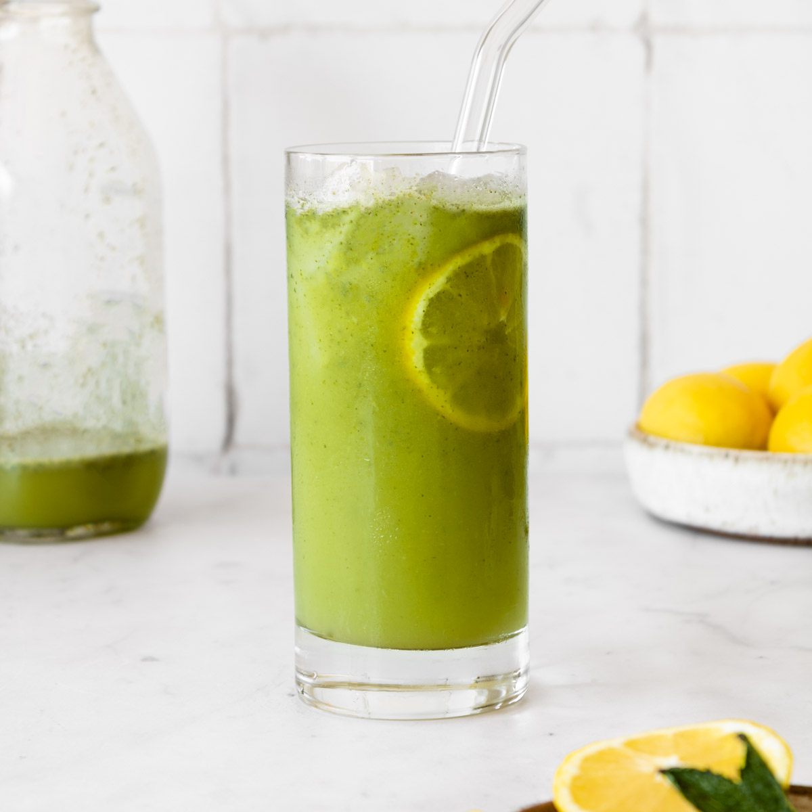

# Limonana

*Lebanese frozen lemon and mint slush: a tall blender of fresh lemon juice, a fat handful of mint leaves, sugar, water and ice, blitzed until pale green and frothy. Iconic across Beirut summer cafés.*

**Serves:** 4 tall glasses

**Prep Time:** 5 minutes

**Cook Time:** 0 minutes

## Overview
Limonana (from "limon" lemon + "nana" mint) is the great Levantine summer drink. The build is dead simple: fresh lemon juice, a serious quantity of mint leaves (a full bunch for four glasses, not a sprig), sugar and ice, all blitzed in a high-powered blender. The result is a thick, pale-green slush with a vivid mint nose and a sharp lemon bite, served in tall glasses with a sprig of fresh mint on top. The trick is the mint quantity: most home cooks underdo it, so the drink ends up sweet-lemon with a hint of mint when it should be mint-lemon, full stop. Café versions in Lebanon and Israel are sometimes thickened with a touch of crushed ice rather than water for an even more sluggy texture. A standby across the Levant in any hot month.

## Ingredients

- 200 ml fresh lemon juice (from about 6 lemons)
- 40 g fresh mint leaves (a full small bunch, leaves picked, stems discarded)
- 100 g caster sugar
- 400 ml cold water
- 4 large handfuls of ice cubes (about 500 g)

### To serve
- 4 mint sprigs
- 4 lemon wheels
- Tall glasses, chilled

## Method

### Stage 1 - Prep the mint
1. Pick the mint leaves from the stems. You should have a packed cup of leaves; if it looks less, add more.
1. Rinse and shake dry.

### Stage 2 - Blend
1. Put the lemon juice, mint leaves, sugar and water into a high-powered blender.
1. Blitz on high for 30 seconds until the mint is completely pulverised and the liquid is a vivid pale-green.
1. Add the ice cubes and blitz again on high for another 30 seconds until you have a thick slush.

### Stage 3 - Taste and adjust
1. Taste: it should be sharp-sweet with a strong mint front.
1. If too sharp, add a tablespoon more sugar and pulse to mix.
1. If too sweet, add another splash of lemon juice and pulse.

### Stage 4 - Serve
1. Pour into chilled tall glasses.
1. Top each with a mint sprig and a lemon wheel.
1. Serve immediately with a thick straw or a long spoon.

## Notes
- **Mint quantity matters.** A small bunch (40 g of leaves) is the right amount for 4 glasses. Less and you've made lemonade.
- **High-powered blender.** A weak blender won't pulverise the mint properly: you'll get green flecks rather than smooth pale-green liquid. Vitamix-class or a Nutribullet does it well.
- **Lemon juice freshness.** Bottled lemon juice tastes flat here; fresh is the whole point.
- **Strain or don't.** Some prefer to strain through a fine sieve for a smooth drink; the unstrained version with mint flecks is more rustic and more traditional.

## Variations
- **Frozen.** Replace the water with extra ice for a thicker slush.
- **Sparkling.** Skip the water; pour the blended concentrate over ice and top with chilled soda water for a fizzy version.
- **Less sugar.** Reduce to 60 g sugar for a sharper, more grown-up drink.

## Storage
- Doesn't store well: the mint oxidises and the slush separates within an hour. Build to order.
