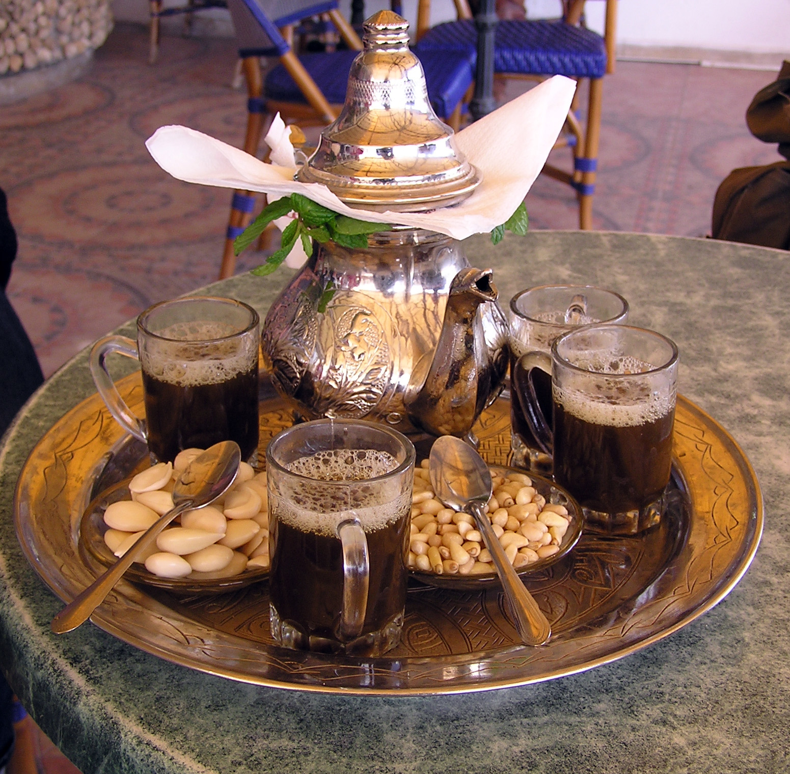

# Atay

*Libyan-Maghrebi mint tea: strong green gunpowder steeped with fresh mint and a heavy hand of sugar, poured long from the pot into small glasses until a thick crown of foam sits on top.*

**Serves:** 4 small glasses

**Prep Time:** 5 minutes

**Cook Time:** 15 minutes

## Overview
Atay is the daily ritual drink of Libya and the wider Maghreb, the small foaming glass of strong sweet green tea that punctuates every meeting, meal and afternoon. The base is gunpowder green tea (rolled pellets that unfurl in the pot), pushed hard with fresh mint and a heavy hand of sugar, simmered briefly to draw out the colour and the bite. The pour is the show: the teapot is lifted high above the glasses so the stream falls a foot or more, aerating as it lands and building the thick frothy crown the Libyans call the keffiyeh, the headdress. Three pours are traditional, the first sharp, the second gentle, the third sweet, following an old North African saying that mirrors the stages of life. The mint must be spearmint, the glasses must be small, and the company is half the point.

## Ingredients

- 1 tbsp Chinese gunpowder green tea
- 1 large handful fresh spearmint (about 20 g, leaves and tender stems)
- 4 tbsp granulated sugar (or to taste)
- 500 ml just-boiled water
- Optional: 1 pine nut per glass

## Method

### Stage 1 - Rinse the tea
1. Place the gunpowder tea in a small teapot.
2. Pour over about 100 ml just-boiled water; swirl gently for 10 seconds.
3. Pour off and discard the water; this removes the dusty bitter top notes.

### Stage 2 - Brew
1. Pour the remaining 400 ml just-boiled water over the rinsed tea.
2. Add the sugar.
3. Set the teapot on the lowest heat possible (or over a tea burner) for 3-4 minutes; do not let it boil hard.
4. Add the mint, pushing the leaves down into the liquid.
5. Steep 4 more minutes.

### Stage 3 - Pour and aerate
1. Pour a small splash into a glass, then pour it back into the pot; repeat twice. This mixes the tea evenly.
2. Hold the pot up high, about 30 cm above the glasses.
3. Pour in a thin steady stream from the height; the falling liquid creates the foam crown.
4. Fill each small glass two-thirds full.
5. Drop in a pine nut if using.
6. Serve hot.

## Notes
- **Gunpowder tea is essential:** loose-leaf green tea will not give the right colour, strength or foam.
- **Spearmint, not peppermint:** spearmint is the sweeter Maghrebi mint; peppermint is too sharp and medicinal.
- **The high pour:** the foam is not decoration but a signal that the tea has been poured properly. Practise over the sink first.
- **Sweetness is non-negotiable:** Libyan atay is sweet; the sugar balances the bite of the tea and the cool of the mint.

## Variations
- Add a small pinch of saffron for a festive amber-tinged version.
- Stir in 2 cardamom pods for an eastern Libyan touch.
- Add a sprig of fresh wormwood (sheeba) in winter for a herbal version.
- Use half spearmint and half lemon verbena for a citrus take.
- Reduce sugar by half for a lighter modern version (still sweeter than most palates expect).

## Serving
After every meal as the closing ritual · with a plate of dates, almonds and dried figs · at any visit, the moment the guest sits down · in the late afternoon as the social drink of the day · alongside a tray of ghraybeh or maqrood for a sweet pairing.

## Storage
- Brew fresh; atay does not keep.
- Leftover tea can be refrigerated and drunk cold within a day as iced mint tea, but the foam is gone.
- The dry tea and dry mint keep in airtight tins for 6 months.
