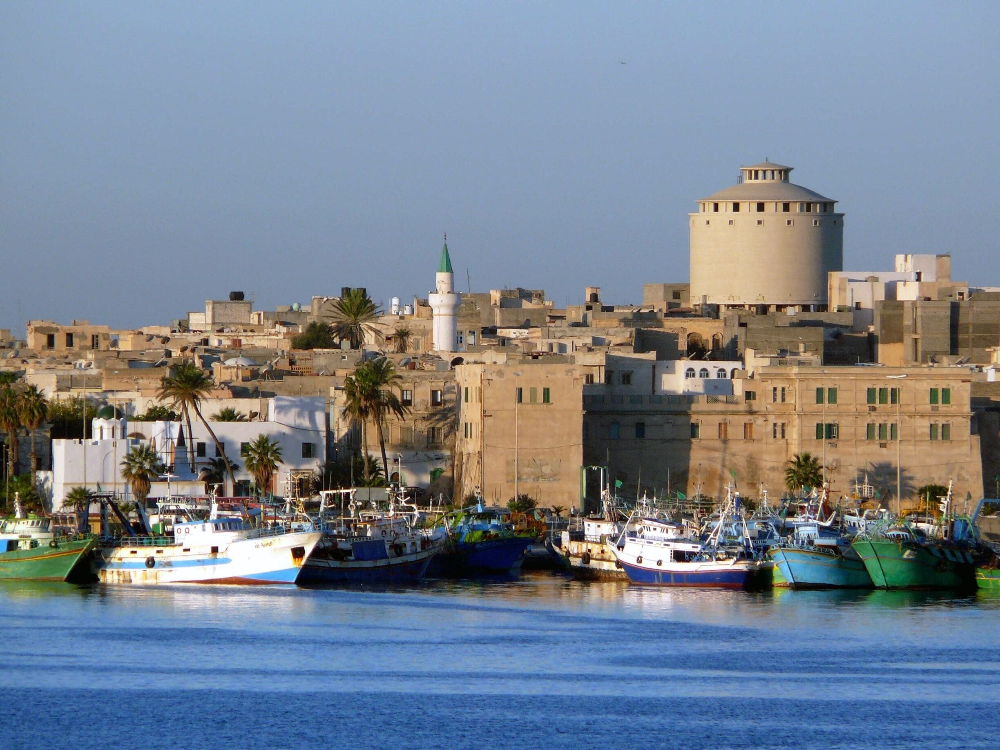

# Libyan Drinks

Libya's drinks sit at the meeting of the Maghreb and the wider Arab world: strong sweet green tea poured from a great height into small glasses (atay), thick cardamom-spiced coffee served in tiny cups (Libyan qahwa), and bright tart infusions made from dried Omani limes (sharab al-loomi) drunk cold through long summer afternoons. Tea is the social ritual; coffee is the morning and evening companion; loomi is the household cooler. Mint grows on every Tripoli balcony, cardamom pods are bought whole from the souk, and dried limes hang in net bags in every pantry. Pour the tea long, pound the cardamom fresh, and let the dried limes steep until the liquid turns the colour of strong tea.
