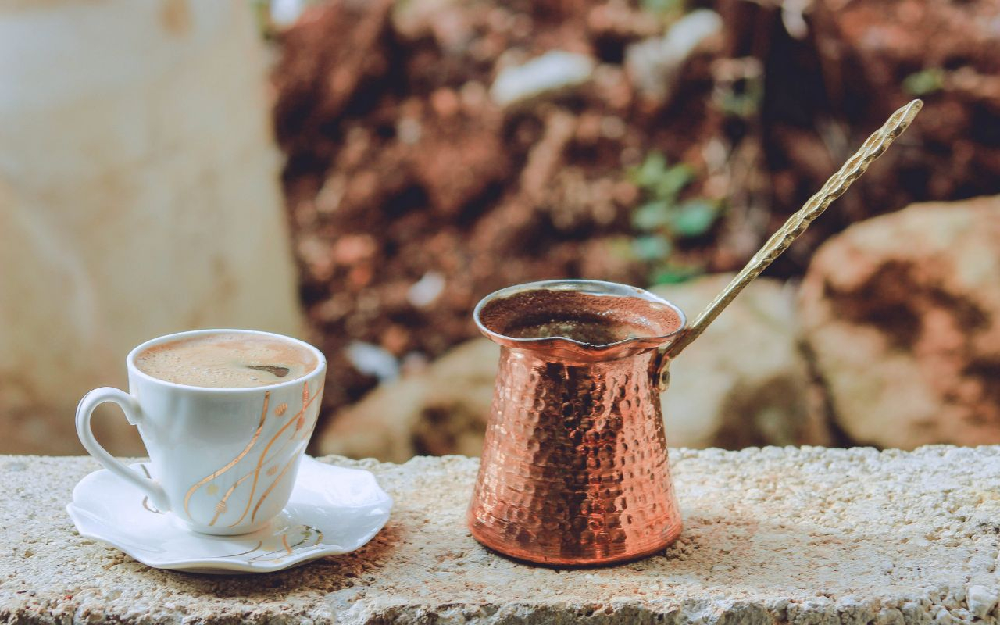

# Libyan Qahwa

*Libyan coffee: finely ground beans simmered with cardamom and a small amount of sugar in a long-handled brass pot, served in small cups with the grounds settling on the bottom.*

**Serves:** 4 small cups

**Prep Time:** 5 minutes

**Cook Time:** 8 minutes

## Overview
Libyan qahwa sits in the same family as Turkish coffee and the broader Maghrebi tradition: very finely ground dark-roast beans, simmered (not filtered) in a long-handled brass pot called a dalla or rakwa, lifted off the heat the moment it threatens to foam over, and poured carefully so the grounds stay at the bottom. The Libyan signature is the cardamom - a generous pinch per cup, sometimes accompanied by a tiny amount of saffron or rose water in fancier versions. Served at any time of day, particularly after the heavy lamb-and-couscous lunch.

## Ingredients
- 4 small cups (about 60 ml each) of water
- 4 tsp very finely ground coffee (Turkish-style grind, even finer than espresso)
- 4 cardamom pods, lightly crushed (or 1/2 tsp ground cardamom)
- 4 tsp sugar (to taste; can go to 6 for sweeter)
- Optional: a tiny pinch of saffron threads, or a few drops of rose water

## Method

### Stage 1 - Combine in the pot
1. Pour the water into a long-handled brass coffee pot (cezve / rakwa / ibrik).
2. Add the coffee, cardamom, sugar and saffron (if using).
3. Stir once with a teaspoon to combine; do not stir again from this point.

### Stage 2 - Heat slowly
1. Place over low heat. Heat slowly - rushing this is the most common mistake.
2. As the coffee warms, foam starts to rise. The first foam, called the "face" (wajh), is the prize.

### Stage 3 - The lift
1. The moment the foam reaches the top of the pot - just before it would boil over - lift the pot off the heat.
2. Pour a tiny amount of foam into each small cup. This is the head; serving it shows hospitality.
3. Return the pot to the heat. Wait for the foam to rise again (faster this time, about 30 seconds).
4. Lift again. Pour the remaining coffee evenly into the cups, dividing the foam.

### Stage 4 - Settle
1. Let the cups sit 1 minute before serving. The grounds settle to the bottom.
2. Add rose water if using - just a drop per cup.

## Notes
- **Grind matters:** Turkish-grind (powder-fine) is essential. Espresso grind is too coarse - the grounds don't settle and the texture is wrong.
- **No stirring during cooking:** Stirring breaks the foam. The single stir at the start is the only one.
- **Two foams:** A traditional service raises the foam twice. The first lift goes to the cups as the head; the second pour fills them. Some makers do three lifts for extra depth.
- **Sip the top:** Drink the top half of the cup carefully; leave the last 5 mm where the grounds settle.

## Serving
- Serve in small cups (about 60 ml). Accompany with a date or a small piece of ghraybeh. The conversation matters more than the coffee speed - this is sit-down coffee.

## Storage
- Make fresh per round. Reheated qahwa is bitter and the grounds rise.
