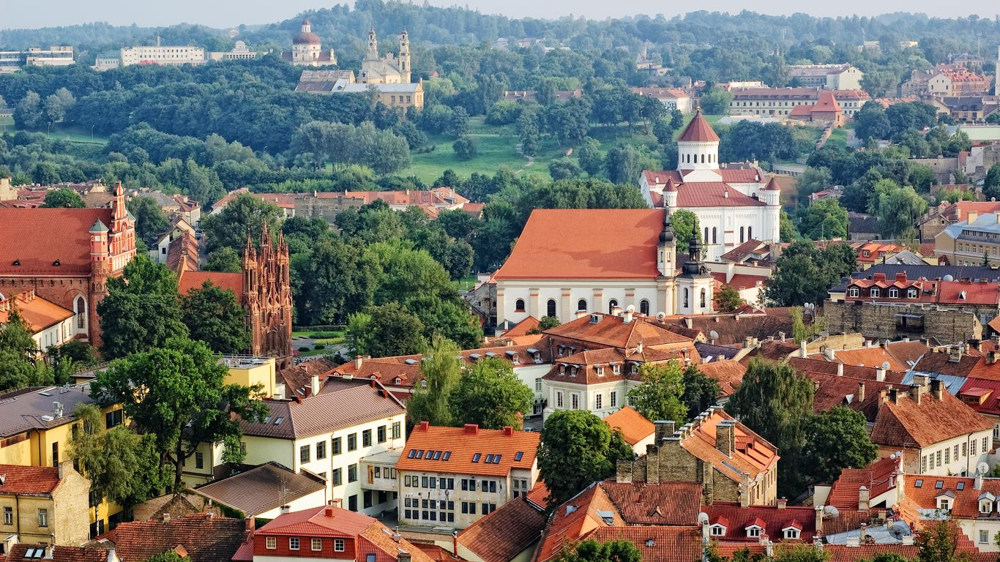

# Drinks of Lithuania

Lithuania's drinks tradition runs from the lightly-fermented to the deeply spirited. Gira, the rye-bread kvass, is the everyday summer pour: every roadside kiosk, every village shop, every grandmother's kitchen has a jug of it on hot afternoons, sweet and faintly sour with that distinct dark-rye tang. Midus, the ancient Baltic honey wine, predates beer in this country and still appears on wedding tables and at midsummer feasts, sipped slowly from small wooden cups. Krupnikas, the warming honey-and-spice liqueur, is the after-dinner pour and the obligatory Christmas Eve sip, infused with cinnamon, cloves, caraway, nutmeg and saffron. The Žemaitija region in the west keeps a long tradition of herbal-spirit infusions, with bog-myrtle, wormwood and forest berries steeped into clear spirit. Beer (alus) is brewed across the country, often unfiltered and unpasteurised; the small Aukštaitija breweries north of Vilnius pour what many consider the most distinct farmhouse beer in Europe.
