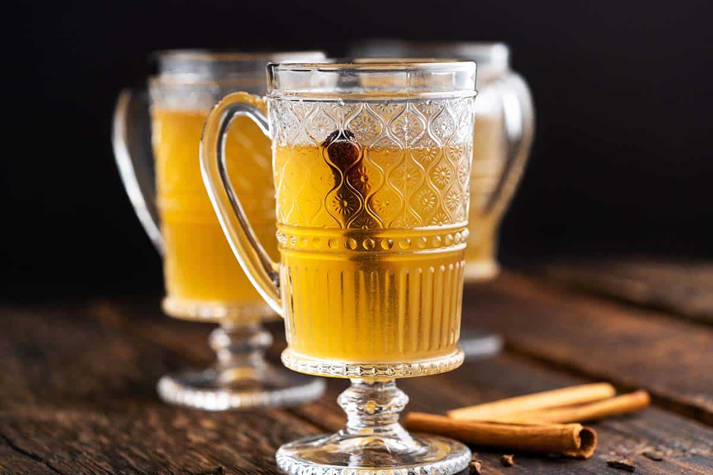

# Krupnikas

*Lithuania's traditional honey-and-spice liqueur: clear spirit infused with honey, cinnamon, cloves, nutmeg, caraway and saffron, served warm in winter and chilled in summer, the obligatory after-dinner pour and the Christmas Eve sip.*

**Serves:** Makes 1 litre (about 20 servings of 50 ml)

**Prep Time:** 30 minutes

**Cook Time:** 20 minutes (plus 2 weeks resting)

## Overview
Krupnikas is the most traditional Lithuanian spirit-and-honey liqueur, the digestif at the end of every festive meal and the warm-from-the-pan winter drink ladled into mugs by the fire. The recipe goes back to at least the sixteenth century, when the apothecaries and monks of the Polish-Lithuanian Commonwealth made it as a fortifying medicinal tonic; it has since become the country's after-dinner pour of choice. The construction is simple in outline and infinite in variation: a clear neutral spirit (vodka or grain alcohol) is steeped with whole spices for a week, then a slow-cooked honey syrup spiced with more aromatics is married into the spirit and the whole thing is rested for at least another week before drinking. Every Lithuanian household swears by a slightly different spice blend; the unchanging core is honey, cinnamon and cloves. Served chilled in glasses as a digestif or warmed gently on the stove with a cinnamon stick as a winter drink, krupnikas is the most distinctly Lithuanian spirit you can pour.

## Ingredients

- 700 ml vodka (40% ABV) or grain spirit
- 500 g good honey (linden or wildflower)
- 300 ml water
- 2 cinnamon sticks
- 6 whole cloves
- 1 tsp caraway seeds
- 1/2 tsp grated nutmeg
- 1 vanilla pod, split
- Zest of 1 lemon (no pith)
- Zest of 1 orange (no pith)
- 1 pinch saffron threads
- 4 cardamom pods, lightly crushed
- 1 small bay leaf
- 1 tbsp grated fresh ginger (optional)

## Method

### Stage 1 - Infuse the spirit
1. Combine the vodka, 1 cinnamon stick, 3 cloves, the caraway, half the nutmeg, the lemon and orange zest, the cardamom and the bay leaf in a clean jar.
2. Seal; shake gently.
3. Steep at room temperature in a dark place for 5-7 days; shake daily.
4. The spirit takes on a pale golden colour and a strong spice aroma.

### Stage 2 - Make the honey syrup
1. Combine the honey, water, the remaining cinnamon stick, remaining cloves, remaining nutmeg, the vanilla pod, the saffron and the ginger (if using) in a heavy saucepan.
2. Heat gently to 65-70°C, stirring; dissolve the honey completely.
3. Simmer very gently for 15 minutes; skim any foam.
4. Do not boil hard, this drives off the honey aroma.
5. Remove from heat; cool fully (about 1 hour). Cover while cooling to keep the aromatics in.

### Stage 3 - Combine
1. Strain the infused vodka through fine muslin to remove the spices.
2. Strain the cooled honey syrup similarly.
3. Combine the two in a clean large jar; stir to mix.
4. The colour deepens to a warm amber.

### Stage 4 - Rest
1. Seal the jar.
2. Rest at room temperature in a dark place for 2 weeks (3-4 weeks is better).
3. The flavour rounds and softens; rough edges smooth away.

### Stage 5 - Bottle
1. Strain once more through fine muslin.
2. Pour into clean dry bottles.
3. Cork or seal; label with the date.

### Stage 6 - Serve
1. **Chilled:** pour 50 ml into a small glass; refrigerate before serving.
2. **Warm:** heat gently in a small pan with an extra cinnamon stick; pour into a warm mug.

## Notes
- **Use real honey:** the soul of krupnikas is honey. Thin supermarket honey gives a thin liqueur. Good linden or wildflower honey gives the proper depth.
- **Don't boil the syrup:** gentle warmth dissolves and infuses; boiling loses the floral aromatics.
- **Cool before combining:** hot syrup poured into spirit evaporates the alcohol. Always cool first.
- **Rest patiently:** young krupnikas is harsh. Two weeks softens it; a month transforms it.

## Variations
- **Stiprusis krupnikas (strong):** use 95% grain alcohol diluted to 50% ABV, the traditional pour, definitely sip slowly.
- **Spiced winter version:** add allspice, star anise and black pepper for a more aggressive blend.
- **Floral version:** add 1 tbsp dried elderflower and 1 tsp dried chamomile.
- **Berry-infused:** add 100 g fresh raspberries or cranberries to the spirit infusion stage.
- **Quick krupnikas:** combine warm honey syrup with infused spirit straight away and rest only 3 days, drinkable, not as deep.

## Serving
- Serve chilled in small glasses as a digestif · warm in a mug on a winter evening · at Christmas Eve · at New Year · with honey cake · with šakotis · with strong coffee · alongside a small piece of dark chocolate · the most Lithuanian after-dinner pour.

## Storage
- Bottled krupnikas keeps 3 years.
- Improves with age over the first 12 months.
- Refrigerate after opening; drink within 6 months.
- Don't freeze; the honey separates and crystallises.

