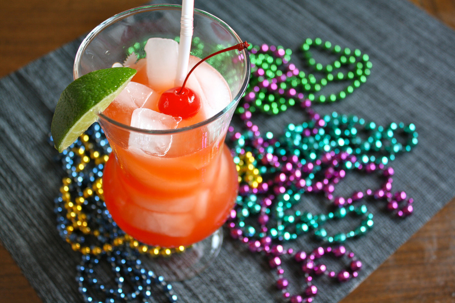

# Hurricane

*The Pat O'Brien's tropical rum punch, invented in 1940s New Orleans when a glut of dark rum needed shifting. Bright red, fruit-juice-heavy, served in the hurricane-lamp glass that named it.*

**Serves:** 1

**Prep Time:** 5 minutes

**Cook Time:** 0 minutes

## Overview
The Hurricane is the cocktail of Bourbon Street: bright red, sweet-sour, served in a 600 ml tulip-shaped glass styled after the chimney of a hurricane lamp. The drink was invented at Pat O'Brien's bar in the French Quarter in the 1940s, when wartime whiskey rationing forced bars to take rum (then plentiful, mostly dark and unsold) in case-load lots to get a single case of bourbon. The bar's owner, Pat O'Brien, devised the Hurricane as a way to push the rum quickly, and it became the bar's signature.

The original Pat O'Brien's recipe uses a passion fruit syrup that is sold under their own label. This recipe gives a from-scratch version that approximates it with a passion-fruit-and-grenadine combination, plus orange and lemon juice for the citrus brightness. The drink is meant to be properly potent (two and a half ounces of rum); rein in if you want a lighter session drink.

## Ingredients
- 60 ml dark rum (Myers's, Gosling's Black Seal, or any aged Jamaican-style rum)
- 30 ml light rum (Bacardi, Plantation, or any white aged rum)
- 30 ml fresh lemon juice
- 30 ml fresh orange juice
- 30 ml passion fruit syrup (or 20 ml passion fruit purée + 10 ml simple syrup)
- 15 ml grenadine
- 5 ml fresh lime juice (optional, for brightness)
- Crushed ice
- 1 orange slice (to garnish)
- 1 maraschino cherry (to garnish)

## Method

### Stage 1 - Build the drink
1. Fill a tall cocktail shaker with ice.
1. Pour in the dark rum, light rum, lemon juice, orange juice, passion fruit syrup, grenadine and lime juice (if using).
1. Shake hard for 12-15 seconds. The shaker should feel frosty cold.

### Stage 2 - Serve
1. Fill a hurricane glass or a tall 400 ml tulip glass two-thirds with crushed ice.
1. Strain the cocktail over the crushed ice. Top up with a small splash of crushed ice if needed; the drink should fill the glass with about 1 cm headroom.
1. Spear the orange slice and maraschino cherry on a cocktail pick and lay it across the rim.
1. Serve with a long straw.

## Notes
- **Two rums are better than one.** The dark rum provides molasses depth and colour; the light rum keeps the drink from being syrupy. A single-rum Hurricane is heavy and one-dimensional.
- **Fresh citrus only.** Bottled lemon juice has the wrong sharpness and the wrong colour; the difference is dramatic.
- **Passion fruit syrup is the signature note.** If you cannot find passion fruit syrup, the workaround is passion fruit purée from the freezer aisle (often sold in 100 g pouches) plus simple syrup to balance. Pat O'Brien's own syrup is sold internationally and is worth tracking down for authenticity.
- **Crushed ice melts faster than cubes.** Drink reasonably promptly; a Hurricane left for half an hour becomes pink water.
- **The glass is half the experience.** A proper hurricane glass (sometimes called a "Pat O'Brien's glass") is widely available; a tall tulip-shape pint glass works as a substitute. A standard tumbler is too short and the layered colour gradient disappears.

## Variations
- **Frozen Hurricane:** blend the cocktail with a cup of crushed ice and serve in a chilled hurricane glass. Sweeter and less potent on the palate, more dessert-like.
- **Hurricane Lite:** halve the rums (15 ml dark, 15 ml light), double the citrus. A sessionable beach version that still tastes like the original.

## Serving
A Hurricane is a sipping drink despite the size of the glass. Two is the typical evening; three is the typical morning-after regret. The drink works well with rich Creole food (jambalaya, gumbo) thanks to the citrus cutting the heat and oil.

## Storage
The drink itself doesn't keep. Passion fruit syrup keeps 3 months refrigerated. Grenadine keeps 6 months refrigerated; check the bottle for the brand-specific date.
