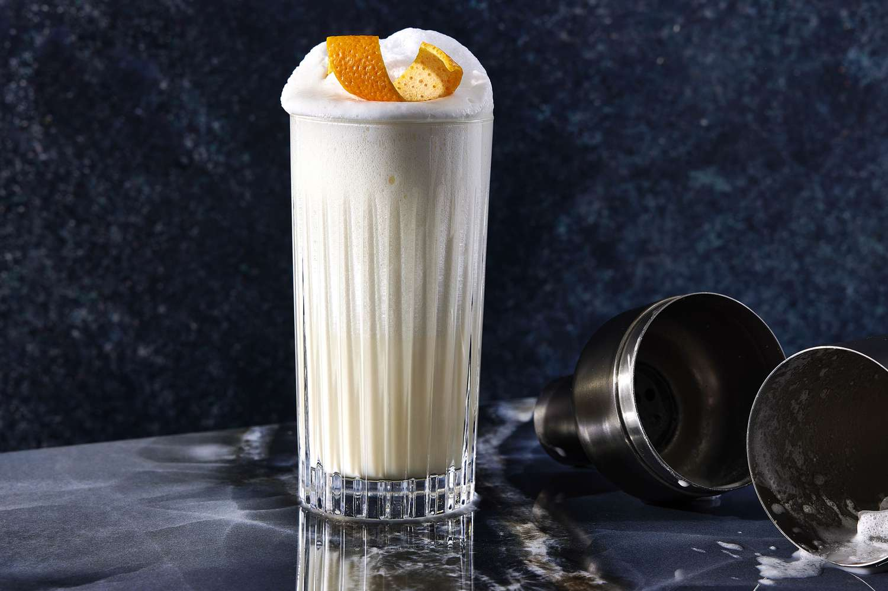

# Ramos Gin Fizz

*The most demanding cocktail in New Orleans: gin, cream, egg white, orange flower water and citrus, shaken for a quarter of an hour until it forms a stiff, towering meringue head. Invented at the Imperial Cabinet Saloon in 1888.*

**Serves:** 1

**Prep Time:** 15 minutes (almost all of it shaking)

**Cook Time:** 0 minutes

## Overview
The Ramos Gin Fizz is the marathon cocktail of New Orleans: a dry-shaken-then-wet-shaken concoction of gin, cream, egg white, citrus, sugar and orange flower water that, properly made, produces a pillowy meringue head that stands proud of the rim of the glass and supports a straw upright in the middle of it. Henry Ramos invented it at his Imperial Cabinet Saloon on Gravier Street in 1888; he employed up to 35 "shaker boys" during Mardi Gras to keep up with demand, with each cocktail shaken by hand for 12-15 minutes in a relay system.

A modern bartender does not shake one drink for 15 minutes (the world record is about 8 minutes, and even a perfectly-made Ramos takes considerable effort). This recipe gives a domestic version that produces a good but more compact head in a more reasonable time. For the full effect, recruit family members and do shifts.

## Ingredients
- 50 ml gin (Old Tom or a London Dry; Plymouth works well)
- 25 ml fresh lemon juice
- 25 ml fresh lime juice
- 20 ml simple syrup
- 30 ml double cream (or heavy cream)
- 1 egg white (medium egg, about 30 ml)
- 4 drops orange flower water (also called orange blossom water; do not exceed 4 drops, the flavour gets soapy fast)
- 1 dash vanilla extract (optional)
- 25 ml chilled soda water (to finish)
- Ice cubes (for the wet shake)

## Method

### Stage 1 - Dry shake
1. Combine the gin, lemon juice, lime juice, simple syrup, cream, egg white, orange flower water and vanilla (if using) in a cocktail shaker without ice.
1. Seal the shaker tightly. Shake hard for 60-90 seconds. This emulsifies the egg white with the citrus and cream and is the foundation of the meringue.

### Stage 2 - Wet shake (the long one)
1. Open the shaker and add 4-5 ice cubes (not crushed; whole cubes preserve the texture better).
1. Seal again. Shake hard for 3-5 minutes (longer if you have stamina; a real Ramos shaker would go 8-12 minutes). The shaker should feel painfully cold and the contents inside should sound airy and viscous rather than slushing.
1. The shake is done when the drink is uniformly thick. If you stop and listen, the contents inside should sound silky and almost solid rather than liquid.

### Stage 3 - Serve
1. Strain the cocktail into a tall chilled highball or Collins glass. Do not add ice to the glass.
1. The drink should fill about three-quarters of the glass with about 2 cm of foam rising above the liquid.
1. Slowly pour the chilled soda water down the inside of the glass. The carbonation lifts the foam dramatically; the head should rise above the rim and stand on its own as a meringue tower.
1. Set the glass on a small saucer (the foam may drip slightly as it relaxes). Insert a straw vertically into the centre of the foam.
1. Serve immediately. The head holds 4-5 minutes; after that it relaxes back into the drink and the geometry is gone.

## Notes
- **The shaking time is the recipe.** A 30-second shake will give you a mediocre gin fizz; the long shake is what produces the meringue. Five minutes is the home minimum. Set a timer.
- **Dry shake first, then wet shake.** This is the modern technique; the original Imperial Cabinet method was a single very long wet shake. Dry-shaking emulsifies the egg-white-and-citrus mix before the ice would otherwise compete for the protein. The result is more reliable.
- **Orange flower water is the marker of the drink.** Less than four drops is forgettable; more than four is overpowering. It is a precision ingredient.
- **Cream, not milk.** A Ramos with milk is a different drink (lighter, less stable). Double cream gives the body that holds the meringue.
- **Old Tom gin** (lightly sweetened, historical pre-Prohibition style) was the original. London Dry works; New Western styles (heavy on cucumber or rose) are wrong.
- **The straw must be vertical.** A leaning straw means the foam isn't dense enough; shake longer next time.

## Variations
- **Ramos for two:** double the recipe in a larger shaker. The volume of cream and egg white makes the shake easier, not harder; this version is the right scale for two people sharing a tasting flight.
- **Frozen Ramos:** blend the dry-shake mixture with crushed ice in a high-power blender, then transfer to a shaker for a 30-second wet shake. A modern shortcut; the texture is similar but slightly more granular.

## Serving
- A Ramos Gin Fizz is a morning cocktail in New Orleans, traditionally taken after a heavy night or as a brunch indulgence. The bright citrus and protein make it sit lighter than its richness suggests. Single serving only; nobody orders a second.

## Storage
The drink itself collapses within minutes; it is a make-and-drink cocktail. Simple syrup keeps a month refrigerated; orange flower water keeps a year in the cupboard.
