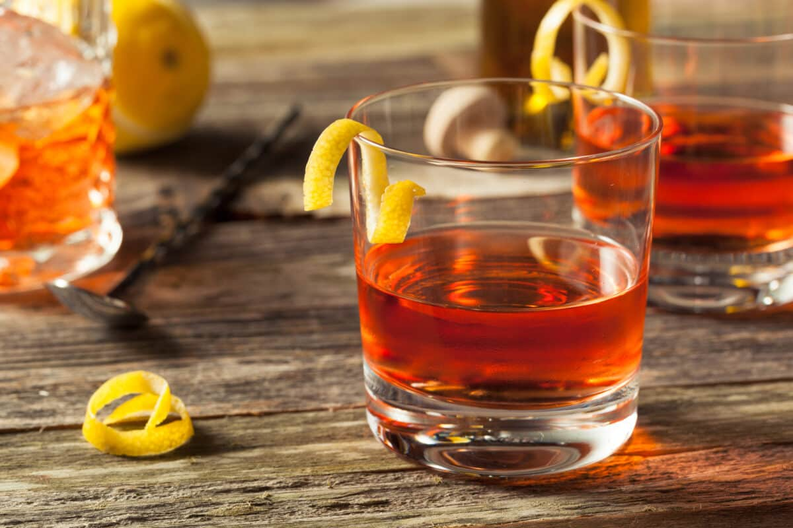

# Sazerac

*Louisiana's official state cocktail and arguably America's oldest: rye whiskey stirred with sugar and Peychaud's bitters, in a chilled glass rinsed with absinthe. Lemon twist, no ice in the glass.*

**Serves:** 1

**Prep Time:** 5 minutes

**Cook Time:** 0 minutes

## Overview
The Sazerac is the official cocktail of New Orleans and Louisiana, traditionally made with rye whiskey (not bourbon), Peychaud's bitters (created in the city by Antoine Peychaud, 1830s) and a chilled rocks glass rinsed with absinthe. The drink predates the cocktail glass we now associate with classic mixology; it is meant to be served in a heavy Old Fashioned glass, with no ice in the finished drink, just an oily-bright lemon twist on top.

The recipe sounds simple, but two things are easy to get wrong. The absinthe is a rinse, not an ingredient; the glass is coated and the excess discarded. And the drink itself is built and stirred in a separate mixing glass, then strained into the prepared serving glass. Skipping the rinse-and-pour gives you something fine but not a Sazerac.

## Ingredients
- 60 ml rye whiskey (Sazerac, Rittenhouse, Old Overholt, all classic choices)
- 1 sugar cube (or ½ tsp white sugar)
- 3 dashes Peychaud's bitters
- 1 dash Angostura bitters (optional but classic)
- 5 ml absinthe (or Herbsaint, the Louisiana-distilled substitute)
- 1 large strip of lemon peel (no pith)
- Ice (in the mixing glass only)

## Method

### Stage 1 - Chill and rinse
1. Fill a heavy-bottomed Old Fashioned glass (the serving glass) with ice and cold water. Set aside to chill while you prepare the drink.
1. In a separate mixing glass, place the sugar cube. Add the Peychaud's bitters and the Angostura. Crush the sugar cube with the back of a bar spoon until dissolved.
1. Add the rye whiskey to the mixing glass. Add 4-5 ice cubes.
1. Stir well with a bar spoon, 25-30 seconds, to chill and slightly dilute the whiskey.

### Stage 2 - Rinse the serving glass
1. Discard the ice and water from the chilled Old Fashioned glass.
1. Pour the absinthe into the glass. Tilt and rotate the glass to coat the entire inside, including the rim. Take 10-15 seconds over this; the rinse should be thorough.
1. Discard the excess absinthe (down the sink or into the mixing glass; some bartenders prefer the latter as it adds a faint note to the final drink). The glass should look slightly wet on the inside with a faint cloudy aniseed smell.

### Stage 3 - Strain and finish
1. Strain the contents of the mixing glass into the prepared serving glass. The drink should fill about two-thirds of the glass; no ice goes in.
1. Cut a long strip of lemon peel. Hold it skin-side down over the glass and twist firmly to release the citrus oils onto the surface of the drink (you should see a brief glisten as the oils hit).
1. Run the oily side of the peel around the rim of the glass, then drop it in. Serve immediately.

## Notes
- **Rye, not bourbon.** The Sazerac was originally cognac (until the 1870s phylloxera blight), and now is rye. Bourbon is sweeter and lacks the spicy edge the drink needs; a Sazerac made with bourbon is a different cocktail.
- **Peychaud's is non-negotiable.** Angostura alone makes a fine cocktail but not a Sazerac. Peychaud's gives the drink its faintly floral, anise-edged background that lifts everything else.
- **The absinthe rinse is non-negotiable too.** Adding absinthe to the drink (rather than rinsing) makes it overpowering. The thin aromatic veil from a rinsed glass is the point.
- **No ice in the serving glass.** The mixing-glass stir provides all the dilution the drink needs. A Sazerac on the rocks waters down as you drink it and the structure collapses.
- **Herbsaint** (also Louisiana, distilled in New Orleans) was created in 1934 when absinthe was banned in the US, and is still the local default in many NOLA bars. Either works.

## Variations
- **Sazerac with cognac:** the original 1850s version. Use a good VSOP-grade cognac in place of the rye. Sweeter, rounder, more obviously antique-tasting.
- **Sazerac with both:** a 30 ml rye / 30 ml cognac split is a now-current take that bridges the historical and modern versions. Works well.

## Serving
A Sazerac is a sipping cocktail, not a session drink. One is plenty before dinner; two suggests the evening is going somewhere late. It is often the first cocktail of a NOLA night and almost never the third.

## Storage
The drink does not keep; it is built to order. The Peychaud's bitters keep on the shelf for years and improve in a half-empty bottle. Absinthe lasts indefinitely.
