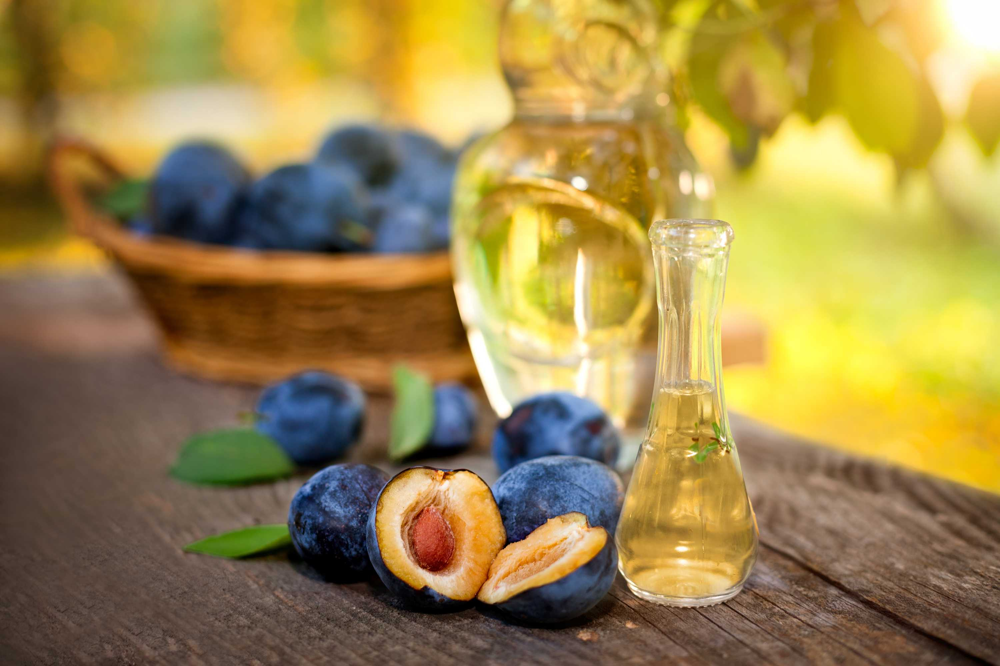

# Macedonian Rakija

*North Macedonia's national spirit: a clear fruit brandy distilled from plums (slivova rakija), grapes (lozova), or quinces (dunkina). 40-50% ABV. Served in small thick glasses as an aperitif before every meal and as the digestive after every dinner. The Macedonian national handshake.*

**Serves:** 1 (50 ml)

**Prep Time:** None (commercial spirit) or 6 months (homemade)

**Cook Time:** None

## Overview
Rakija (the generic Balkan term for fruit brandy) is North Macedonia's national spirit - distilled from fermented fruit by virtually every Macedonian rural family. The most common varieties: slivova rakija (from plums), lozova rakija (from grapes), and dunkina rakija (from quinces). Homemade rakija from a neighbour or family is generally stronger (50-60% ABV) than commercial (40-45% ABV) and is offered with pride at every Macedonian visit. Served chilled or room temperature in small thick glasses, usually 50 ml shots. Drunk neat - sipping is the canonical Macedonian way (not shooting). The opening "živeli!" (cheers!) is mandatory before the first sip; eye contact is mandatory.

## Ingredients

### Per serving
- 50 ml Macedonian rakija (commercial brands: Skovin, Brkič, Stara Tikveška Rakija; or homemade from a neighbour)
- A small thick rakija glass (50 ml)
- Optional: a small piece of cheese or a slice of cured meat alongside (the Macedonian "meze")

### Homemade rakija (overview only)
- 10 kg ripe fruit (plums, grapes, quinces)
- Sugar (if needed for fermentation)
- Yeast
- A copper still (kazan)
- 6 months minimum for fermentation + distillation

## Method
1. Pour 50 ml into a small glass.
2. Serve room temperature or slightly chilled.
3. Make eye contact with companions.
4. Say "Živeli!" (cheers).
5. Sip slowly.

## Notes
- **Sip, don't shot:** the canonical Macedonian way.
- **Small glass:** 50 ml is appropriate.
- **Live the meze tradition:** with cheese and cured meat.

## Variations
**Slivova rakija:** the canonical plum brandy.
**Lozova rakija:** grape brandy.
**Dunkina rakija:** quince brandy.
**Mastika:** anise-flavoured rakija.
**Pelinkovac:** rakija with wormwood - the bitter Macedonian aperitif.
**Honey rakija:** rakija with honey.

## Serving
Before every Macedonian meal (aperitif, the canonical setting) · after every Macedonian meal (digestif) · with cheese and cured meat as meze · at a Macedonian wedding · as a Macedonian guest welcome · at home for visitors.

## Storage
Bottles keep indefinitely. Don't refrigerate (mutes the aromas). Once opened, drink within 2 years.
