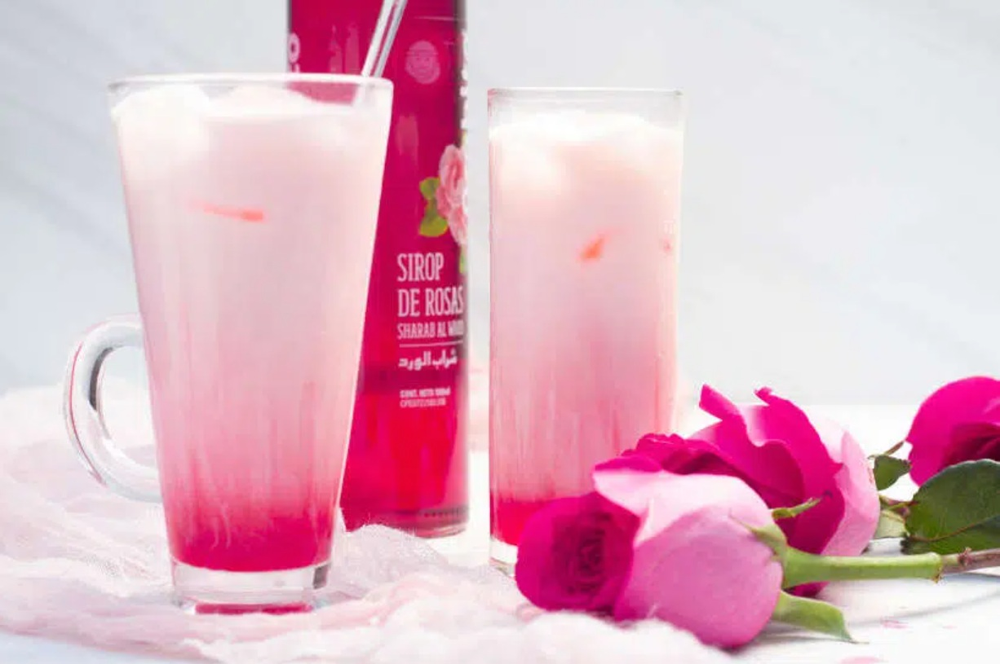

# Bandung

*Malaysia's bubblegum-pink rose milk: condensed milk thinned with cold water, stirred with bright pink rose syrup, served over a tall glass of ice. Festive, sweet, ubiquitous at weddings and Eid.*

**Serves:** 4 tall glasses

**Prep Time:** 5 minutes

**Cook Time:** 0 minutes

## Overview
Bandung (sometimes "air bandung" or "sirap bandung") is a Malaysian and Singaporean staple that needs no cooking, no equipment beyond a jug and ice, and tastes vivid and floral. The colour is the giveaway: a bright pink that comes from rose syrup (the bottled stuff sold at every Malaysian grocery, usually labelled "rose syrup" or "sirap mawar"). Mixed with sweetened condensed milk thinned with cold water and tipped over a tall glass of ice, it's a drink built for hot weather and special occasions. You'll find it at every Malay wedding, Hari Raya feast (Eid) and pasar malam (night market) across the country, often served in plastic bags with a straw. The Singaporean version sometimes adds a splash of sarsi (root beer) for an extra fizz layer. A childhood drink for most Malaysians of any background.

## Ingredients

- 100 ml rose syrup (bottled, sold at Malaysian / South Asian groceries)
- 200 ml sweetened condensed milk
- 800 ml cold water
- 1 teaspoon rose water (optional, for extra floral lift)
- Plenty of ice cubes

### To serve
- 4 tall glasses, chilled
- Fresh rose petals or mint sprigs (optional)

## Method

### Stage 1 - Mix the base
1. In a large jug, whisk the sweetened condensed milk with the cold water until smooth. The colour should be a pale, creamy beige.
1. Stir in the rose syrup; the colour shifts to a vivid bubblegum pink.
1. Stir in the rose water if using.

### Stage 2 - Taste and adjust
1. Taste. Bandung should be sweet, milky, distinctly floral. If too sweet, add more cold water; if too pale, add a splash more syrup; if too sharp, a touch more condensed milk.

### Stage 3 - Serve
1. Fill the chilled glasses with ice cubes.
1. Pour the bandung over the ice.
1. Garnish with a fresh rose petal or mint sprig if you have them.
1. Serve with a long spoon or straw.

## Notes
- **Rose syrup brands.** ROSE brand (the Singaporean classic, sold in glass bottles) is the standard; Kasturi and Ahmad are other good brands. Avoid grenadine: it's pomegranate, not rose.
- **Condensed milk, not fresh.** Bandung's specific texture comes from sweetened condensed milk. Fresh milk gives a thinner, less sweet drink that isn't bandung.
- **Rose water lift.** Optional but recommended; it amplifies the rose syrup's floral side and stops the drink tasting one-note sweet.
- **Cold water, not warm.** Mixing into warm water gives a slightly curdled-looking texture; stick to cold or chilled water.

## Variations
- **Soda bandung.** Use chilled soda water instead of still for a fizzier version.
- **Bandung cincau.** Add a spoonful of grass jelly (cincau) at the bottom of the glass; very common Malaysian variation. Soaks up the rose flavour beautifully.
- **Bandung sarsi.** Top up the last third of the glass with cold root beer (sarsi); the result is a layered drink that's a Singapore hawker centre favourite.

## Storage
- The mixed base keeps 3 days in the fridge in a sealed jug. Don't add ice in advance; build to order over ice.
