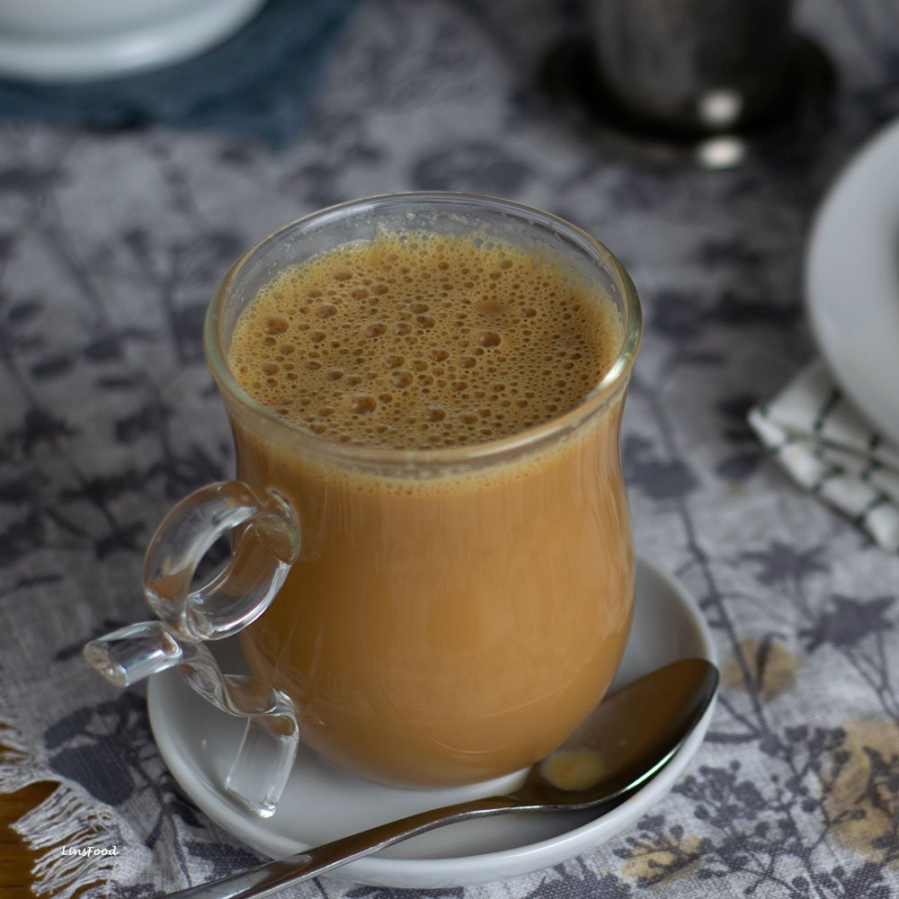

# Teh Tarik

*Malaysia's national drink: strong black tea pulled between two metal mugs from arm's length, mixed with sweetened condensed milk and evaporated milk until the surface erupts in a thick, frothy head. Theatrical, sweet, deeply tannic.*

**Serves:** 2 glasses

**Prep Time:** 5 minutes

**Cook Time:** 5 minutes

## Overview
Teh tarik (literally "pulled tea") is Malaysia's most famous drink, served at every mamak stall, kopitiam and roadside warung across the country. The brew itself is a strong black tea, usually a robust Ceylon blend, sometimes mixed with a touch of cardamom. The defining ritual is the pour: the brewed, milked tea is poured from one metal mug into another from as high as the stallholder's arm can reach, often two or three feet, then poured back. The repeated long pours aerate the drink, cool it slightly, and build a thick foam head that's iconic. At home you can do the same with two pint glasses or two heatproof jugs; the result is a sweeter, creamier tea than the British equivalent, with a head almost like a coffee. The base milk is always evaporated milk + sweetened condensed milk, not fresh milk. That's the Malaysian signature.

## Ingredients

- 4 teaspoons strong black loose-leaf tea (a Ceylon blend, or 4 tea bags broken open)
- 600 ml boiling water
- 4 tablespoons sweetened condensed milk
- 4 tablespoons evaporated milk
- 1 cardamom pod, lightly crushed (optional, traditional in some regions)

### Equipment
- 2 heatproof metal jugs or large pint glasses (one of them must be ceramic or glass so you don't burn your hand)

## Method

### Stage 1 - Brew the tea
1. Put the tea (loose or bags) and cardamom pod (if using) into a small pot or large mug.
1. Pour over the boiling water and leave to steep for 4 minutes; you want a strong, dark, slightly tannic brew.
1. Strain into one of the heatproof jugs.

### Stage 2 - Add the milks
1. Stir in the sweetened condensed milk and evaporated milk while the tea is still hot. Stir until fully dissolved; the colour goes from deep amber to a milk-tea brown.

### Stage 3 - Pull
1. Hold the jug of milky tea in one hand and the empty jug in the other.
1. Pour from the milky-tea jug into the empty jug from as high as your arm can reach (about 60 cm to start, more once you're confident). Keep the receiving jug close to the ground.
1. Pour all the tea across, then swap and pour back the other way.
1. Repeat 4 to 6 times. The aerated surface will build a thick foam on top.
1. The first 1 or 2 pulls are at half height while you find your rhythm; build to higher pulls as you get the hang of it. Practice over a sink the first time.

### Stage 4 - Serve
1. Pour the pulled tea into 2 glasses. The foam will sit on top in a thick, almost-cappuccino head.
1. Serve immediately while hot.

## Notes
- **Both milks, not one.** Sweetened condensed milk alone is too sweet and one-note; evaporated milk alone is too thin. The mamak version uses both, and that's what makes it teh tarik rather than just milky tea.
- **The arm height.** The taller the pour, the more aeration and the better the foam. Mamak stalls do 1.2 metre pours; at home, 50 to 60 cm is comfortable and effective.
- **Cardamom is optional.** Many Malaysian families add it; the standard street stall doesn't. Both are valid.
- **Strong tea is the base.** A weak brew gets washed out by the milk. Don't be shy with the tea quantity.

## Variations
- **Teh tarik halia.** Add a 2 cm knob of crushed ginger to the brew with the tea. Warming, slightly spicy variant.
- **Teh tarik ais.** Pulled tea cooled then served over a tall glass of ice. The iced version is just as common in Malaysia.
- **Kopi tarik.** Same technique with strong filter coffee instead of tea. Equally popular at kopitiams.

## Storage
- Doesn't store: serve straight after pulling. If you must, you can keep brewed-milked tea (un-pulled) warm in a flask for an hour, then pull just before serving.
