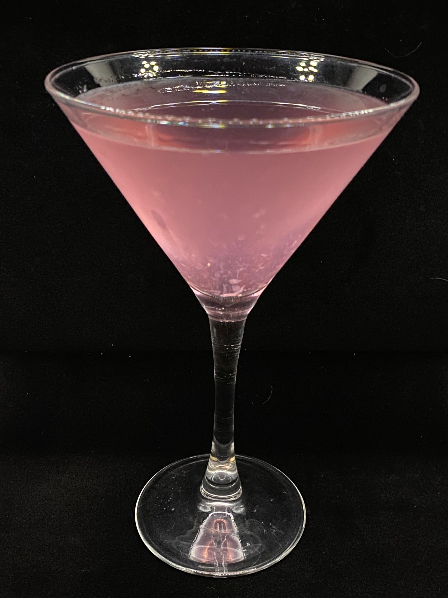

# Bajtra (Prickly Pear Liqueur)

*Malta's indigenous liqueur: a sweet bright-pink-to-red liqueur made from the prickly pears that grow wild on every Maltese stone wall. Fermented and distilled or macerated with sugar to make a sweet fruity digestif. Served chilled in small glasses as an after-dinner drink. The most Maltese of all Maltese spirits.*

**Serves:** 1 (50 ml)

**Prep Time:** 1 minute (for serving) OR 2 weeks (for homemade maceration)

**Cook Time:** None

## Overview
Bajtra (the Maltese name for the prickly pear / Opuntia ficus-indica fruit) is Malta's indigenous fruit liqueur - made from the deep-pink-to-magenta fruits of the prickly pear cactus that grows wild on every Maltese stone wall and across the rocky landscape. The fruit ripens in late summer (August-October); during this season, every Maltese household traditionally makes a batch of bajtra liqueur. The commercial brand Zeppi's makes the most famous version; smaller producers across Malta and Gozo make excellent artisanal versions. The construction is straightforward maceration: ripe prickly pears are peeled (carefully - the fruits have invisible spines), the flesh is chunked, combined with sugar and a neutral spirit (vodka or 96% alcohol), and left to macerate 2-4 weeks; the liqueur is then strained, sweetened to taste, and bottled. The colour is deep pink to magenta; the flavour is sweet, slightly floral, with the unique prickly pear taste (somewhat like watermelon crossed with strawberry, but more delicate). Served chilled in small glasses as a digestif. Three details: PEEL VERY CAREFULLY (prickly pears have tiny invisible spines called glochidia that get in skin), MATURE 2-4 WEEKS minimum, and STRAIN THOROUGHLY (the prickly pear has seeds and pulp that need filtering).

## Ingredients

### For 1 litre homemade bajtra
- 1 kg ripe prickly pears (skin removed; about 500 g flesh)
- 500 ml vodka (40% ABV) OR 200 ml neutral spirit (96% ABV) + 300 ml water
- 300 g caster sugar (adjust to taste)
- 200 ml water (for sugar syrup)
- 1 cinnamon stick (optional)
- 2 cloves (optional)

### Per serving (commercial or homemade)
- 50 ml chilled bajtra
- A small chilled glass
- Optional: 1 ice cube

## Method

### Stage 1 - Peel the prickly pears
1. Wear gloves (the fruit has tiny invisible spines).
2. Cut off the top and bottom of each fruit.
3. Score a slit along one side; peel back the thick skin.
4. The bright pink/magenta flesh is inside.
5. Discard the skins.

### Stage 2 - Prepare the flesh
1. Cut the peeled fruit into chunks.
2. Place in a large sterilised jar.

### Stage 3 - Macerate
1. Pour the vodka (or diluted neutral spirit) over the fruit.
2. Add cinnamon and cloves (if using).
3. Seal the jar; shake gently.
4. Store in a cool dark place for 2-4 weeks, shaking once a week.
5. The spirit absorbs the bright pink colour and the prickly pear flavour.

### Stage 4 - Strain
1. Pour the macerated mixture through a fine sieve lined with muslin.
2. Press gently to extract; don't squeeze hard (extracts bitter notes).
3. Strain twice for clear liqueur.

### Stage 5 - Sweeten
1. Make a sugar syrup: combine sugar and water; heat till sugar dissolves; cool.
2. Add the sugar syrup to the strained liqueur.
3. Adjust to taste - start with half the syrup, taste, add more.

### Stage 6 - Bottle
1. Pour into a sterilised bottle.
2. Seal; let mature another 1-2 weeks.

### Stage 7 - Serve
1. Refrigerate at least 4 hours before serving.
2. Pour 50 ml into a small chilled glass.
3. Serve as a digestif after dinner.

## Notes
- **Wear gloves when peeling:** the invisible spines hurt.
- **Strain twice:** clears the liqueur of pulp and seeds.
- **Mature 2-4 weeks minimum:** improves with age (3+ months is excellent).

## Variations
**Without cinnamon/cloves:** pure prickly pear flavour.
**With lemon zest:** add 2 tablespoons fresh lemon zest during maceration.
**Stronger version:** use 96% neutral spirit + less water; reach ~30% ABV.
**Sweeter version:** double the sugar syrup.
**With orange blossom water:** add 1 teaspoon at the end - Maltese-Arab touch.

## Serving
As a Maltese after-dinner digestif (the canonical setting) · at a Maltese village festa · at a Maltese wedding bar · with espresso · as a Maltese gift bottle · at home as the indigenous Maltese spirit.

## Storage
- Bottled bajtra keeps 2-3 years.
- Refrigerate after opening; consume within 1 year.
- The colour fades over time; flavour deepens.
