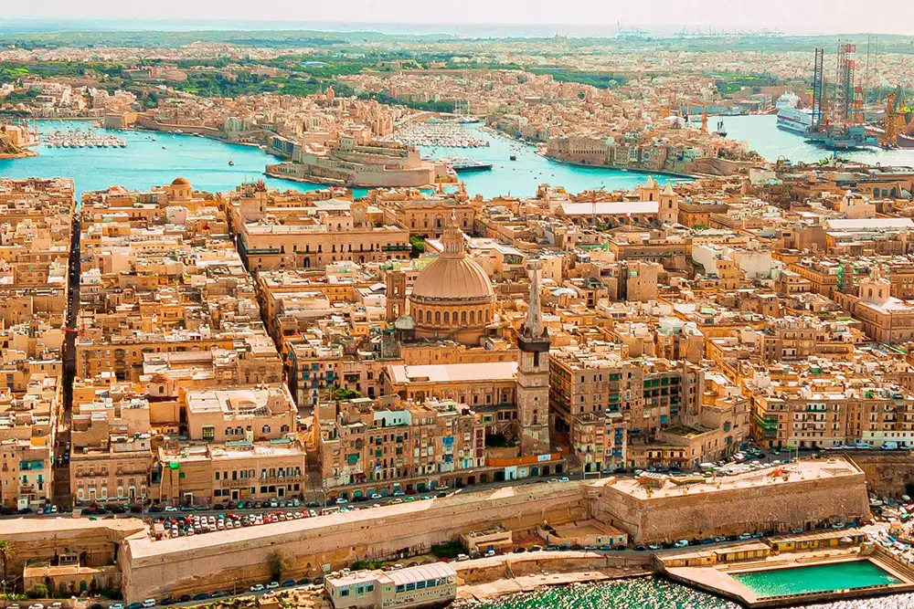

# Drinks of Malta

Malta's drinks reflect its Mediterranean position and British colonial legacy. Kinnie - the bitter-orange-and-herb soft drink invented in 1952 - is the traditional Maltese non-alcoholic drink, drunk at every meal and at every café. Cisk lager has been brewed in Malta since 1928 and is the national beer. Bajtra (prickly pear liqueur) is the indigenous Maltese spirit, distilled from the wild prickly pears that grow across the islands. Maltese wines from the islands' own vineyards (Marsovin, Meridiana, Delicata) are increasingly recognised internationally; the white Bdejjet, the red Sirah, and the rare indigenous Ġellewża grape produce uniquely Maltese wines.
