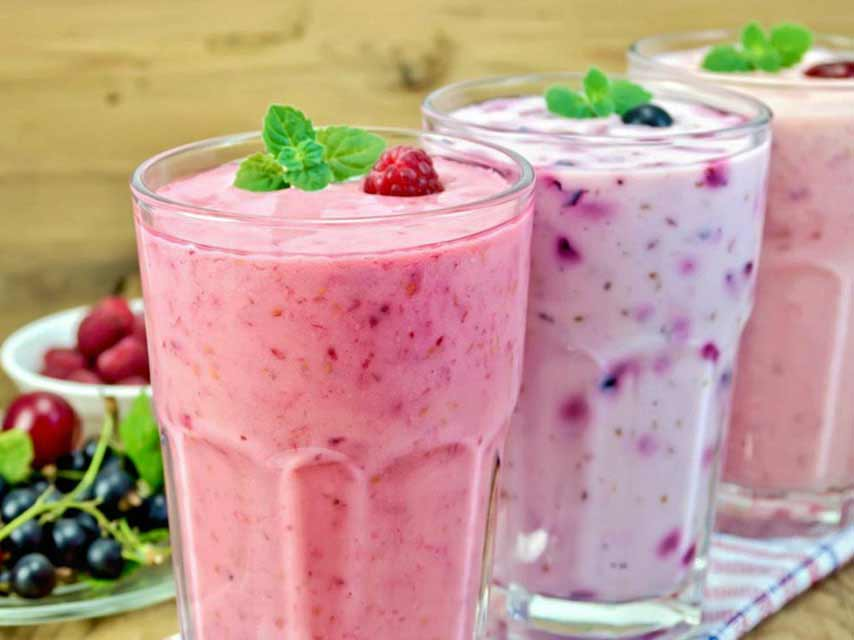

# Alouda

*Mauritian rose-milk slush: cold milk sweetened with rose syrup, layered with soaked basil seeds, agar jelly cubes and a scoop of vanilla ice cream. The signature Port Louis market drink.*

**Serves:** 4 tall glasses

**Prep Time:** 15 minutes (plus 30 minutes for basil seed soak)

**Cook Time:** 5 minutes

## Overview
Alouda is Mauritius's most iconic drink, sold from market stalls in Port Louis (especially around the Central Market) by vendors who layer the ingredients in tall glasses in front of you. The build has four distinct components: cold milk sweetened with rose syrup (the bright pink kind), soaked tukmaria (sweet basil seeds) that swell into translucent jelly-coated black dots, cubes of agar agar jelly (usually pale green), and a scoop of vanilla ice cream floated on top. The texture is the whole point: thick rose-milk in your mouth, slippery jelly cubes, the popping caviar-texture of basil seeds, melting ice cream. Sometimes called the Mauritian falooda (the Indian cousin), alouda is its own creature: less pistachio, more agar jelly, almost always with ice cream. Sold deep cold in any heat, it's a national drink.

## Ingredients

### For the basil seeds
- 3 tablespoons tukmaria (sweet basil seeds, sold at South Asian groceries)
- 250 ml cold water

### For the agar jelly
- 2 g agar agar powder (1 teaspoon)
- 300 ml water
- 2 tablespoons caster sugar
- 1 to 2 drops green food colouring (traditional but optional)

### For the rose milk
- 800 ml full-fat milk, very cold
- 100 ml rose syrup
- 100 ml sweetened condensed milk

### To serve
- 4 small scoops vanilla ice cream
- Crushed pistachios (optional)
- Tall glasses, chilled

## Method

### Stage 1 - Soak basil seeds (do first)
1. Put the tukmaria in a small bowl with the cold water; stir.
1. Leave 30 minutes. The seeds swell to about 4 times their size with a translucent jelly coating around each black seed.
1. Drain off any excess water (a little remaining is fine).

### Stage 2 - Make the agar jelly
1. Bring the water and sugar to the boil in a small pan, stirring to dissolve.
1. Whisk in the agar agar powder and boil for 2 to 3 minutes; the mixture should be clear and slightly thickened.
1. Add the green food colouring if using.
1. Pour into a shallow container (a small lunch box works) about 1 cm deep.
1. Cool 5 minutes, then refrigerate until set: about 30 minutes.
1. Cut the set jelly into 1 cm cubes.

### Stage 3 - Make the rose milk
1. In a large jug, whisk together the cold milk, rose syrup and sweetened condensed milk until smooth and a clear bubblegum pink.
1. Refrigerate until ready to serve.

### Stage 4 - Layer the glasses
1. In each tall chilled glass, spoon in 1 tablespoon of soaked basil seeds at the bottom.
1. Add a heaping spoonful of agar jelly cubes (about 1 tablespoon).
1. Pour the cold rose milk over until the glass is three-quarters full.
1. Float a small scoop of vanilla ice cream on top.
1. Scatter crushed pistachios if using.

### Stage 5 - Serve
1. Serve immediately with a long spoon (you need a spoon to fish out the jelly and basil seeds) and a wide straw.

## Notes
- **Tukmaria not chia.** Tukmaria (sweet basil seeds) are smaller and swell more transparently than chia. Chia works in a pinch but the texture is wrong.
- **Agar, not gelatin.** Agar sets a firmer, drier jelly that holds its cube shape in cold milk. Gelatin slumps and melts.
- **Cold everything.** Glasses chilled, milk straight from the fridge. Alouda's whole point is icy.
- **Layer just before serving.** If you build glasses 30 minutes ahead, the basil seeds keep swelling and the ice cream is already half-melted.

## Variations
- **Pink jelly.** Use red food colouring instead of green for an all-pink drink.
- **Almond alouda.** Add a tablespoon of crushed almonds to the bottom of each glass with the basil seeds.
- **No ice cream.** Common at home; finish with just a sprinkle of pistachios. Still a proper alouda.

## Storage
- The components store separately. Soaked basil seeds keep 2 days in the fridge; agar jelly keeps 4 days; rose milk keeps 3 days. Assembled drinks don't keep: build to order.
