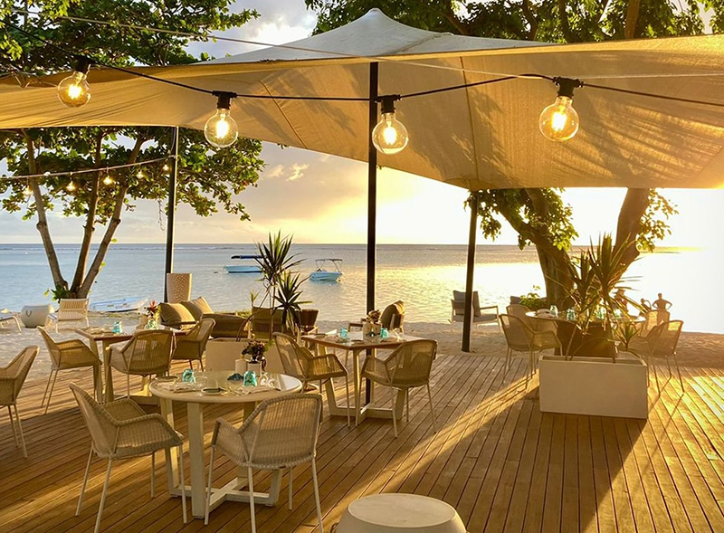

# Drinks of Mauritius

Alouda, the rose-milk slush with basil seeds, agar jelly and a scoop of vanilla ice cream that defines Port Louis market afternoons; Bois Cheri vanilla tea grown on the island; falooda from the dholl puri stalls; rum from the local distilleries.
