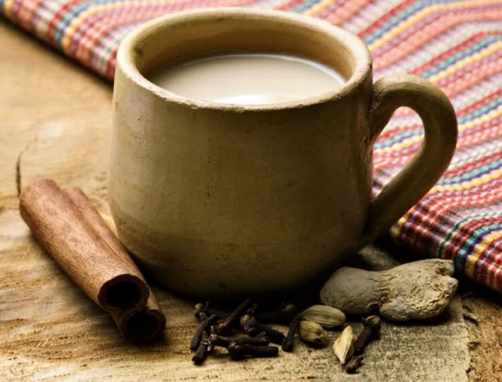

# Mauritian Vanilla Tea

*Strong Mauritian black tea infused with a split vanilla pod and a stick of cinnamon, sweetened with cane sugar, served either hot in glass tumblers or chilled over ice. The everyday tea of the island.*

**Serves:** 4 cups

**Prep Time:** 3 minutes

**Cook Time:** 5 minutes

## Overview
Mauritius is a tea-growing island, and the tea you'll be served at any home or café there is almost always vanilla-scented. Local producers (Bois Cheri being the oldest and most famous) blend their black teas with vanilla pieces grown on the island; the result is a soft, fragrant, lightly floral tea that's nothing like English Breakfast and even less like Earl Grey. The home preparation amplifies the vanilla with an actual split pod added to the brew, plus a stick of cinnamon for warmth. Served hot in small glass tumblers (the Indian-Mauritian habit) with cane sugar stirred in, or chilled over ice on humid afternoons, it's the everyday drink of the island. If you can't find Bois Cheri vanilla tea, a strong Assam or Ceylon with a fresh vanilla pod gives a similar result.

## Ingredients

- 4 teaspoons Mauritian vanilla black tea (Bois Cheri brand, or 4 tea bags), OR 4 teaspoons strong Assam tea + half a vanilla pod
- 1 vanilla pod, split lengthways (use even if you already have flavoured tea, for the extra hit)
- 1 cinnamon stick
- 800 ml water
- 4 to 6 teaspoons cane sugar (demerara or jaggery)
- Splash of milk (optional, à la Mauritian-Indian style)

### To serve
- Small glass tumblers (the local habit) or teacups

## Method

### Stage 1 - Brew
1. Bring the water to the boil in a small saucepan.
1. Add the tea (loose, in an infuser, or in bags), the split vanilla pod, and the cinnamon stick.
1. Reduce to a low simmer for 4 minutes; the kitchen will smell like vanilla custard.

### Stage 2 - Strain and sweeten
1. Strain the tea into a warmed teapot.
1. Stir in the cane sugar to taste. The Mauritian default is sweet: 1 to 1.5 teaspoons per cup.
1. Add a splash of milk if you're going the Indian-Mauritian way.

### Stage 3 - Serve
1. Pour into small glass tumblers or teacups.
1. Serve hot, or pour over a tall glass of ice for the iced version.

## Notes
- **The vanilla pod matters.** Even with flavoured Bois Cheri tea, adding a fresh pod doubles the vanilla. Save the spent pod afterwards: rinse, dry, bury in a jar of sugar to make vanilla sugar for baking.
- **Cane sugar over white.** Demerara or jaggery rounds out the vanilla; refined white sugar tastes flat against the vanilla and cinnamon.
- **Glass tumblers.** Mauritian-Indian households serve tea in small heatproof glass tumblers, never mugs. You can see the colour, and the temperature drops faster.
- **Don't over-steep.** Past 4 to 5 minutes the black tea turns harshly tannic and overwhelms the vanilla.

## Variations
- **Iced version (thé glacé vanille).** Brew double-strength, chill, pour over ice with a slice of lemon.
- **Vanilla chai.** Add 4 cardamom pods and a 1 cm piece of crushed ginger to the brew for a Mauritian-Indian masala chai variant.
- **No cinnamon.** Some prefer pure vanilla; skip the cinnamon stick.

## Storage
- Brewed tea keeps 1 day in the fridge for the iced version. The vanilla pod can be rinsed, dried and reused once for a slightly milder second brew.
