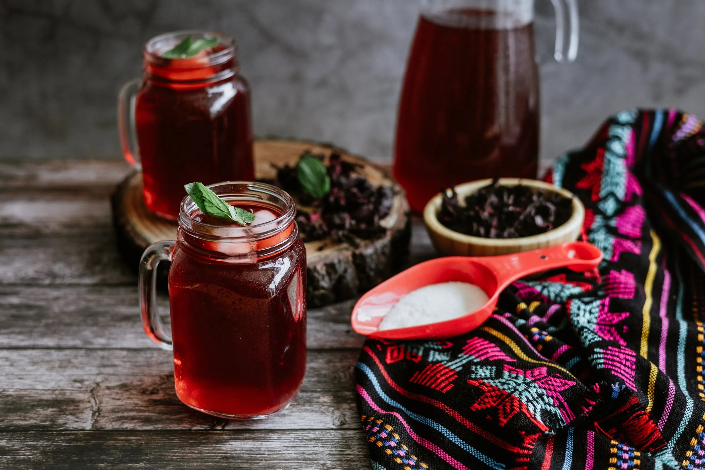

# Agua de Jamaica

*The deep-magenta hibiscus water poured at every taqueria counter and street stand across Mexico. Dried hibiscus calyces simmered with water and sugar, chilled hard, served in big glass jars over ice with a wedge of lime. Tart, faintly cranberry-like, addictively refreshing.*

**Serves:** 6 to 8 tall glasses (makes 2 litres)

**Prep Time:** 5 minutes

**Cook Time:** 20 minutes (plus chilling)

## Overview
Agua de jamaica (pronounced ha-MY-ka) is one of the three classic aguas frescas of Mexico, alongside horchata and tamarindo. The base is dried hibiscus calyces - the same flower that makes Nigerian zobo, Egyptian karkadeh and Caribbean sorrel, each prepared distinctively. The Mexican version is the cleanest of the family: just hibiscus, water and sugar, with maybe a stick of cinnamon or a strip of orange peel for warmth. The colour is a deep magenta-burgundy, the flavour bright and tart with a clean clean finish, slightly cranberry-like but distinctly its own. At a taquería it sits in a huge glass barrel on the counter alongside horchata (creamy white) and tamarindo (deep brown) - the three colours of the holy aguas frescas trinity. Order one with your tacos al pastor; it cuts the richness perfectly.

## Ingredients

- 80 g dried hibiscus calyces (flor de jamaica; from any Mexican grocery, or Caribbean/Middle Eastern shops, or health food stores)
- 2 litres cold water
- 200 g caster sugar (or to taste - Mexican aguas are properly sweet)
- 1 cinnamon stick (optional)
- A 5 cm strip of unwaxed orange peel (optional)
- Juice of 1 lime

### To serve
- Plenty of ice cubes
- Lime wedges
- 6 to 8 tall glasses, chilled

## Method

### Stage 1 - Simmer
1. Rinse the hibiscus briefly under cold water to remove dust.
1. Put it in a large saucepan with 1 litre of the water, the cinnamon stick and orange peel (if using).
1. Bring to the boil, then reduce to a simmer for 10 minutes. The water turns a deep ruby-magenta.

### Stage 2 - Sweeten
1. Off the heat, stir in the sugar until completely dissolved.
1. Add the remaining 1 litre of cold water to dilute and start cooling.
1. Stir in the lime juice - this brightens the colour from dull red to vivid magenta.

### Stage 3 - Strain and chill
1. Strain through a fine sieve into a large jug, pressing the spent calyces to extract every drop. Discard solids.
1. Refrigerate at least 3 hours, ideally overnight. The flavour deepens cold.

### Stage 4 - Serve
1. Fill tall glasses with ice and pour the chilled jamaica over.
1. Garnish each with a lime wedge.

## Notes
- **Bag of dried hibiscus.** A standard Mexican grocery bag of jamaica is usually 100-200 g. Use 80 g for this 2-litre recipe; less makes a weak drink.
- **Lime at the end.** The lime juice both deepens the colour and balances the natural slight tartness with a brighter acid edge. Don't skip.
- **Sweet by Mexican standards.** Aguas frescas are properly sweet. If 200 g sugar sounds like a lot, start at 150 g and adjust up. Less sweet than full-sugar zobo, but sweeter than a British cordial.

## Variations
- **With ginger.** Add a 5 cm piece of fresh ginger to the simmer. Common at Oaxacan stalls.
- **Sparkling.** Top with cold soda water instead of still in the glass.
- **With chia.** Stir in 2 tablespoons of soaked chia seeds for a textured agua de jamaica con chía.

## Storage
- Refrigerate up to 5 days in a sealed jug. The flavour is brightest the first 3 days.
