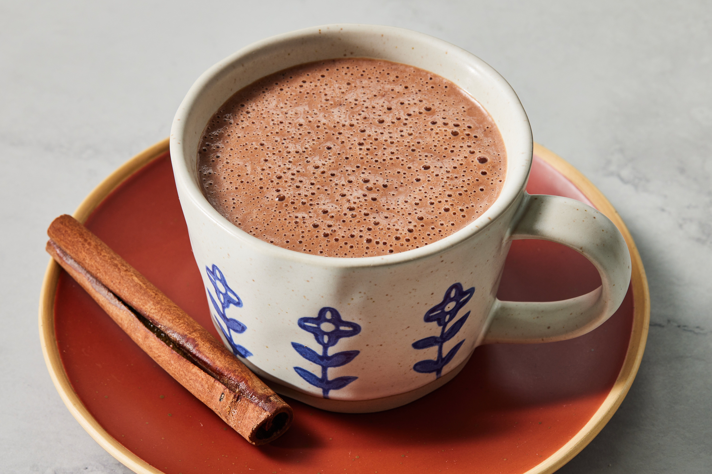

# Champurrado

*Mexico's thick, warm winter chocolate: masa harina whisked with water to thicken, simmered with milk, Mexican chocolate tablets, cinnamon and piloncillo. Velvety, faintly grainy from the corn, deeply chocolate, served in mugs alongside tamales for breakfast on cold mornings or after midnight at the Day of the Dead.*

**Serves:** 4 mugs

**Prep Time:** 5 minutes

**Cook Time:** 20 minutes

## Overview
Champurrado is the corn-thickened cousin of regular Mexican hot chocolate, and its defining ingredient is masa harina, the nixtamalised corn flour used for tortillas and tamales. Whisked with cold water first to make a slurry (lumps will ruin the drink), then added to simmering milk along with broken Mexican chocolate tablets (the classic brand is Abuelita or Ibarra, the disc-shaped chocolate with grainy unrefined sugar pressed in) and piloncillo (Mexican raw cane sugar in cone form), it slowly thickens to a velvety consistency that's somewhere between a chocolate drink and a thin pudding. Cinnamon and sometimes a small piece of anise round the spice. Champurrado is one of the traditional drinks for Día de los Muertos (Day of the Dead), shared at midnight vigils; it's also a winter breakfast drink in Mexico City and the Bajío region, served alongside tamales pulled from steamers in the market. The whole point is the texture, never bland, never thin, just thick enough to be substantial without being a pudding.

## Ingredients

- 4 tablespoons masa harina (Maseca brand; the same flour used for tortillas, not corn flour or polenta)
- 250 ml cold water (for the masa slurry)
- 1 litre whole milk
- 1 Mexican chocolate tablet (90 g; Abuelita or Ibarra) OR 80 g dark chocolate + 1 teaspoon cinnamon + 1 tablespoon sugar
- 60 g piloncillo OR 60 g dark muscovado sugar
- 1 cinnamon stick
- 1 star anise (optional, traditional in some regions)
- A pinch of fine salt

### To serve
- 4 mugs, warmed
- Ground cinnamon for dusting
- Optional: a thin Mexican wafer (oblea) on the side

## Method

### Stage 1 - Make the masa slurry
1. In a small bowl, whisk the masa harina with 250 ml of cold water until completely smooth, with no lumps. The mixture should be thin and pourable.

### Stage 2 - Start the chocolate base
1. Pour the milk into a heavy-bottomed saucepan. Add the broken-up Mexican chocolate tablet (chop it into rough chunks first to help it dissolve), the piloncillo (broken into small chunks if it's a cone), the cinnamon stick, the star anise and a pinch of salt.
1. Warm over medium-low heat, stirring frequently with a wooden spoon, until the chocolate and piloncillo have completely dissolved. About 6-8 minutes.

### Stage 3 - Add the masa slurry
1. While whisking the milk mixture continuously, pour in the masa harina slurry in a slow steady stream. Whisk vigorously to prevent any lumps from forming.
1. Increase the heat to medium and continue whisking until the mixture comes to a gentle simmer.

### Stage 4 - Simmer to thicken
1. Reduce the heat to low and simmer for 8-10 minutes, whisking constantly. The champurrado will thicken noticeably, going from milky to a velvety, slightly viscous consistency that coats the back of a spoon. If it gets too thick, whisk in a splash more hot milk.
1. Taste: it should be richly chocolate, warmly spiced, and properly sweet. Adjust sugar (an extra tablespoon of piloncillo or brown sugar) if it tastes flat.

### Stage 5 - Serve
1. Remove the cinnamon stick and star anise.
1. Pour into warmed mugs. The drink should be hot but not scorching.
1. Dust each mug with a pinch of ground cinnamon.
1. Serve immediately with a tamale or pan dulce on the side.

## Notes
- **Masa harina, not cornstarch.** Masa harina (Maseca brand) is nixtamalised corn flour, the same one used for tortillas. It has a distinctive faintly grainy flavour that's the whole point. Cornstarch gives a slick thickness without the corn character.
- **Whisk constantly.** Once the masa hits the milk, lumps form fast if you stop whisking. Keep moving until the simmer thickens it.
- **Mexican chocolate is the right one.** Abuelita and Ibarra tablets include the cinnamon and sugar already; they're built for hot chocolate. Substituting plain dark chocolate works but you need to add cinnamon and a touch more sugar to compensate.
- **Texture is the trick.** Champurrado should be thick enough to coat a spoon but still pour easily from a jug. Too thin and it's just hot chocolate; too thick and it's chocolate pudding.

## Variations
- **Champurrado de chocolate negro.** Skip the Mexican chocolate; use 100 g dark chocolate plus 1.5 teaspoons of cinnamon and 2 tablespoons of sugar. More chocolate-forward.
- **Atole blanco.** Skip the chocolate entirely; just masa, milk, vanilla, sugar and cinnamon. The white version of atole, often served at Día de los Muertos alongside champurrado.
- **With chilli.** Add a pinch of ground ancho or guajillo chilli. A subtle warm undertone, not heat. Modern but traditional in some Mexico City stands.
- **Vegan version.** Replace milk with oat milk; works surprisingly well because the masa carries the body. Use a vegan dark chocolate.

## Storage
- Best fresh, but keeps 2 days in the fridge. Reheat gently in a saucepan with a splash of milk to loosen; whisk to prevent skins forming.
- The texture thickens further as it cools; you may need to thin with milk on reheating.
