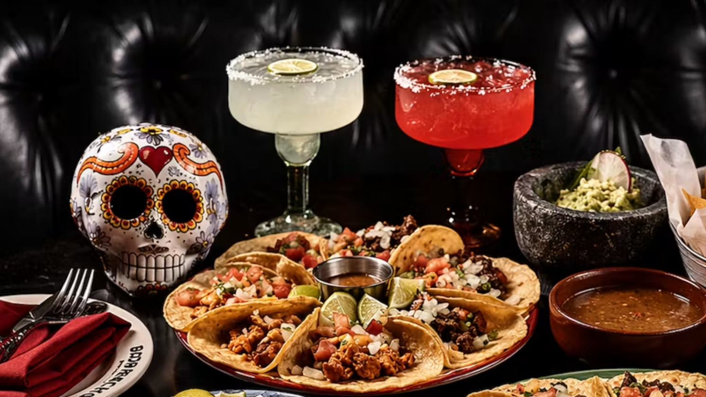

# Drinks of Mexico

Horchata at every taqueria counter, aguas frescas in big glass jars on the streets of CDMX, champurrado on a cold morning. Rice, cinnamon, fresh fruit and corn anchor the everyday drink; tequila and mezcal sit on the cocktail shelf.
