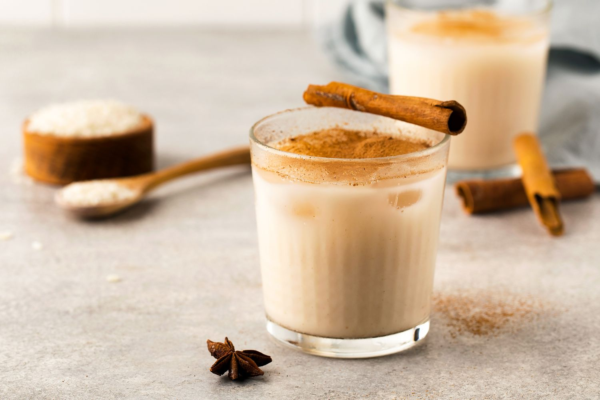

# Horchata

*Mexican rice-and-cinnamon drink: long-grain rice soaked overnight with cinnamon, blitzed, strained and sweetened. Pale, creamy, properly cold.*

**Serves:** 6

**Prep Time:** 10 minutes (plus overnight soaking)

**Cook Time:** 0 minutes

## Overview
Horchata is Mexico's everyday answer to lemonade, served from big jugs at every taqueria and street stall alongside agua fresca and Jamaica (hibiscus). The Mexican version is rice-based (the Spanish original uses tigernuts, the Salvadoran uses morro seeds; all worth knowing about but distinct drinks), made by soaking long-grain white rice overnight with cinnamon sticks, then blending hard, straining through a fine sieve and sweetening with sugar and vanilla. The result is a creamy, pale-cream drink that looks like milk but contains none, properly cold, fragrant with cinnamon. Pour over ice in a tall glass with a dusting of ground cinnamon on top, sometimes with a few drops of sweet condensed milk floated for the proper Mexican-restaurant version. Drink it with anything spicy; horchata is the universal balancer.

## Ingredients

### Soak (do this the night before)
- 200 g long-grain white rice (basmati or jasmine work too)
- 2 cinnamon sticks (broken into 2 or 3 pieces each)
- 1 litre cold water

### To finish
- 700 ml cold water (additional, for blending)
- 100 g caster sugar (start here, adjust to taste)
- 1 teaspoon vanilla extract
- Pinch of fine salt
- 100 ml whole milk OR 100 ml sweetened condensed milk (optional; the milk version is creamier, condensed milk is what you'd get at a Mexican restaurant)

### To serve
- Plenty of ice cubes
- Ground cinnamon (for dusting)
- Cinnamon stick per glass (optional)

## Method

### Stage 1 - Soak overnight
1. Rinse the rice briefly under cold running water; drain.
1. Tip the rice and broken cinnamon sticks into a large bowl or jug.
1. Pour over the 1 litre of cold water.
1. Cover with cling film or a plate and refrigerate overnight (8 to 12 hours). The water will turn cloudy and the rice will swell.

### Stage 2 - Blend
1. Tip the entire soaked mixture (rice, cinnamon and soaking water) into a blender.
1. Add 700 ml of cold water, the sugar, vanilla and salt.
1. Blend on high for 2 to 3 minutes until the rice is broken down to a fine sediment and the liquid looks creamy.

### Stage 3 - Strain
1. Set a fine sieve lined with two layers of muslin or cheesecloth over a large jug.
1. Pour the blended horchata through; let it drip through naturally first, then press the solids gently with the back of a spoon to extract the last of the liquid. Don't squeeze hard; you'll force the rice solids through.
1. Discard the rice and cinnamon solids.

### Stage 4 - Finish and chill
1. If using milk or condensed milk, stir into the strained horchata at this stage.
1. Taste; adjust sugar (some people want it sweeter), vanilla (more for richer) or cinnamon (a quarter teaspoon ground stirred in if the cinnamon-stick flavour didn't carry).
1. Refrigerate at least 1 hour before serving.

### Stage 5 - Serve
1. Stir well; horchata settles in the fridge so always shake or stir before pouring.
1. Fill tall glasses with ice cubes.
1. Pour the horchata over the ice.
1. Dust the top with a pinch of ground cinnamon; drop in a cinnamon stick for the look if you have one.
1. Serve immediately, ideally with something spicy.

## Notes
- **Overnight soak is non-negotiable.** Short-soaked rice doesn't break down properly and the horchata tastes thin and starchy. Plan for the night before.
- **Muslin strain, not just a sieve.** A coarse sieve leaves rice particles behind that make the drink grainy. Muslin or cheesecloth, two layers, is what you want.
- **Condensed milk is the taqueria upgrade.** A spoonful per glass swirled in turns this from the home version into the restaurant version. It's not authentic to every region of Mexico but it's how it's served at lots of taquerias.
- **Adjust the sweetness.** Some Mexican horchatas are very sweet; some are bone-dry and rely on cinnamon. Both are correct; pick your level.

## Variations
- **Horchata with strawberry.** Blend in 100 g fresh strawberries with the rice; pink horchata, common in some regions of Mexico.
- **Horchata with chocolate.** Add 30 g grated dark chocolate or 2 tablespoons cocoa powder when blending.
- **Horchata de chufa (Spanish).** Use 200 g tigernuts (chufa) instead of rice; this is the Valencian original, drier and more savoury. Tigernuts are sold at health food shops and online.

## Storage
- Refrigerate up to 4 days in a sealed jug; shake or stir well before serving.
- Don't freeze; the texture turns gritty on thawing.
- The dry rice + cinnamon soak mix doesn't keep dry; soak only what you need.
