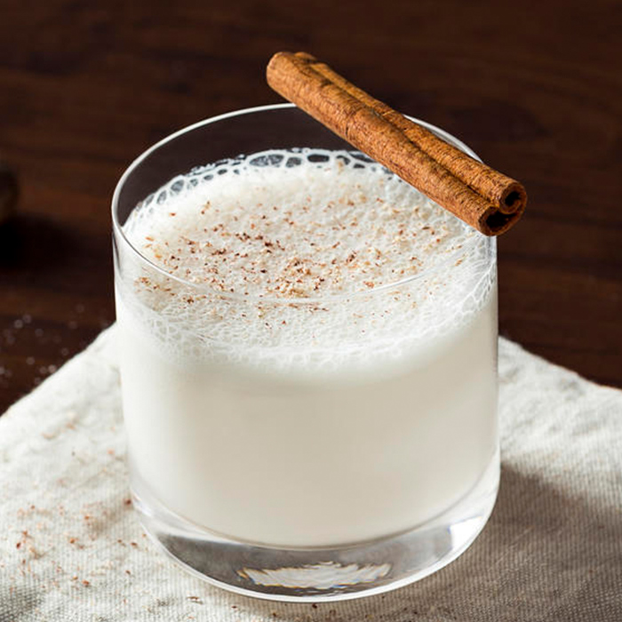

# Bourbon Milk Punch

*The Southern brunch cocktail: bourbon shaken with milk, cream, sugar and vanilla, served in a tall chilled glass with a grating of nutmeg. Cooling, faintly Christmas-spiced, deceptively strong.*

**Serves:** 1

**Prep Time:** 5 minutes

## Overview
Milk punch is one of the older surviving American cocktails, with a lineage that runs back to the 17th and 18th centuries (a "clarified milk punch" technique was popular in the British Caribbean and migrated to the American South). The modern Southern version is unclarified: bourbon (or brandy), whole milk, cream, sugar and vanilla, shaken hard with ice and served strained over fresh ice or up in a chilled glass. A grating of nutmeg on top is essential.

The drink is associated more with Mississippi and Louisiana than anywhere else, where it has been a Sunday brunch fixture for over a century. It is also the drink most often suggested as a hangover cure in the region (the bourbon supplies hair-of-the-dog, the milk and cream calm the stomach, the sugar settles the appetite). Take that as the medical advice it isn't.

## Ingredients
- 60 ml bourbon (Buffalo Trace, Maker's Mark, Knob Creek, any standard)
- 90 ml whole milk
- 30 ml double cream
- 15 ml simple syrup (or 1 tbsp icing sugar)
- ½ tsp vanilla extract
- Ice cubes
- Fresh nutmeg, for grating

## Method

### Stage 1 - Combine
1. Add the bourbon, whole milk, double cream, simple syrup and vanilla to a cocktail shaker filled with ice.

### Stage 2 - Shake
1. Seal and shake hard for 12-15 seconds. The shaker should feel painfully cold.

### Stage 3 - Strain and serve
1. Strain into a chilled rocks glass over a single large ice cube, or into a coupe glass with no ice.
1. Grate fresh nutmeg generously over the top.
1. Serve at once.

## Notes
- **Whole milk and double cream.** Skimmed milk gives a thin, sad drink. Full-fat dairy is structural.
- **Fresh nutmeg is essential.** Pre-ground nutmeg in a jar is half the aroma. Buy whole nutmeg and grate with a microplane; the difference is dramatic.
- **Brandy is the older version.** Pre-Prohibition American milk punches were brandy-based (cognac or domestic brandy). Bourbon took over after Prohibition and is now the default in the South. Either works; brandy gives a rounder, less spicy drink.
- **Shake hard.** This is the cocktail's primary preparation; the foam that forms is part of the texture. Light shaking gives a thin drink.

## Variations
- **Brandy milk punch:** swap bourbon for cognac. The pre-Prohibition version.
- **Coffee milk punch:** replace 30 ml of the milk with cold-brew coffee. Adds a faint bitter edge.
- **Clarified milk punch:** the historical technique, combine the cocktail with warm milk in a separate vessel; the milk curdles, the curds are strained out through cheesecloth, leaving a brilliantly clear drink with the body and silkiness of milk but no opacity. A weekend project; book Dave Arnold's *Liquid Intelligence* for the precise method.
- **With egg white:** add an egg white before shaking for a foamier, denser drink.

## Serving
- A brunch cocktail. Two with eggs benedict on a Sunday morning is the proper occasion. Also good as a nightcap with a slice of plain pound cake.

## Storage
The drink does not keep; it separates and goes flat. Build to order. The dairy components are perishable and should not be batched and held.
