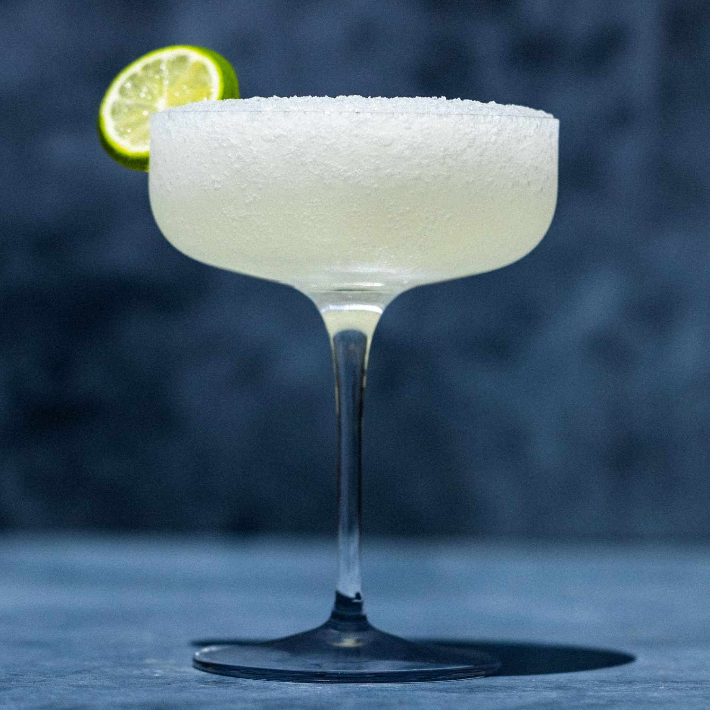

# Frozen Daiquiri

*The Mississippi gas-station classic: rum, lime, sugar and a blender's worth of ice, frozen into a slushy, served in a tall styrofoam cup with a straw. Drive-thru daiquiris are legal in Mississippi; this is the home version.*

**Serves:** 2 (or 1, depending on the day)

**Prep Time:** 5 minutes

## Overview
A frozen daiquiri at a Mississippi gas station is a regional institution. Daiquiri stops are scattered across the southern half of the state, often combined with a fuel station or a small drive-thru shed, offering pre-made frozen daiquiris in pastel colours (banana, strawberry, peach, mudslide, hurricane) dispensed from slushy machines into 32-ounce styrofoam cups. They are sold sealed (with a separate straw, technically making them a "closed container" and so legally transportable in the car), and they are inexpensive enough that this is genuinely how a great many Mississippians order their happy hour.

The home version is built in a blender. The recipe below is the classic lime version, the foundation of every other flavour. The colour variations layer fruit purée into the same base.

## Ingredients
- 100 ml white rum (Bacardi, Plantation, or any decent light rum)
- 60 ml fresh lime juice (about 3 limes)
- 30 ml simple syrup (or 2 tbsp granulated sugar)
- 1 tsp lime zest (optional, for brightness)
- 400 g ice cubes (or 4 cups crushed ice)
- 1 lime wheel (to garnish)

## Method

### Stage 1 - Combine in the blender
1. Add the white rum, fresh lime juice, simple syrup and lime zest (if using) to a high-powered blender.
1. Add the ice on top.

### Stage 2 - Blend
1. Start the blender on low and gradually increase to high. Blend for 30-45 seconds, until the mixture is uniformly slushy with no large ice chunks remaining. The texture should be like a thick smoothie.
1. If too thick (won't pour), add 1 tbsp cold water. If too thin (watery slush), add a small handful more ice and pulse briefly.

### Stage 3 - Serve
1. Pour into 2 tall glasses (or 1 large styrofoam cup, for authenticity).
1. Garnish with a lime wheel hooked on the rim.
1. Serve with a thick straw. Drink quickly before it melts.

## Notes
- **A powerful blender is essential.** Standard blenders struggle with whole ice cubes. If yours is underpowered, use crushed ice; if even that fails, switch to a Vitamix or similar.
- **Fresh lime juice only.** Bottled lime juice has the wrong colour and the wrong taste; the drink will fall flat.
- **The ratio is the recipe.** Two parts rum, one and a half parts lime juice, one part simple syrup, two cups of ice per serving. Tinker and the balance falls apart.
- **Adjust sweetness to taste.** Mississippi-style daiquiris are sweeter than the classic Cuban original. Increase simple syrup by 10 ml for a sweeter, more gas-station-like profile.
- **Watch the strength.** Two of these and you have had three regular cocktails' worth of rum hidden in the slush. Pace yourself.

## Variations
- **Strawberry daiquiri:** add 200 g fresh or frozen strawberries to the blend. Reduce ice slightly.
- **Banana daiquiri:** add 1 ripe banana to the blend.
- **Peach daiquiri:** add 1 ripe peach (stoned, chopped) or 100 g frozen peach slices.
- **Hurricane-style frozen:** swap the rum mix to 60 ml light + 40 ml dark rum, add 30 ml passion fruit syrup, 15 ml grenadine, and 30 ml orange juice. Pink and tropical.
- **Mudslide:** add 30 ml Kahlúa and 30 ml Baileys, reduce simple syrup. Coffee-cream version.

## Serving
A frozen daiquiri is its own occasion. Drink it on a porch on a hot afternoon, on a boat, or out of a styrofoam cup in your car (as the law allows in Mississippi, where the closed-container statute treats sealed daiquiri cups as transportable).

## Storage
The drink melts within 15-20 minutes; eat the cocktail as you drink it. A leftover daiquiri can be returned to the freezer for an hour to re-firm, but the texture suffers.
