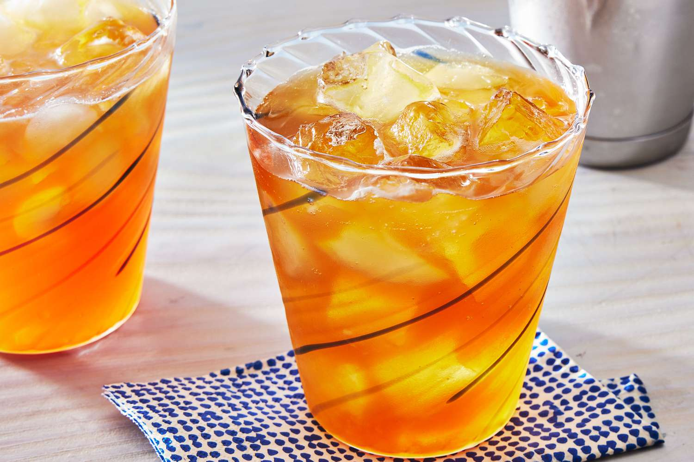

# Mississippi Punch

*Jerry Thomas's 1862 punch: bourbon, brandy, dark rum, lemon, sugar and a generous quantity of crushed ice, served in a tall glass with mint and a long straw. The riverboat drink of the antebellum Mississippi.*

**Serves:** 1

**Prep Time:** 5 minutes

## Overview
Mississippi Punch first appears in print in Jerry Thomas's *The Bartender's Guide* of 1862, the first American cocktail book ever published. Thomas was a New Orleans bartender (later New York) who collected the punches of the Mississippi riverboat era - drinks served on the long paddlewheel boats running between Memphis, Vicksburg, Natchez and New Orleans in the 1850s. The punch combines three spirits (bourbon, brandy and dark rum), sweetens with sugar, sharpens with lemon, and chills hard over crushed ice. The result is a long, fruity, mid-strength drink that tasted then (and tastes now) like a riverboat afternoon.

The drink is bigger and easier-drinking than its strength suggests. Three half-ounces of spirit add up to a quarter-pint, but the crushed ice melts as you drink it and the citrus and sugar dilute the alcohol. Two are perfect; three are aspirational.

## Ingredients
- 25 ml bourbon (Buffalo Trace, Maker's Mark or any standard bourbon)
- 25 ml cognac or brandy
- 25 ml dark Jamaican-style rum (Myers's, Gosling's)
- 20 ml fresh lemon juice
- 15 ml simple syrup (or 1 tbsp granulated sugar)
- Crushed ice
- 1 lemon wheel (to garnish)
- 1 sprig fresh mint (to garnish)
- 4-5 berries or pineapple chunks (seasonal, optional)

## Method

### Stage 1 - Build
1. Fill a tall hurricane glass or large highball with crushed ice (about three-quarters full).
1. Pour the bourbon, cognac, dark rum, lemon juice and simple syrup directly over the ice.

### Stage 2 - Stir
1. Stir well with a long bar spoon, 15-20 seconds, until the outside of the glass is frosted and the ice has slumped slightly.

### Stage 3 - Garnish and serve
1. Top up with more crushed ice if needed.
1. Skewer the fresh fruit on a long cocktail pick and lay across the glass.
1. Slap the mint sprig once between your palms (to release the aromatics) and tuck it into the ice.
1. Hook a lemon wheel over the rim. Serve with a long straw.

## Notes
- **Three spirits, equal measure.** Tinkering with the ratios changes the drink. Bourbon alone is too sweet; brandy alone is too soft; rum alone is too tropical. The balance is the punch.
- **Crushed ice is structural.** The cocktail is meant to be a long sipper that gradually dilutes as the ice melts. Cubes give a different drink: sharper, stronger, less generous.
- **Fresh lemon juice only.** Bottled lemon juice has the wrong colour and the wrong sharpness. Use a fresh lemon every time.
- **The fruit garnish is decorative more than functional.** Strawberries and pineapple chunks were the original Jerry Thomas garnish; a single lemon wheel is the modern minimalist version.
- **Adjust the sweetness to taste.** Simple syrup is the easiest way; granulated sugar dissolves slowly in cold liquid and tastes gritty unless given time to dissolve.

## Variations
- **Riverboat punch (the modern New Orleans version):** add 15 ml orange curaçao and double the simple syrup. Sweeter and more tropical; closer to a Hurricane in profile.
- **Without rum:** the original 1862 Jerry Thomas version did not always include rum (he listed it as optional). A two-spirit version (bourbon and brandy) is cleaner and more old-fashioned in taste.

## Serving
A long afternoon drink. Goes well with light food (a salad, a sandwich, fried okra). One per person before dinner is plenty; two and you have started a session.

## Storage
The drink does not keep. Simple syrup keeps a month refrigerated. The spirits last indefinitely. Build to order.
