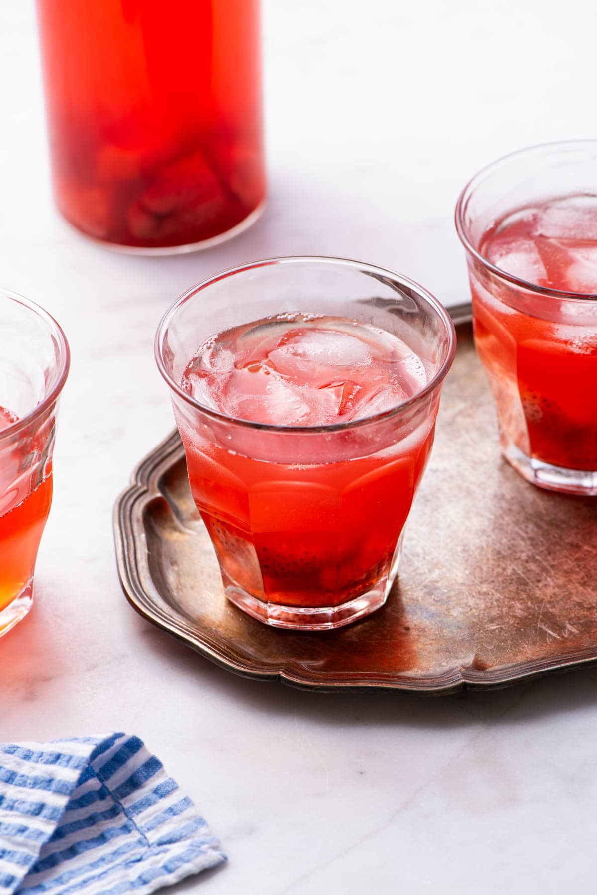

# Compot

*The Moldovan fruit compote: stone fruit and berries gently simmered with sugar and water, jarred for the cellar and ladled cold over winter meals. The children's drink and dessert pour in every grandmother's pantry.*

**Serves:** 4 (a 1.5 L jar)

**Prep Time:** 20 minutes

**Cook Time:** 20 minutes

## Overview
Compot is the home-made fruit drink and dessert pour of every Moldovan grandmother, ladled cold from a jar in the cellar over Sunday lunch or hot from a saucepan on a winter evening. It is not a thick compote in the Western sense; the Moldovan compot is a light fruit-infused syrup with the whole pieces of fruit suspended in it, drunk like a juice and the fruit fished out and eaten with the dessert. The classic version is sour cherry (compot de vișine), but apricot, plum, apple, pear, and mixed berry are all made through the year. Each summer the cellar shelves fill with rows of mismatched jars holding the year's harvest, sealed against the long winter when the only fresh fruit is the apple under the bed.

## Ingredients

### For a 1.5 L jar of sour cherry compot
- 500 g sour cherries (vișine), fresh or frozen, stems removed (pits left in for flavour, or removed for ease)
- 150 g caster sugar
- 1.2 L cold water
- 1 strip lemon peel (optional)
- 1 cinnamon stick (optional, for a winter version)

### For other classic Moldovan compots
- **Apricot compot:** 600 g halved pitted apricots, 150 g sugar, 1.2 L water
- **Apple compot:** 600 g peeled cored apple wedges, 100 g sugar, 1 cinnamon stick, 1.2 L water
- **Plum compot:** 600 g halved pitted plums, 130 g sugar, 1.2 L water
- **Mixed berry compot:** 500 g mixed strawberries, raspberries, currants, 140 g sugar, 1.2 L water

## Method

### Stage 1 - Prepare the fruit
1. Pick over the cherries; remove any with soft spots.
2. Rinse under cold water; drain.
3. Pull the stems off; leave the pits in (the pit adds a faint almond note to the syrup) or pit them if you prefer the cleaner drink.

### Stage 2 - Make the syrup
1. Combine the water and sugar in a wide pan.
2. Add the lemon peel and cinnamon if using.
3. Bring to a boil over high heat, stirring once or twice until the sugar is dissolved.
4. Reduce to a steady simmer.

### Stage 3 - Cook the fruit
1. Tip the prepared cherries into the simmering syrup.
2. Drop the heat to low; do not let the compot boil hard or the fruit falls apart.
3. Cook gently for 6 to 8 minutes (apricots and apples need 10 to 12 minutes).
4. The fruit should be tender but still hold its shape; the syrup will turn deep red.

### Stage 4 - Cool and store
1. Take off the heat.
2. Pour into a heatproof glass jug or a 1.5 L sterilised glass jar.
3. Cool to room temperature uncovered.
4. Cover and refrigerate; the flavour deepens overnight.

### Stage 5 - Serve
1. Stir the jar; the fruit will have settled to the bottom.
2. Ladle into a glass or cup with some fruit in each pour.
3. Serve cold from the jar in summer or warm from the pan in winter.

## Notes
- **The light syrup:** Moldovan compot is a drink, not a jam; the sugar ratio is much lower than for preserves.
- **Do not boil hard:** the fruit collapses; a low simmer is correct.
- **Pits or no pits:** leaving the cherry pits in adds a faint almond note (from the kernel) but means warning guests to spit them out.
- **Cellar-set:** for shelf storage, can in sterilised jars at 90°C for 20 minutes; otherwise refrigerate up to 2 weeks.
- **Eat the fruit:** the syrupy cherries served alongside a slice of plăcintă cu brânză dulce make a complete dessert.

## Variations
- **Cu mentă:** with a sprig of fresh mint in the syrup, summer version.
- **Cu vin roșu:** with 100 ml red wine added to the syrup, an adult version.
- **Cu coniac:** with a splash of brandy stirred in at serving.
- **Mulled (hot) compot:** with cloves, cinnamon stick, and orange peel, served warm in mugs on a cold day.
- **Quick compot:** with frozen fruit and 5 minutes of simmering for an everyday weekday drink.

## Serving
Cold from the jar in a tall glass with a few cherries floating in each pour. Alongside a slice of Cușma lui Guguță or any Moldovan cake. Hot from a saucepan in a thick winter mug. The children's drink at every family Sunday lunch; the adults' pour with a small slug of vișinata added.

## Storage
- Refrigerate up to 2 weeks in a sealed jar.
- Properly canned (90°C for 20 minutes in sterilised jars): 1 year in a cool cellar.
- Freezes well in plastic containers: 6 months; defrost in the fridge overnight.

