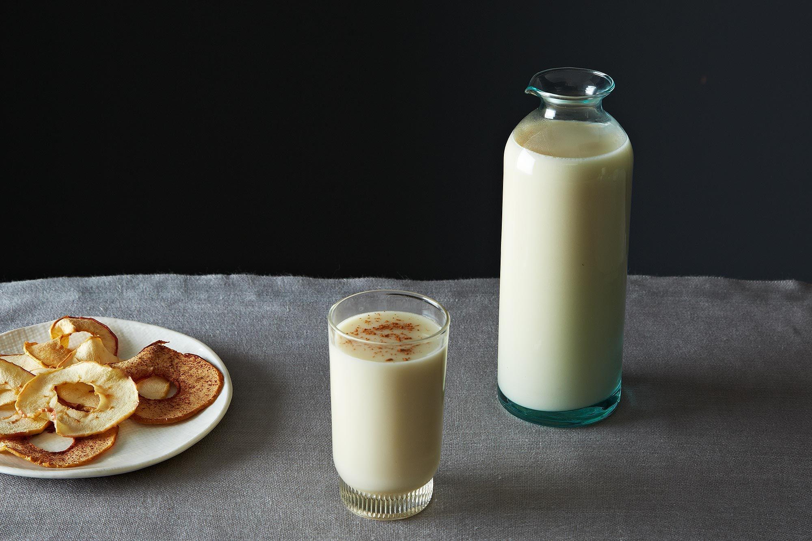

# Moroccan Almond Milk

*The Moroccan summer drink: blanched almonds blended with water, strained, sweetened heavily, perfumed with orange blossom water and a pinch of cinnamon, served deeply chilled in tall glasses. Creamy, faintly floral, the cooling foil to a long couscous lunch.*

**Serves:** 4 tall glasses (makes 1 litre)

**Prep Time:** 15 minutes (plus 8 hours almond soak)

**Cook Time:** 0 minutes

## Overview
Moroccan almond milk (chorba lozt, or simply lait d'amandes in the French-Moroccan kitchen) is a far more ceremonial drink than the commercial supermarket almond milks of the modern food world. The Moroccan version is properly thick, sweetened generously and perfumed with orange blossom water (ma zhar), which is the signature scent of Moroccan sweet kitchens and the local definition of "summery". A pinch of cinnamon brings warmth; some households add a few drops of rose water for extra floral lift. Served deeply chilled in tall glasses, sometimes with a few crushed pistachios floating on top, it's the special-occasion drink at weddings, religious feasts and warm afternoons when mint tea would feel too brisk. The technique is straightforward — soak, blend, strain through cloth, sweeten — but the finish with orange blossom water is what makes it distinctly Moroccan rather than the generic almond milk you'd find anywhere else.

## Ingredients

- 250 g blanched almonds (skinless; if you only have skin-on, blanch them yourself by pouring boiling water over them, leaving 1 minute, then slipping off the skins)
- 1 litre cold water (for blending)
- 100 to 150 g caster sugar, to taste
- 2 to 3 tablespoons orange blossom water (start with 2; add more to taste)
- 1 teaspoon ground cinnamon (plus extra for dusting)
- A few drops of rose water (optional)
- A pinch of fine salt

### To serve
- Plenty of ice cubes
- 2 tablespoons finely chopped pistachios (optional, traditional)
- 4 tall glasses, chilled

## Method

### Stage 1 - Soak the almonds
1. Rinse the blanched almonds in cold water.
1. Put them in a bowl, cover with cold water by at least 5 cm, and refrigerate at least 8 hours (overnight is ideal). The almonds soften considerably and become easier to blend smooth.

### Stage 2 - Blend
1. Drain and rinse the almonds.
1. Put them into a high-powered blender with 500 ml of the 1 litre of cold water.
1. Blitz on high for 2 to 3 minutes until you have a thick, creamy, milky liquid.
1. Add the remaining 500 ml of water and blitz for another 30 seconds to combine fully.

### Stage 3 - Strain through cloth
1. Set a fine sieve over a large jug. Line it with a clean muslin cloth (or use a nut milk bag).
1. Pour the blended liquid through, then gather the cloth and squeeze hard to extract every drop. This step matters — under-strained almond milk is gritty. The pulp left behind can be dried for use in baking.

### Stage 4 - Sweeten and perfume
1. Stir in 100 g of sugar and the salt until completely dissolved.
1. Stir in 2 tablespoons of orange blossom water, the cinnamon, and the rose water (if using).
1. Taste: it should be subtly sweet, distinctly floral, with cinnamon as a background note. Add more sugar (up to 50 g) and orange blossom water (up to 1 more tablespoon) if it tastes flat.

### Stage 5 - Chill
1. Refrigerate at least 3 hours. The flavour deepens and the orange blossom water infuses fully.

### Stage 6 - Serve
1. Pour into chilled tall glasses over ice cubes.
1. Scatter a pinch of crushed pistachios on top of each glass; dust with a tiny extra pinch of cinnamon.
1. Serve immediately, very cold.

## Notes
- **Soak the almonds.** Skipping the soak gives gritty milk and weaker flavour. 8 hours minimum; 12-24 gives more depth.
- **Strain hard through cloth.** Sieve alone gives a slightly gritty drink. Cloth or nut-milk bag is the right tool.
- **Orange blossom water is the signature.** Don't substitute with vanilla extract or "anything floral"; orange blossom is specific. Mediterranean / Middle Eastern groceries sell it; "fleur d'oranger" on French-style bottles is the same thing.
- **Sweet by Moroccan standards.** Don't underdo the sugar; it should be properly sweet, almost like a thin liquid horchata.

## Variations
- **Without rose water.** Skip the rose; just orange blossom and cinnamon. The most common village version.
- **With pure honey.** Replace sugar with 80 g of mild honey. Slightly different flavour profile, traditional in some regions.
- **Almond and date.** Add 6 pitted Medjool dates to the blender. Sweetens naturally, adds depth; a popular Ramadan iftar drink.
- **Iced almond and rose granita.** Pour the chilled liquid into a metal tray, freeze 2 hours, scrape with a fork. Dessert-drink.

## Storage
- Refrigerate up to 3 days. Stir or shake before pouring as the almond solids settle.
- Don't freeze the liquid; the texture separates badly on thawing. Granita-style freezing (above) works.
