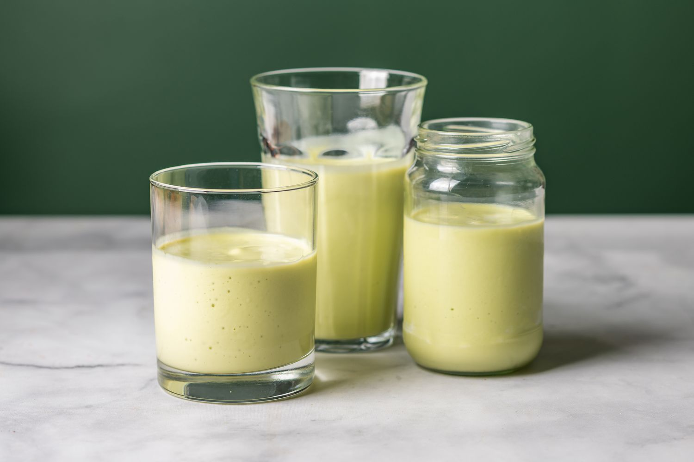

# Moroccan Avocado Smoothie (Aseer Avocado)

*Morocco's signature street smoothie: ripe avocado blended with cold milk, sugar, vanilla, almonds and a touch of orange blossom water, served thick and pale-green in tall glasses with a sprinkle of crushed nuts. Creamy enough to substitute for breakfast.*

**Serves:** 4 tall glasses

**Prep Time:** 10 minutes

**Cook Time:** 0 minutes

## Overview
Moroccan avocado smoothie is one of those things that catches first-time visitors off guard. In the UK and US, avocado is treated as a savoury fruit; in Morocco (and across much of North Africa, the Middle East and Southeast Asia), avocado is dessert. The drink, sold at juice bars in every Moroccan town from Casablanca to Marrakech under the name "aseer avocado", is blended with milk, sugar, almonds, vanilla and a few drops of orange blossom water, producing a thick, pale-green, faintly nutty drink that has more in common with a milkshake than a fruit smoothie. The Moroccan twist on the broader Middle Eastern preparation is the orange blossom water, which carries the same signature scent as the country's sweet kitchens. Served deeply chilled in tall glasses, sometimes layered with strawberry purée or topped with crushed pistachios, it's the breakfast-or-afternoon drink at juice bars; Moroccan teenagers drink it instead of ordering coffee.

## Ingredients

- 2 large ripe avocados (Hass; ripe means yields to gentle thumb pressure)
- 600 ml cold whole milk
- 6 to 8 tablespoons caster sugar, to taste
- 2 tablespoons sweetened condensed milk (optional but recommended for the proper Moroccan thickness)
- 1 teaspoon vanilla extract
- 1 to 2 teaspoons orange blossom water (start at 1)
- 2 tablespoons ground almonds (or 4 whole blanched almonds added to the blender)
- A handful of ice cubes (about 8 cubes)

### To serve
- 2 tablespoons crushed pistachios or chopped almonds
- A small pinch of ground cinnamon (optional)
- 4 tall glasses, chilled

## Method

### Stage 1 - Prep the avocados
1. Halve the avocados, remove the stones, scoop the flesh into a high-powered blender.
1. The avocados should be fully ripe, yielding to thumb pressure but not mushy. Under-ripe avocados give a fibrous bitter drink.

### Stage 2 - Blend
1. Add the cold milk, 6 tablespoons of sugar, the sweetened condensed milk (if using), vanilla extract, orange blossom water, ground almonds and ice cubes to the blender.
1. Blitz on high for 60-90 seconds until completely smooth and pale-green. Stop and scrape down the sides if needed.

### Stage 3 - Taste and adjust
1. Taste. The Moroccan version is properly sweet (Moroccan juice bars use more sugar than you'd expect). Add 1 more tablespoon at a time if it tastes flat. If too thick, add a splash more milk.
1. The texture should be thick enough to coat a spoon but pour easily from the blender jug, somewhere between a smoothie and a milkshake.

### Stage 4 - Serve
1. Pour into chilled tall glasses.
1. Top each with a generous pinch of crushed pistachios or chopped almonds.
1. Add a tiny dusting of cinnamon if you like.
1. Serve immediately with a wide straw or a long spoon.

## Notes
- **Ripe avocados only.** Hard avocados give a fibrous, bitter, grainy drink. Yielding-to-thumb is the right ripeness.
- **Sweet by Moroccan standards.** 6-8 tablespoons of sugar might seem aggressive; this is correct. The avocado is naturally bland and needs heavy sweetening to come into balance.
- **The orange blossom water is signature.** Don't skip, it's what makes this Moroccan rather than a generic avocado milkshake. Start at 1 teaspoon; rose-water-fragrant overkill is a real risk.
- **Cold ingredients.** Milk straight from the fridge, ice cubes, blended quickly so it doesn't warm up. The drink is served cold.

## Variations
- **Avocado and strawberry layered.** Make the avocado smoothie and a separate strawberry milkshake; layer them in the glass for a pink-and-green two-tone drink. Visual showpiece.
- **Avocado and date.** Add 4 pitted Medjool dates to the blender. Natural sweetness; less added sugar needed.
- **With banana.** Add 1 ripe banana for extra body and natural sweetness.
- **Vegan version.** Use oat milk and 2 tablespoons of coconut cream in place of milk and condensed milk. Works well; lightly different flavour.

## Storage
- Best fresh. Refrigerate up to 8 hours sealed; after that the avocado oxidises and the colour darkens to an unappealing brown-green even though the taste stays acceptable.
- Don't freeze; texture is destroyed.
