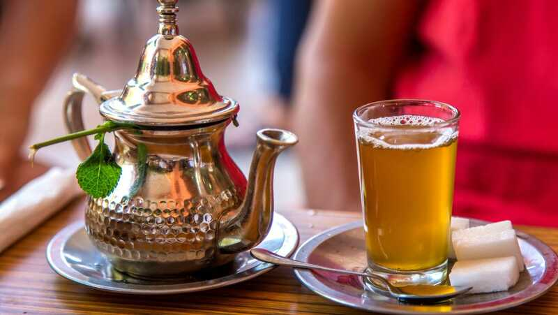

# Drinks of Morocco

Atay (mint tea) is the national pour, made with green gunpowder tea, a generous bunch of spearmint and a startling amount of sugar; the high pour into the small glass is the show. Served at the start, the middle and the end of every meal, and refused at your peril.
