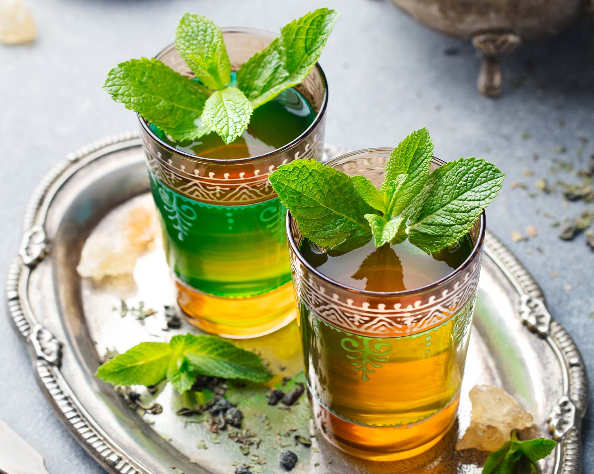

# Moroccan Mint Tea

*The pour from a great height: green gunpowder tea, a generous bunch of fresh mint, sugar to the point of impudence, served in small glasses with the bubbles you only get from pouring high.*

**Serves:** 4

**Prep Time:** 5 minutes

**Cook Time:** 10 minutes

## Overview
Moroccan mint tea, known as atay, is the national drink and the social glue of the country: served at every gathering, hospitality refused at your peril, prepared with a theatrical pour from at least 30 cm above the glass to oxygenate the tea and put a foamy head on the surface. The build is straightforward but the technique matters. Green gunpowder tea (so called because the leaves are rolled into tight pellets that unfurl in hot water) gets a "wash" with boiling water that's discarded to remove the bitterness, then is steeped properly with a generous handful of fresh spearmint and a startling amount of sugar (Moroccans drink it very sweet by western standards). The tea steeps in a long-spouted teapot called a berrad, and the pour is high enough that the host appears to be putting on a small show. Serve in small heatproof glasses at the start of a meal, the end of a meal, or any time guests come over. Refusing one is rude; accepting three is polite.

## Ingredients

### Tea
- 1 tablespoon green gunpowder tea (look at a Middle Eastern grocer or online; ordinary green tea works but lacks the pellet ritual)
- 750 ml boiling water (divided: 100 ml for the wash, 650 ml for the brew)
- A generous bunch fresh spearmint (about 30 g; spearmint is the right variety, not the dark purple peppermint sometimes labelled "mint")
- 4 to 6 tablespoons sugar (start at 4 and add more; Moroccans use more)

### To serve
- 4 small heatproof glasses
- A sprig of fresh mint in each glass
- A small bowl of sugar at the table for those who want more

## Method

### Stage 1 - Wash the tea (optional but traditional)
1. Tip the gunpowder tea into a heatproof teapot, ideally a metal Moroccan berrad with a long spout. Any heatproof pot works.
1. Pour over 100 ml of boiling water; swirl for 5 seconds; pour off and discard. This first water carries the bitterness; the rest of the brew is smoother.

### Stage 2 - Brew with mint
1. Add the fresh mint sprigs (stalks and all; don't be precious about chopping) and the sugar to the teapot with the washed tea.
1. Pour over the remaining 650 ml of boiling water.
1. Set on a low heat for 2 to 3 minutes; the mixture should come to a gentle simmer but not a rolling boil.

### Stage 3 - Mix by pouring
1. Pour a small amount of tea into a glass, then pour it back into the teapot. Repeat twice. This circulates the sugar and tea and helps build the foam.
1. Taste; the tea should be sweet enough that you'd consider it dessert. Add more sugar if needed.

### Stage 4 - Pour with theatre
1. Hold the teapot at least 30 cm (a forearm's length) above the first glass.
1. Pour in a steady stream; the height aerates the tea and creates the white foamy head that's the signature of a proper pour.
1. Fill each glass two-thirds; don't overfill.
1. Slide a sprig of fresh mint into each glass.

### Stage 5 - Serve and refill
1. Serve immediately; Moroccan mint tea is properly hot and should be drunk warm.
1. Refill from the same pot two or three times during the meal; the tea will get stronger and sweeter as the leaves continue to extract.

## Notes
- **Gunpowder tea is the right tea.** The tight pellets release their flavour slowly and survive the long brew without going bitter. Loose-leaf green tea works but the flavour and ritual aren't quite right.
- **Spearmint is the right mint.** Peppermint (the dark purple-stemmed one) is too aggressive; the round-leafed bright green spearmint is what's used in Morocco.
- **Sugar is non-negotiable.** Westerners often want to reduce the sugar; in Morocco that would be considered an insult to the host. Try it sweet first; adjust on the second cup.
- **The pour is a show.** The higher you pour from, the bigger the head; it also cools the tea slightly and oxygenates it. Practise over a sink first.

## Variations
- **Mint and absinthe.** Add a small sprig of fresh wormwood for a slightly bitter, herbaceous edge. Very traditional in some Moroccan households.
- **Saharan style.** Triple the sugar, halve the water, brew for longer. The syrupy version drunk by Tuareg nomads in the desert; goes down with three small glasses each, the second sweeter than the first.
- **Iced Moroccan mint tea.** Brew strong, cool, pour over ice with extra fresh mint; works as a summer pour.

## Storage
- Drink within an hour of pouring.
- The first pour from a brewed pot is the lightest; the second is fuller and the third is properly strong, which is the traditional sequence.
- Don't refrigerate brewed tea; it goes bitter overnight.
