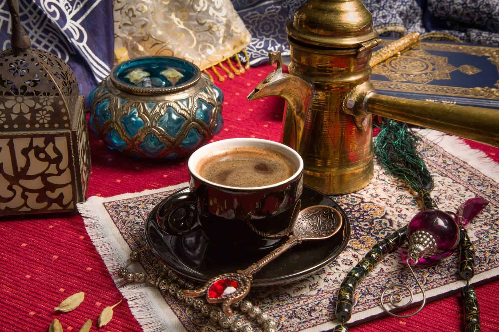

# Qahwa Beldiya (Moroccan Spiced Coffee)

*Morocco's spiced coffee: dark Arabica beans ground with green cardamom, cinnamon, nutmeg, black pepper, sesame and a touch of clove, brewed strong, served in small cups. The coffee that grandmothers prepare for guests in the country medinas — far older and far more aromatic than the espressos Casablanca's cafés serve.*

**Serves:** 4 small cups

**Prep Time:** 3 minutes

**Cook Time:** 6 minutes

## Overview
Qahwa beldiya ("country coffee" — beldi means rural / traditional / artisanal in Moroccan Arabic) is the proper Moroccan spiced coffee, distinct from the espresso-based French-Moroccan café culture you'll find in the cities. The beldi tradition is older and pre-Western: medium-dark Arabica beans pre-ground with a specific spice blend that always includes green cardamom, cinnamon and a touch of nutmeg, and often includes black peppercorns, white sesame seeds, cloves, ginger and aniseed depending on the household and region. Marrakech style leans heavy on cardamom and cinnamon; Fes adds more sesame and aniseed; Rif valley style includes black pepper. The brew is made by simmering the spiced grounds in water on the stovetop (no espresso machine), then poured grounds-and-all into small cups where the grounds settle at the bottom. Sweetened with sugar to taste, served alongside a piece of mint tea cake or a small plate of dates. The aroma when you grind the beans is one of the great smells of the Moroccan kitchen.

## Ingredients

### Pre-mix the spice blend (enough for several pots)
- 50 g whole green cardamom pods
- 3 cinnamon sticks
- 1 small whole nutmeg, lightly cracked
- 1 teaspoon black peppercorns
- 1 tablespoon white sesame seeds
- 4 whole cloves
- 1 tablespoon aniseed (optional, Fes-style)
- 2 cm fresh ginger, sliced and dried (optional)

### For the pot of coffee (this recipe)
- 4 tablespoons medium-dark Arabica ground coffee (espresso-grind works)
- 1 to 2 teaspoons of the spice blend above (crushed in a mortar and pestle)
- 600 ml cold water
- 4 to 6 teaspoons white or brown sugar, to taste (Moroccan qahwa is properly sweet)

### To serve
- 4 small porcelain cups or espresso cups with saucers
- Optional: a small plate of dates or kaab el ghazal pastries

## Method

### Stage 1 - Crush the spice mix
1. Take 1 to 2 teaspoons of the pre-made spice blend (crack open the cardamom pods if they're whole). Crush coarsely in a mortar and pestle so the spices release their oils. Don't grind to a fine powder — coarse pieces give cleaner flavour and settle out better at the end.

### Stage 2 - Brew
1. Combine the cold water, ground coffee and crushed spices in a small saucepan.
1. Bring to a gentle simmer over medium heat, stirring occasionally with a wooden spoon. Don't let it boil hard — gentle simmer is the right temperature.
1. Simmer for 5-6 minutes. The kitchen will smell of cardamom and cinnamon; the brew turns very dark.

### Stage 3 - Settle and sweeten
1. Off the heat, let the coffee sit undisturbed for 1 minute. The grounds will settle to the bottom of the pot.
1. Stir in the sugar while still warm; the proper Moroccan version is sweet.

### Stage 4 - Serve
1. Pour gently into small cups, holding the pot at a slight angle so the grounds stay at the bottom. The last 1-2 cm of the pot should be left undisturbed.
1. Serve immediately, with a small plate of dates or pastries.

## Notes
- **Make the spice mix in batches.** Mixing it once and storing in a sealed jar (keeps 6 months) means you can pull out a teaspoon any time the household wants qahwa. Pre-mixed by Moroccan grandmothers is the traditional approach.
- **Don't over-grind the spices.** Coarse crush, not fine powder. Coarse pieces give brighter flavour without overwhelming and settle out cleanly. Fine powder muddies the cup.
- **Don't boil hard.** Simmer is right. Hard boiling extracts the bitter compounds in the coffee while the spices flatten.
- **Cardamom heavy.** The defining spice in Moroccan qahwa is cardamom; aim for the cardamom being the strongest single note in the spice blend.

## Variations
- **Cinnamon-only minimalist.** Just 1 cinnamon stick per pot, no other spices. Lighter, less aromatic; the everyday simple version.
- **Tarwa (with milk).** Half the water replaced with hot whole milk after brewing; sweetened. The Moroccan latte.
- **With khoudenjal.** Add a small piece of galangal root (called khoudenjal locally) to the brew. Warming, slightly medicinal; popular in cooler northern regions.
- **Cold qahwa beldiya.** Brewed double-strength, chilled, poured over ice. Not traditional but increasingly common in modern Casablanca cafés.

## Storage
- Brewed coffee doesn't store well; flavour fades within 30 minutes. Brew fresh.
- The spice blend (in a sealed jar at room temperature) keeps 6 months. Whole spices keep their flavour far better than pre-ground.
