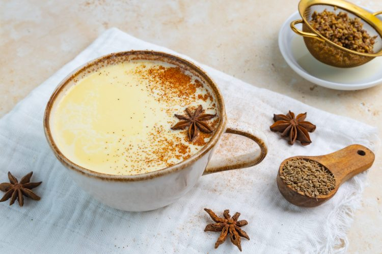

# Anijsmelk (Dutch Anise Milk)

*The Netherlands' winter children's drink: whole milk warmed gently with crushed star anise, sweetened with sugar and dusted with cinnamon, strained and served piping hot.*

**Serves:** 2

**Prep Time:** 3 minutes

**Cook Time:** 10 minutes

## Overview
Anijsmelk is the Netherlands' most ubiquitous winter children's drink and one of the country's most identity-defining warm beverages: the canonical bedtime drink for Dutch children from October to March, made in every Dutch grandmother's kitchen and sold at Dutch winter markets as a hot alternative to mulled wine. Three ingredients only (whole milk, whole star anise, sugar) but the technique matters. Whole milk is non-negotiable: skim or semi-skim doesn't carry the anise oil. The pods are specifically star anise from Illicium verum (not anise seed, not fennel seed); lightly crushed to release the volatile oils, then warmed gently in the milk for eight to ten minutes (a longer steep gives stronger flavour; under six leaves the milk thin). Sweetened with a tablespoon of sugar per cup. Strained to remove the pods, served piping hot in a tall mug: often paired with a speculaas biscuit, a piece of taai-taai, or a small pepernoten Sinterklaas spice biscuit.

## Ingredients

### Per drink (multiply for more)
- 250 ml whole milk
- 2 whole star anise pods (lightly crushed)
- 1 tablespoon caster sugar (or to taste; some Dutch grandmothers use 2 tablespoons)
- (Optional: 1 small thin slice of fresh ginger - the modern variant)
- (Optional: 1/4 teaspoon vanilla extract)
- A dust of ground cinnamon to finish

### To serve
- A tall mug or a teacup, pre-warmed with hot water
- A small spoon for stirring
- 1 small Dutch biscuit alongside (speculaas, taai-taai, pepernoten, or a stroopwafel)
- A wool blanket (the canonical Dutch winter accompaniment)

## Method

### Stage 1 - Crush the star anise
1. Place the whole star anise pods on a chopping board.
2. Press firmly with the flat of a knife (or smash with a pestle) - the pods should crack open and release their fragrance.
3. Don't pulverise them into powder; just crack the pods so the volatile oils can leach out.

### Stage 2 - Warm the milk
1. Pour the milk into a small heavy saucepan.
2. Add the crushed star anise pods.
3. Add the sugar.
4. (If using optional ginger or vanilla, add now too.)
5. Place over medium-low heat.

### Stage 3 - Slow steep
1. Warm the milk gently 6-8 minutes, stirring once or twice.
2. The temperature should reach about 80-85°C - you'll see small bubbles forming around the edge of the pan and steam rising; the milk should be hot enough to drink but not yet boiling.
3. DO NOT BOIL - boiling scorches the milk and creates a skin.
4. The longer the steep (up to 10-12 minutes), the stronger the anise flavour. 8 minutes is the canonical Dutch grandmother's timing.

### Stage 4 - Strain
1. Pre-warm 2 tall mugs by filling them with hot water for 30 seconds; tip out.
2. Pour the anijsmelk through a fine sieve into the warm mugs, catching the star anise pods.
3. (The strained anise pods can be reused once - they have a second infusion in them; keep them dry to use again the next evening.)

### Stage 5 - Finish
1. Stir each mug briefly to make sure the sugar is fully dissolved.
2. Dust a small pinch of ground cinnamon over the surface.
3. (Optional: float a whole fresh star anise on top as decoration.)

### Stage 6 - Serve
1. Hand the warm mug to the diner.
2. Place a small biscuit alongside (speculaas is the canonical companion).
3. Drink slowly; the aroma rises with the steam.
4. The first sip should taste of warm milk, gentle aniseed, and sweetness - nothing else.

## Notes
- **Whole milk is essential:** the fat in whole milk is what carries the aniseed oils. Skim milk gives a thin, one-note drink.
- **Star anise pods, not anise seed:** the specific star-shape pod from Illicium verum has the right aromatic profile. Anise seed (from Pimpinella anisum) is more delicate and produces a different (and arguably inferior) drink. Fennel seed is also a no.
- **Don't boil:** scorched milk is unpleasant; a skin on top is even worse. 85°C is the sweet spot.
- **Length of steep is variable:** 6 minutes gives a light hint; 10 minutes gives strong anise; 12 minutes is the maximum before bitterness sets in.
- **The bedtime ritual:** in the Netherlands, this is the canonical drink for sleepy children - the anise is mildly soothing and the warm milk helps everyone sleep.
- **Re-use the star anise once:** they have a second infusion in them.

## Variations
**Anijsmelk met honing (with honey):** swap the sugar for 1 tablespoon of good honey per cup - mellower, more aromatic.
**Anijsmelk met kaneel (cinnamon-heavy):** add a cinnamon stick to the steep alongside the star anise - more aromatic, more Christmas-market.
**Adult anijsmelk (with rum or anise liqueur):** add 15 ml of dark rum or Pernod / Pastis to each mug just before drinking - the grown-up variant.
**Anijsmelk met saffraan (saffron variant):** see [Slemp](slemp.md) - the slightly richer Dutch winter drink that adds saffron, tea and more spices.
**Anijsmelk on ice (summer variant):** cool the brewed anijsmelk fully; serve over ice with a small twist of orange peel - the modern Amsterdam café summer variant.
**Anijsmelk with foam (latte-style):** steam the milk to a latte texture (use a milk steamer); steep the anise first, strain, then froth - the modern coffee-shop variant.
**Vegan anijsmelk:** swap whole milk for full-fat oat milk or coconut milk (canned, not light) - the texture is similar; the aniseed dominates either way.
**Anijsmelk with ginger:** add a thin slice of fresh ginger to the steep - the warming variant for cold and flu season.

## Serving
At a Dutch grandmother's kitchen on a winter evening (the canonical setting) · at a Dutch Sinterklaas (5 December) celebration after the gift-giving · at a Dutch Christmas market hot-drink stall · at a Dutch family bedtime ritual · at a Dutch sledding outing as the warming drink on returning home · at a Dutch ice-skating shelter · at home as the children's-bedtime ritual · paired with a speculaas biscuit, a piece of taai-taai, or a small chocolate.

## Storage
- Make and drink fresh - anijsmelk doesn't keep more than an hour; the milk loses its fresh anise top-notes and the texture can change.
- Refrigerate up to 24 hours; reheat gently on the stovetop (don't boil).
- Don't reheat in the microwave - uneven heating creates hot spots and can scorch the milk.
- Whole star anise pods keep indefinitely in a sealed jar in a dry pantry.
- A pre-mixed "anise-and-sugar" sachet (3 crushed pods + 1 tablespoon sugar) per serving can be prepped ahead and steeped in milk on demand - useful for cold-weekend mornings.
- The strained star anise pods can be re-used once for a second infusion the next evening; keep them dry between uses.
