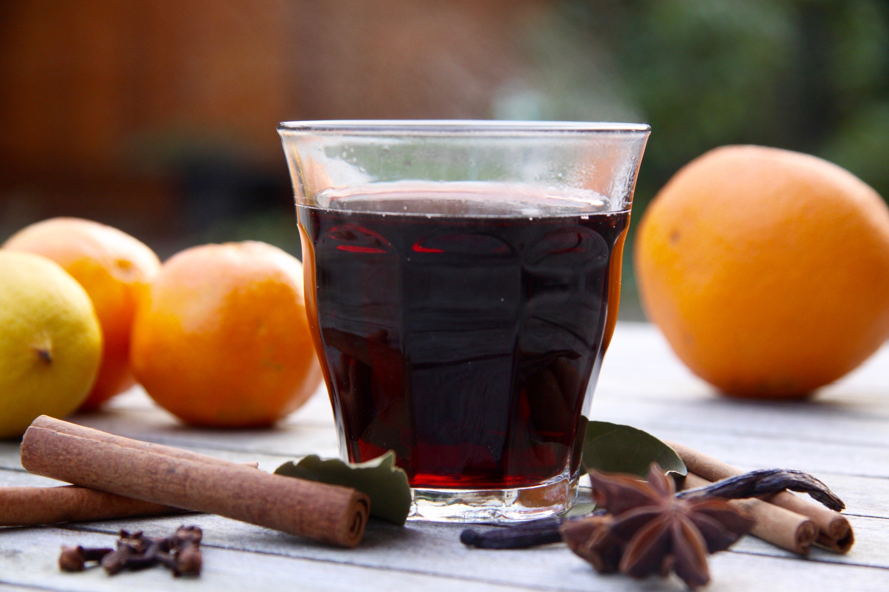

# Bisschopswijn (Dutch Mulled Wine)

*The Dutch winter mulled wine, named for the Sinterklaas bishop figure: a sturdy red wine warmed gently with strips of orange and lemon peel, a cinnamon stick, cloves, star anise, a few cardamom pods, and brown sugar - simmered just below boiling so the alcohol stays, the flavours marry, and the kitchen fills with the smell of warm spice. Served in small heavy ceramic mugs at Dutch Christmas markets, Sinterklaas evenings, and Christmas Eve dinners. The Dutch counterpart to German Glühwein and French vin chaud - distinct in its slightly more orange-forward profile and the canonical Sinterklaas association.*

**Serves:** 6

**Prep Time:** 10 minutes

**Cook Time:** 25 minutes

## Overview
Bisschopswijn ("bishop's wine") is the Dutch version of mulled wine, named after the Sinterklaas figure - the bishop of Myra (Sint Nicolaas) whose annual 5 December feast is one of the most important dates in the Dutch calendar. The drink dates to at least the 17th century and reflects the Dutch spice-trade era: cloves and cinnamon from the East Indies, star anise from China, cardamom from southern India, all of which arrived through the Amsterdam spice docks. The construction has three Dutch-specific moves that distinguish bisschopswijn from German Glühwein or French vin chaud. First, the orange and lemon peel: bisschopswijn uses GENEROUS strips of peel from both orange and lemon (the strips are zested with a peeler, avoiding the bitter white pith), which give the drink a stronger citrus presence than its German cousin. The peel goes in at the start and stays in throughout the simmer. Second, the spice mix: cinnamon stick + star anise + cloves + cardamom pods - the four core warm spices. Some recipes add a slice of fresh ginger; some add a vanilla pod. The cardamom is the slightly Dutch-Indonesian colonial flourish. Third, the wine: a sturdy but not too tannic red - the Dutch traditional choice is a Bordeaux-style or a Côtes du Rhône; nothing too oaky, nothing too thin. The wine is warmed gently to 80-90°C and held there - never boiled (which evaporates the alcohol and gives a sour overcooked result). Sweetened with brown sugar (some Dutch homes use honey). Served in small heavy ceramic mugs with a small biscuit (speculaas or pepernoten) alongside. Three details: WARM, NEVER BOIL (80-90°C; the alcohol stays, the flavours marry; boiling makes a sour kitchen-rag), USE GENEROUS CITRUS PEEL (more orange than you'd think; this is what makes it bisschopswijn rather than Glühwein), and SMALL HEAVY MUGS (the drink loses heat fast; small portions in heavy mugs stay warm longer).

## Ingredients

### Per 1 bottle of wine (serves 6)
- 1 bottle (750 ml) red wine (Bordeaux, Côtes du Rhône, Merlot, or a sturdy Italian; nothing too oaky or thin)
- 1 orange (zested with a peeler in long strips, juice reserved)
- 1 lemon (zested with a peeler in long strips)
- 1 cinnamon stick
- 4 whole cloves
- 2 star anise pods (lightly crushed)
- 4 cardamom pods (lightly crushed)
- 1 thin slice fresh ginger (5 mm thick, optional)
- 4-5 tablespoons soft dark brown sugar (or to taste; less if you prefer drier; more for sweeter)
- (Optional: 1 vanilla pod, split lengthwise)
- (Optional: 60 ml dark rum or brandy added at the end for extra warmth - the canonical Sinterklaas adult variant)

### To finish (per mug)
- A small slice of fresh orange, floated on top
- A small stick of cinnamon for stirring
- (Optional) A small splash of rum or brandy

### To serve
- 6 small heavy ceramic mugs (about 200 ml each), pre-warmed
- A small spoon for stirring
- A plate of speculaas biscuits, pepernoten, or taai-taai cookies alongside
- A wool blanket and a winter evening (the canonical Dutch winter atmosphere)

## Method

### Stage 1 - Prepare the citrus peel
1. With a vegetable peeler, take long thin strips of zest from the orange (avoid the white pith - it's bitter).
2. Repeat with the lemon.
3. You should have about 6-8 long strips of orange zest and 4-6 of lemon zest.
4. Juice the orange; reserve the juice (about 80 ml).

### Stage 2 - Lightly crush the spices
1. Place the star anise and cardamom pods on a board.
2. Press firmly with the flat of a knife - the pods should crack open without pulverising.

### Stage 3 - Build the bisschopswijn
1. Pour the red wine into a heavy saucepan (use a non-reactive pan - stainless steel or enamelled cast iron; aluminium reacts with the wine acids and gives a metallic taste).
2. Add the orange and lemon peel strips.
3. Add the cinnamon stick, cloves, crushed star anise, crushed cardamom, slice of ginger.
4. (If using the optional vanilla pod, add now.)
5. Add the reserved orange juice.
6. Add 4 tablespoons of brown sugar.

### Stage 4 - The slow warm (this is the key)
1. Place over medium-low heat.
2. Warm slowly 15-20 minutes till the temperature reaches 80-85°C - small bubbles forming around the edge but NOT actively boiling.
3. Do NOT let it boil. If you see bubbles rising rapidly, take off the heat immediately and let it sit 2 minutes before returning to a lower heat.
4. The kitchen will fill with the smell of warm spice and citrus; the wine darkens slightly; the sugar dissolves.

### Stage 5 - Taste and adjust
1. Taste; should be warmly spiced, citrus-forward, gently sweet, with the wine's body still recognisable.
2. Add more sugar if too sour; more orange juice if too sweet; a small extra splash of cardamom or clove if you want more spice.

### Stage 6 - Optional fortification
1. For the canonical Sinterklaas adult variant: turn off the heat; stir in 60 ml of dark rum or brandy. The added spirit brings warmth back to a bisschopswijn that's been simmered a long time.

### Stage 7 - Strain and serve
1. Pre-warm 6 small ceramic mugs with hot water; tip out.
2. Pour the bisschopswijn through a fine sieve into a clean warm jug.
3. Pour into the warm mugs - about 200 ml each.
4. Float a fresh slice of orange on top of each mug.
5. Place a small cinnamon stick in each as a stirrer (optional).
6. Hand out warm.

### Stage 8 - The Dutch ritual
1. Place a small plate of speculaas biscuits, pepernoten or taai-taai cookies in the centre of the table.
2. Sip the bisschopswijn slowly; the aroma rises with the steam.
3. The drink is meant to last 15-20 minutes of an evening - refill once or twice.
4. The canonical Dutch winter evening: a Christmas Eve dinner finished, the candles lit, the bisschopswijn warm, the company unhurried.

## Notes
- **Don't boil:** the most common bisschopswijn mistake. Boiling cooks off the alcohol and creates an unpleasant cooked-wine flavour. 80-85°C is the sweet spot.
- **Sturdy red wine:** a mid-priced Bordeaux, Côtes du Rhône, or Chianti works. Nothing too oaky; nothing too thin. A €6-10 bottle is fine; expensive wine is wasted.
- **Generous citrus peel:** more than you'd think. The orange-forward profile is what makes it Dutch rather than German.
- **Brown sugar over white:** the molasses notes pair with the spices better. Honey is also acceptable; white sugar is the least good.
- **Small ceramic mugs:** the drink loses heat fast; small portions in heavy mugs stay warm longer than tall glasses or thin cups.
- **Better in batches throughout the evening:** Dutch tradition is to keep a small saucepan of bisschopswijn warm on the lowest heat throughout a Sinterklaas evening, refilling guests' mugs as the evening progresses.

## Variations
**Bisschopswijn with raisins (the older tradition):** add 100 g raisins to the steep; the raisins absorb wine and become a small treat eaten with a spoon from the bottom of the mug - the historical 19th-century Dutch variant.
**Bisschopswijn with apple:** add 1 chopped apple (Bramley or Granny Smith) to the steep - more autumn-fruit-forward.
**White bisschopswijn (modern):** swap red wine for a sturdy white (Riesling, dry Tokaji); reduce the cinnamon; add more cardamom and ginger - the modern Dutch tea-room variant.
**Brandy-fortified bisschopswijn (canonical Sinterklaas):** add 60 ml brandy or dark rum at the end - the canonical adult drink.
**Mulled cider variant (cidersbisschopswijn):** swap the red wine for sturdy cider; the same spices and citrus - the Dutch cider-region variant.
**Quick weeknight bisschopswijn:** use a pre-made mulling-spice bag; warm with red wine, orange juice and brown sugar for 8 minutes - 10 minutes total.
**Glühwein (German cousin):** less citrus peel, more cinnamon and clove; usually no cardamom; sometimes a slice of fresh ginger. The German version.
**Vin chaud (French cousin):** less spice, more citrus, often with a star anise floating in each glass; the French Alpine version.
**Wassail (English Christmas cousin):** with cider AND red wine + roasted apples + spices; the English Christmas Eve drink.
**Non-alcoholic bisschopswijn:** swap the red wine for 750 ml of unsweetened pomegranate juice + 250 ml of red grape juice; same spices and citrus - works surprisingly well.

## Serving
At a Dutch Sinterklaas (5 December) family gathering (the canonical setting) · at a Dutch Christmas Eve dinner · at an Amsterdam Christmas market hot-drink stall · at a Dutch ice-skating festival shelter · at a Dutch winter family Sunday lunch · at a Dutch sledding-and-return-home ritual · at home as the canonical December evening drink · paired with speculaas, pepernoten, taai-taai, gingerbread, or a small chunk of mature Dutch cheese.

## Storage
- Refrigerates 3 days; reheats well on the stovetop (don't boil).
- The flavours marry overnight - day-2 bisschopswijn is often better than fresh.
- Don't reheat in the microwave - uneven heating creates hot spots.
- The whole spices (cinnamon stick, cloves, star anise, cardamom) can be re-used once for a lighter second batch.
- Pre-mixed "bisschopswijn spice sachets" (cinnamon stick + 4 cloves + 2 star anise + 4 cardamom + ginger slice + dried orange zest, all in a small muslin bag) are sold in Dutch supermarkets in December - convenient for fast weekday warmth.
- Don't freeze - the texture changes irreversibly; the cooked-wine notes intensify.
